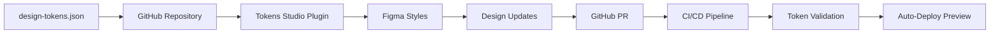

# CoreFlow360 V4 - Figma Token Sync Guide

## 🎯 Overview

This guide establishes seamless synchronization between CoreFlow360 V4's design token system and Figma using the Tokens Studio plugin, enabling true design-developer collaboration with a single source of truth.

## 🔄 Sync Architecture



## 📋 Prerequisites

### For Designers
- [ ] **Figma account** with edit access to CoreFlow360 files
- [ ] **Tokens Studio plugin** installed in Figma
- [ ] **GitHub account** with repository access
- [ ] **Basic Git knowledge** (creating branches, PRs)

### For Developers
- [ ] **GitHub Actions** enabled for repository
- [ ] **Token validation script** configured
- [ ] **Storybook deployment** set up (optional)
- [ ] **Merge permissions** for token-related PRs

## 🚀 Initial Setup

### Step 1: Install Tokens Studio Plugin

1. **Open Figma** and go to the CoreFlow360 design file
2. **Open Plugins** (Resources → Plugins in menu)
3. **Search** for "Tokens Studio for Figma"
4. **Install** the plugin
5. **Launch** the plugin from Plugins menu

### Step 2: Connect GitHub Repository

1. **Open Tokens Studio** plugin in Figma
2. **Go to Settings** (gear icon)
3. **Select "GitHub"** as storage provider
4. **Authenticate** with your GitHub account
5. **Configure repository settings**:
   ```
   Repository: [organization]/CoreFlow360-V4
   Branch: design-tokens
   File Path: design-system/design-tokens.json
   ```

### Step 3: Initial Token Import

1. **Click "Pull from GitHub"** in Tokens Studio
2. **Verify token import** - Check that all token sets appear:
   - Global tokens (colors, typography, spacing)
   - Semantic tokens (backgrounds, text, borders)
   - Component tokens (button, card, modal, etc.)
3. **Apply to Figma** - Click "Update Figma" to create styles

## 🎨 Designer Workflow

### Daily Token Usage

#### 1. Working with Existing Tokens

```
✅ Using Tokens in Figma:
1. Select element (text, shape, frame)
2. Open Tokens Studio plugin
3. Choose appropriate semantic token:
   - Background: canvas, surface, muted
   - Text: primary, secondary, muted
   - Border: default, muted, strong
4. Apply token to element
5. Token appears as Figma style
```

#### 2. Creating New Components

```
✅ Component Creation Process:
1. Design component using existing tokens
2. For new token needs:
   - Use semantic tokens when possible
   - Document rationale for new tokens
   - Follow naming conventions
3. Test component in light/dark themes
4. Document component variants
```

### Token Modification Workflow

#### When to Modify Tokens

**✅ MODIFY TOKENS WHEN:**
- Adjusting semantic color meanings
- Adding new component variants
- Updating spacing scale
- Adding new theme support

**❌ DON'T MODIFY TOKENS FOR:**
- One-off design exceptions
- Temporary experiments
- Component-specific customizations

#### Step-by-Step Token Updates

1. **Create Design Branch**
   ```
   In Tokens Studio:
   → Settings → Storage
   → Create new branch: "tokens/new-feature"
   ```

2. **Modify Tokens**
   - Add/edit tokens in Tokens Studio interface
   - Use proper naming conventions
   - Maintain token hierarchy (Global → Semantic → Component)

3. **Test Changes**
   ```
   Testing Checklist:
   - Apply to test components in Figma
   - Check light/dark theme compatibility
   - Verify accessibility contrast ratios
   - Test responsive behavior
   ```

4. **Document Changes**
   ```
   Required Documentation:
   - Token purpose and usage
   - Components affected
   - Breaking changes (if any)
   - Migration notes for developers
   ```

5. **Push to GitHub**
   ```
   In Tokens Studio:
   → Click "Push to GitHub"
   → Add commit message
   → Create pull request
   ```

## 👨‍💻 Developer Integration

### GitHub Actions Setup

#### Token Validation Workflow

Create `.github/workflows/token-validation.yml`:

```yaml
name: Token Validation

on:
  pull_request:
    paths:
      - 'design-system/design-tokens.json'
      - 'design-system/tokens.css'
      - 'tailwind.tokens.cjs'

jobs:
  validate-tokens:
    runs-on: ubuntu-latest
    steps:
      - uses: actions/checkout@v4

      - name: Setup Node.js
        uses: actions/setup-node@v4
        with:
          node-version: '18'

      - name: Install dependencies
        run: npm ci

      - name: Validate token schema
        run: npm run tokens:validate

      - name: Build with new tokens
        run: |
          cd frontend
          npm ci
          npm run build

      - name: Test component compatibility
        run: npm run test:tokens

      - name: Generate token diff
        run: npm run tokens:diff
```

#### Auto-Deploy Preview (Optional)

```yaml
  deploy-preview:
    needs: validate-tokens
    runs-on: ubuntu-latest
    steps:
      - name: Deploy Storybook Preview
        run: |
          npm run build-storybook
          npm run deploy:preview

      - name: Comment PR with preview link
        uses: actions/github-script@v6
        with:
          script: |
            github.rest.issues.createComment({
              issue_number: context.issue.number,
              owner: context.repo.owner,
              repo: context.repo.repo,
              body: '🎨 Token Preview: [View Storybook](https://preview.coreflow360.com/pr-${{ github.event.number }})'
            });
```

### Token Validation Script

Create `scripts/validate-tokens.js`:

```javascript
const fs = require('fs');
const path = require('path');

// Validate token schema
function validateTokens() {
  const tokensPath = path.join(__dirname, '../design-system/design-tokens.json');
  const tokens = JSON.parse(fs.readFileSync(tokensPath, 'utf8'));

  const errors = [];

  // Check required structure
  if (!tokens.global) errors.push('Missing global tokens');
  if (!tokens.semantic) errors.push('Missing semantic tokens');

  // Validate token references
  validateTokenReferences(tokens, errors);

  // Check naming conventions
  validateNamingConventions(tokens, errors);

  if (errors.length > 0) {
    console.error('❌ Token validation failed:');
    errors.forEach(error => console.error(`  - ${error}`));
    process.exit(1);
  }

  console.log('✅ Token validation passed');
}

validateTokens();
```

Add to `package.json`:

```json
{
  "scripts": {
    "tokens:validate": "node scripts/validate-tokens.js",
    "tokens:diff": "git diff --name-only HEAD~1 HEAD | grep 'design-tokens.json'",
    "test:tokens": "npm run build && npm run typecheck"
  }
}
```

## 🔍 Review Process

### Design Review Checklist

**For Token Changes:**
- [ ] **Semantic appropriateness** - Does the token serve a clear purpose?
- [ ] **Naming convention** - Follows established patterns?
- [ ] **Backward compatibility** - Won't break existing components?
- [ ] **Theme support** - Works in all supported themes?
- [ ] **Accessibility compliance** - Meets contrast requirements?

**For Component Updates:**
- [ ] **Token usage** - Uses semantic tokens appropriately?
- [ ] **Responsive behavior** - Works across breakpoints?
- [ ] **State variations** - Includes hover, focus, disabled states?
- [ ] **Documentation** - Clear usage guidelines provided?

### Developer Review Checklist

**Code Quality:**
- [ ] **Build passes** - No compilation errors
- [ ] **Tests pass** - All token-related tests succeed
- [ ] **Type safety** - TypeScript validates correctly
- [ ] **Performance** - No significant bundle size increase

**Token Integration:**
- [ ] **CSS generation** - New variables appear in tokens.css
- [ ] **Tailwind mapping** - Classes available in Tailwind
- [ ] **Component compatibility** - Existing components unaffected
- [ ] **Documentation updated** - Changes reflected in docs

## 🚨 Troubleshooting

### Common Issues

#### 1. Tokens Not Syncing to Figma

**Problem:** Updated tokens in GitHub don't appear in Figma

**Solutions:**
```
1. Check Tokens Studio connection:
   - Settings → Storage → Verify GitHub connection
   - Ensure correct repository/branch selected

2. Manual sync:
   - Click "Pull from GitHub" in Tokens Studio
   - Check for plugin error messages

3. Clear cache:
   - Tokens Studio → Settings → Clear Cache
   - Restart Figma and reconnect plugin
```

#### 2. Build Fails After Token Changes

**Problem:** Frontend build fails with unknown utility classes

**Solutions:**
```
1. Verify Tailwind config:
   - Check tailwind.config.js includes token mappings
   - Ensure tokens.css is imported

2. Clear build cache:
   - Delete node_modules/.cache
   - Run npm ci && npm run build

3. Check token syntax:
   - Validate design-tokens.json structure
   - Run npm run tokens:validate
```

#### 3. Figma Styles Out of Sync

**Problem:** Figma shows old token values

**Solutions:**
```
1. Force style update:
   - Tokens Studio → "Update Figma" button
   - Check "Force update" option

2. Recreate styles:
   - Delete conflicting Figma styles
   - Re-import from Tokens Studio

3. Check token hierarchy:
   - Ensure semantic tokens reference global tokens
   - Verify no circular references
```

## 📊 Monitoring & Analytics

### Token Usage Tracking

#### Figma Analytics

```
Track in Figma:
- Component instances using tokens
- Hardcoded values vs token usage
- Theme switching frequency
- New component creation rate
```

#### Developer Metrics

```
Track in codebase:
- Token adoption percentage
- Build performance impact
- CSS bundle size changes
- Component refactor completion
```

### Success Metrics

**Designer Productivity:**
- [ ] 90%+ new components use tokens
- [ ] <24hr token sync time from Figma to code
- [ ] Zero hardcoded values in new designs
- [ ] Consistent theme switching

**Developer Experience:**
- [ ] Build time remains stable
- [ ] CSS bundle size doesn't increase >10%
- [ ] 100% type safety for token usage
- [ ] Zero token-related build failures

## 🔐 Security & Permissions

### GitHub Access Control

```
Repository Permissions:
- Designers: Read + PR creation
- Frontend Leads: Write + PR approval
- Design System Team: Admin access
- Bot Accounts: Token validation only
```

### Figma Access Management

```
Figma Permissions:
- Design Team: Full edit access
- Tokens Studio Plugin: Token management only
- External Contributors: Comment/view only
- Automated Systems: Read-only API access
```

## 🎓 Training Resources

### For Designers

**Required Training:**
- [ ] Tokens Studio plugin walkthrough (1 hour)
- [ ] GitHub workflow basics (30 minutes)
- [ ] Token naming conventions (30 minutes)
- [ ] Theme management principles (45 minutes)

**Recommended Resources:**
- [Tokens Studio Documentation](https://docs.tokens.studio/)
- [Design Tokens 101](https://spectrum.adobe.com/page/design-tokens/)
- [CoreFlow360 Token System Overview](./refactor-plan.md)

### For Developers

**Required Training:**
- [ ] Token system architecture (1 hour)
- [ ] GitHub Actions workflow (45 minutes)
- [ ] Component integration patterns (1 hour)
- [ ] Troubleshooting common issues (30 minutes)

**Recommended Resources:**
- [Design Tokens W3C Spec](https://design-tokens.github.io/community-group/format/)
- [CSS Custom Properties Guide](https://developer.mozilla.org/en-US/docs/Web/CSS/Using_CSS_custom_properties)
- [Tailwind CSS Customization](https://tailwindcss.com/docs/theme)

## 📅 Sync Schedule & Maintenance

### Regular Sync Operations

**Daily:**
- [ ] Automated token validation on PR creation
- [ ] Build verification for token changes
- [ ] Storybook preview deployment

**Weekly:**
- [ ] Manual sync verification between Figma and GitHub
- [ ] Token usage analytics review
- [ ] Component library documentation updates

**Monthly:**
- [ ] Token system performance review
- [ ] Unused token cleanup
- [ ] Sync process optimization
- [ ] Training material updates

### Maintenance Tasks

**Quarterly:**
- [ ] Major version updates for Tokens Studio plugin
- [ ] Token schema evolution planning
- [ ] Cross-team workflow review
- [ ] Tool integration assessment

**Annually:**
- [ ] Design system architecture review
- [ ] Token taxonomy refinement
- [ ] Tool migration evaluation
- [ ] Team training refresh

## 🔧 Advanced Configuration

### Custom Token Types

For advanced use cases, extend the token schema:

```json
{
  "custom": {
    "motion": {
      "easing": {
        "bounce": {
          "value": "cubic-bezier(0.68, -0.55, 0.265, 1.55)",
          "type": "cubicBezier"
        }
      }
    },
    "gradient": {
      "primary": {
        "value": "linear-gradient(135deg, {semantic.colors.accent.primary} 0%, {semantic.colors.accent.secondary} 100%)",
        "type": "gradient"
      }
    }
  }
}
```

### Multi-Brand Support

Structure tokens for multiple brands:

```json
{
  "brands": {
    "coreflow": {
      "colors": {
        "primary": { "value": "#0369a1", "type": "color" }
      }
    },
    "enterprise": {
      "colors": {
        "primary": { "value": "#1e40af", "type": "color" }
      }
    }
  }
}
```

## 📞 Support & Escalation

### Issue Escalation Path

1. **Level 1: Self-Service**
   - Check troubleshooting section
   - Review documentation
   - Search GitHub issues

2. **Level 2: Team Support**
   - Ask in team chat
   - Create GitHub issue
   - Request pair programming session

3. **Level 3: System Owner**
   - Contact Design System team lead
   - Schedule architecture review
   - Escalate to technical leadership

### Emergency Procedures

**Token System Down:**
1. Switch to fallback CSS variables
2. Notify all teams immediately
3. Implement hotfix branch
4. Post-mortem within 24 hours

**Figma Sync Failure:**
1. Manual token export from Figma
2. Direct file update in GitHub
3. Bypass normal review process
4. Fix automation afterward

---

## 📝 Quick Reference

### Essential Commands
```bash
# Validate tokens
npm run tokens:validate

# Build with new tokens
npm run build

# Generate token diff
npm run tokens:diff
```

### Key Files
```
design-system/design-tokens.json    # Source of truth
design-system/tokens.css           # CSS variables
tailwind.tokens.cjs               # Tailwind extension
frontend/tailwind.config.js       # Frontend config
```

### Plugin Shortcuts
```
Tokens Studio:
- Cmd/Ctrl + P: Quick token search
- Cmd/Ctrl + U: Update Figma styles
- Cmd/Ctrl + Shift + P: Push to GitHub
```

---

*This guide evolves with the token system. Last updated: 2025-09-24*
*For questions or updates, contact the Design System team.*