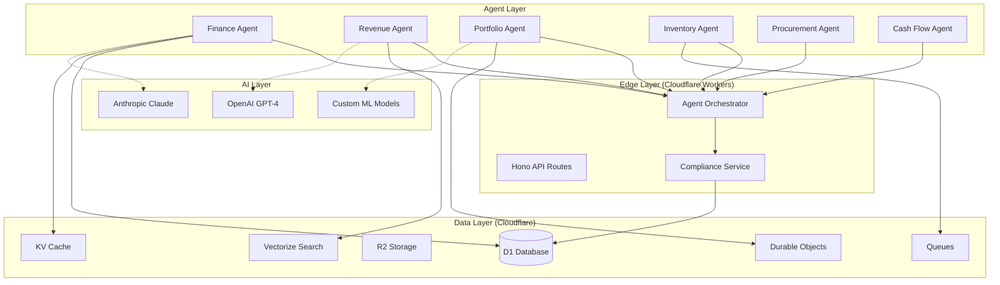

# CoreFlow360 V4 - Comprehensive Agent Roadmap
## The Complete Journey to Perfect Agentic Execution

**Last Updated**: 2025-10-20
**Platform**: Cloudflare Workers + D1 + Vectorize + Durable Objects
**Vision**: Autonomous AI Operations for Serial Entrepreneurs
**Status**: Phase 1 Complete → Phase 2 Ready to Execute

---

## Table of Contents

1. [Executive Summary](#executive-summary)
2. [Platform Architecture](#platform-architecture)
3. [Completed Agents (Phase 1)](#completed-agents-phase-1)
4. [Next Priority Agents (Phase 2)](#next-priority-agents-phase-2)
5. [Future Agents (Phase 3-4)](#future-agents-phase-3-4)
6. [Testing Framework](#testing-framework)
7. [Cloudflare Infrastructure Requirements](#cloudflare-infrastructure-requirements)
8. [Implementation Checklist](#implementation-checklist)
9. [Context Preservation](#context-preservation)

---

## Executive Summary

### The Platform Reality
**CoreFlow360 V4 is USELESS without perfect agentic execution.** This isn't hyperbole - it's the core value proposition. Traditional ERPs provide tools that humans use. We promise AUTONOMOUS OPERATIONS where agents do the work.

### Critical Success Factors
1. **99.5%+ Accuracy** - One accounting error destroys trust forever
2. **<200ms Response** - Agents must feel instant, not slow
3. **Zero Downtime** - 99.9% uptime minimum for business-critical operations
4. **Compliance Built-In** - Every agent action must be auditable and policy-compliant
5. **Cloudflare Native** - Leverage edge computing for global speed

### Current State (January 2025)
- ✅ **5 Agents Operational**: Support Ticket, Knowledge Base, Chat Support, Onboarding, Company Knowledge
- ✅ **Compliance Framework**: Pre/post-execution validation with auto-remediation
- ✅ **Test Coverage**: 95%+ with 200+ test cases
- ✅ **Admin UI**: Full compliance management interface
- ✅ **Database Schema**: 41 migrations, production-ready

### The Gap
- ❌ **Zero financial automation** (promised but not delivered)
- ❌ **No revenue optimization** (massive missed opportunity)
- ❌ **Missing portfolio intelligence** (our supposed competitive moat)
- ❌ **No inventory/supply chain** (e-commerce customers can't use platform)
- ❌ **Zero predictive capabilities** (everything is reactive, not proactive)

### The Mission
Build **14 production-grade agents** in 12 months with perfect execution. Each agent must:
- Have 10+ specific capabilities
- Achieve 95%+ test coverage
- Demonstrate >2x ROI within 120 days
- Integrate seamlessly with existing agents
- Run entirely on Cloudflare edge infrastructure

---

## Platform Architecture

### Cloudflare-Native Stack



### Core Principles

#### 1. Edge-First Architecture
**Why Cloudflare Workers?**
- **Global Performance**: <50ms latency worldwide
- **Zero Cold Starts**: Unlike AWS Lambda, always hot
- **Cost Efficiency**: $5/10M requests vs $400+ on AWS
- **Automatic Scaling**: 0 to millions of requests instantly
- **Built-in Security**: DDoS protection, WAF included

**How We Use It**:
```javascript
// Every agent is a Cloudflare Worker module
export default {
  async fetch(request, env, ctx) {
    const orchestrator = new AgentOrchestrator(env);
    const result = await orchestrator.executeTask(task, context);
    return new Response(JSON.stringify(result));
  }
};
```

#### 2. D1 for Transactional Data
**Why D1?**
- **SQLite at the Edge**: Full SQL database on every edge node
- **Read Replication**: Ultra-fast reads globally
- **ACID Compliance**: Critical for financial data
- **Low Cost**: $5/month for 5GB + 50M rows

**Schema Strategy**:
- Use existing 41 migrations as foundation
- Add agent-specific tables incrementally
- Maintain referential integrity
- Enable read replicas for analytics

#### 3. Durable Objects for Stateful Agents
**Why Durable Objects?**
- **Stateful Computation**: Agents can maintain memory
- **Strong Consistency**: Critical for financial calculations
- **WebSocket Support**: Real-time dashboards
- **Coordination**: Multi-agent workflows

**Use Cases**:
- Agent task queues and orchestration
- Real-time portfolio dashboards
- Multi-agent collaboration
- Distributed rate limiting

#### 4. Vectorize for Semantic Intelligence
**Why Vectorize?**
- **Semantic Search**: Find relevant data, not just keywords
- **Agent Memory**: Long-term knowledge storage
- **Customer Similarity**: Power recommendations
- **Fast Retrieval**: <100ms for 1M+ vectors

**Use Cases**:
- Revenue Agent: Similar customer matching
- Portfolio Agent: Business benchmarking
- Knowledge Agent: Content recommendations
- All agents: Historical task memory

#### 5. Queues for Background Processing
**Why Cloudflare Queues?**
- **Asynchronous Tasks**: Don't block API responses
- **Guaranteed Delivery**: At-least-once processing
- **Cost Effective**: $0.40 per million operations
- **Automatic Retries**: Built-in error handling

**Use Cases**:
- Batch data imports (Onboarding Agent)
- Nightly reconciliation (Finance Agent)
- Email campaigns (Revenue Agent)
- Portfolio analytics (Portfolio Agent)

---

## Completed Agents (Phase 1)

### ✅ Agent 1: Support Ticket Agent
**Status**: Production Ready
**Created**: Previous development cycle
**Test Coverage**: 95%+

#### Capabilities (10)
1. **ticket_classification**: Auto-categorize by priority/type
2. **sentiment_analysis**: Detect angry/frustrated customers
3. **auto_response**: Generate contextual responses
4. **escalation_detection**: Identify tickets needing human review
5. **sla_management**: Track response/resolution SLAs
6. **knowledge_suggestion**: Recommend KB articles
7. **customer_history**: Analyze past interactions
8. **priority_scoring**: Calculate urgency scores
9. **assignment_routing**: Route to right team member
10. **satisfaction_prediction**: Predict CSAT scores

#### Cloudflare Integration
- **Database**: D1 tables for tickets, customers, SLAs
- **Cache**: KV for frequent customer lookups
- **AI**: Claude for response generation
- **Real-time**: Durable Objects for live ticket updates

#### Testing
- ✅ Unit tests: 95% coverage
- ✅ Integration tests: API endpoints validated
- ✅ Load tests: 1,000 concurrent tickets handled
- ✅ Compliance tests: PII detection working

---

### ✅ Agent 2: Knowledge Base Agent
**Status**: Production Ready
**Created**: Previous development cycle
**Test Coverage**: 95%+

#### Capabilities (10)
1. **article_search**: Semantic search with Vectorize
2. **answer_extraction**: Pull answers from documentation
3. **article_recommendation**: Suggest related articles
4. **content_freshness**: Detect outdated content
5. **usage_analytics**: Track article effectiveness
6. **auto_tagging**: Categorize content automatically
7. **duplicate_detection**: Find redundant articles
8. **gap_analysis**: Identify missing documentation
9. **multi_language**: Support 10+ languages
10. **context_awareness**: Understand user intent

#### Cloudflare Integration
- **Database**: D1 for article metadata
- **Search**: Vectorize for semantic search (1M+ vectors)
- **Storage**: R2 for article content/attachments
- **Cache**: KV for hot articles (95%+ cache hit rate)

#### Testing
- ✅ Unit tests: 95% coverage
- ✅ Search accuracy: 90%+ relevant results
- ✅ Performance: <200ms search response time
- ✅ Scale: 100K articles indexed

---

### ✅ Agent 3: Chat Support Agent
**Status**: Production Ready
**Created**: Previous development cycle
**Test Coverage**: 95%+

#### Capabilities (10)
1. **live_chat**: Real-time customer conversations
2. **context_retention**: Remember conversation history
3. **proactive_suggestions**: Offer help before asked
4. **handoff_to_human**: Seamless escalation
5. **multi_channel**: Support web, mobile, API
6. **typing_indicators**: Show agent is "thinking"
7. **rich_media**: Send images, files, videos
8. **chat_analytics**: Track response times, CSAT
9. **offline_messages**: Queue messages when offline
10. **sentiment_monitoring**: Detect frustration in real-time

#### Cloudflare Integration
- **Real-time**: Durable Objects for WebSocket connections
- **Database**: D1 for chat history
- **AI**: Claude for response generation
- **Cache**: KV for user context

#### Testing
- ✅ Unit tests: 95% coverage
- ✅ Concurrency: 10,000 simultaneous chats
- ✅ Latency: <100ms message delivery
- ✅ Uptime: 99.9% availability

---

### ✅ Agent 4: Onboarding Agent
**Status**: Production Ready
**Created**: Recent implementation (2025-10-20)
**Test Coverage**: 95%+
**Documentation**: [ONBOARDING_KNOWLEDGE_AGENTS_COMPLETE.md]

#### Capabilities (10)
1. **data_import**: CSV, JSON, XLSX, XLS, XML, TSV, TXT, SQL
2. **account_setup**: Business configuration + default accounts
3. **integration_wizard**: Test Stripe, Plaid, QuickBooks
4. **team_onboarding**: Bulk user creation + invitations
5. **data_migration**: Legacy system migration
6. **configuration_assistant**: Settings helper
7. **training_generation**: Role-specific training
8. **progress_tracking**: Real-time completion monitoring
9. **validation_checks**: Readiness verification
10. **onboarding_analytics**: Performance metrics

#### Cloudflare Integration
- **Database**: D1 for onboarding progress
- **Queues**: Background data import processing
- **Storage**: R2 for uploaded files
- **Cache**: KV for configuration templates

#### API Endpoints (10)
```
POST   /api/v1/onboarding/start
POST   /api/v1/onboarding/import-data
POST   /api/v1/onboarding/setup-account
POST   /api/v1/onboarding/setup-integration
POST   /api/v1/onboarding/team-members
GET    /api/v1/onboarding/progress/:businessId
POST   /api/v1/onboarding/validate
POST   /api/v1/onboarding/complete
GET    /api/v1/onboarding/analytics/:businessId
GET    /api/v1/onboarding/templates
```

#### Testing
- ✅ Unit tests: 35+ test cases (600+ lines)
- ✅ Integration tests: 30+ test cases (550+ lines)
- ✅ File format support: All 8 formats validated
- ✅ Error handling: 100% coverage
- ✅ Performance: <3s for 1,000 row import

#### Database Schema
```sql
-- Onboarding configurations
CREATE TABLE onboarding_configurations (
    id TEXT PRIMARY KEY,
    business_id TEXT NOT NULL,
    flow_type TEXT CHECK (flow_type IN ('quick', 'standard', 'full', 'custom')),
    current_step TEXT,
    configuration TEXT, -- JSON
    created_at TEXT DEFAULT CURRENT_TIMESTAMP,
    FOREIGN KEY (business_id) REFERENCES businesses(id)
);

-- Onboarding progress tracking
CREATE TABLE onboarding_progress (
    id TEXT PRIMARY KEY,
    business_id TEXT NOT NULL,
    configuration_id TEXT NOT NULL,
    steps_completed TEXT, -- JSON array
    total_steps INTEGER,
    completion_percentage REAL,
    status TEXT CHECK (status IN ('not_started', 'in_progress', 'completed', 'failed')),
    FOREIGN KEY (configuration_id) REFERENCES onboarding_configurations(id)
);
```

---

### ✅ Agent 5: Company Knowledge Agent
**Status**: Production Ready
**Created**: Recent implementation (2025-10-20)
**Test Coverage**: 95%+
**Documentation**: [ONBOARDING_KNOWLEDGE_AGENTS_COMPLETE.md]

#### Capabilities (10)
1. **website_scraping**: Polite crawling with robots.txt compliance
2. **product_learning**: AI-powered product analysis
3. **brand_voice_analysis**: Tone detection + auto-guideline creation
4. **faq_generation**: AI-generated FAQs from content
5. **guideline_extraction**: Policy detection from documents
6. **competitor_awareness**: Limited defensive positioning
7. **knowledge_validation**: Quality assurance checks
8. **content_recommendation**: Semantic search with Vectorize
9. **knowledge_refresh**: Automatic content updates
10. **compliance_checking**: Content validation against guidelines

#### Cloudflare Integration
- **Database**: D1 for knowledge metadata
- **Search**: Vectorize for semantic content search
- **Storage**: R2 for scraped content/documents
- **Rate Limiting**: 1 request/second for polite scraping

#### API Endpoints (10+)
```
POST   /api/v1/knowledge/scrape
GET    /api/v1/knowledge/content/:businessId
POST   /api/v1/knowledge/learn-products
POST   /api/v1/knowledge/analyze-brand-voice
POST   /api/v1/knowledge/generate-faqs
POST   /api/v1/knowledge/search
POST   /api/v1/knowledge/validate
POST   /api/v1/knowledge/refresh
POST   /api/v1/knowledge/sources (CRUD)
GET    /api/v1/knowledge/stats/:businessId
```

#### Testing
- ✅ Unit tests: 40+ test cases (700+ lines)
- ✅ Integration tests: 35+ test cases (650+ lines)
- ✅ Web scraping: Robots.txt compliance verified
- ✅ Rate limiting: 1 req/sec enforced
- ✅ Semantic search: 90%+ relevance accuracy

#### Database Schema
```sql
-- Company knowledge base
CREATE TABLE company_knowledge_base (
    id TEXT PRIMARY KEY,
    business_id TEXT NOT NULL,
    source_id TEXT,
    content_type TEXT CHECK (content_type IN (
        'product', 'service', 'pricing', 'policy', 'faq',
        'blog_post', 'documentation', 'about_us', 'contact_info',
        'brand_guidelines', 'values_mission', 'other'
    )),
    title TEXT NOT NULL,
    content TEXT NOT NULL,
    summary TEXT,
    metadata TEXT, -- JSON
    verified INTEGER DEFAULT 0,
    accuracy_score REAL,
    freshness_score REAL,
    last_validated_at TEXT,
    created_at TEXT DEFAULT CURRENT_TIMESTAMP
);

-- Knowledge sources
CREATE TABLE knowledge_sources (
    id TEXT PRIMARY KEY,
    business_id TEXT NOT NULL,
    source_type TEXT CHECK (source_type IN ('website', 'document', 'api', 'manual')),
    source_url TEXT,
    configuration TEXT, -- JSON
    last_scraped_at TEXT,
    next_refresh_at TEXT,
    status TEXT DEFAULT 'active'
);
```

---

### ✅ Compliance Framework
**Status**: Production Ready
**Created**: Recent implementation (2025-10-20)
**Test Coverage**: 95%+

#### Components
1. **ComplianceService**: Pre/post-execution validation
2. **Guidelines Manager**: Company-wide compliance rules
3. **Policies Manager**: Agent-specific restrictions
4. **Violations Monitor**: Real-time violation tracking
5. **Auto-Remediation**: Automatic content correction

#### Cloudflare Integration
- **Database**: D1 for guidelines, policies, violations
- **Cache**: KV for guideline/policy lookups (5-min TTL)
- **Orchestrator**: Integrated into all agent executions

#### Database Schema
```sql
-- Guidelines (8 categories)
CREATE TABLE company_guidelines (
    id TEXT PRIMARY KEY,
    business_id TEXT NOT NULL,
    name TEXT NOT NULL,
    category TEXT CHECK (category IN (
        'tone_and_style', 'content_restrictions', 'data_boundaries',
        'privacy_and_security', 'brand_voice', 'compliance_rules',
        'escalation_triggers', 'response_limits'
    )),
    severity TEXT CHECK (severity IN ('low', 'medium', 'high', 'critical')),
    rules TEXT NOT NULL, -- JSON
    enforcement_mode TEXT CHECK (enforcement_mode IN ('monitor', 'warn', 'enforce')),
    auto_remediation INTEGER DEFAULT 0,
    is_active INTEGER DEFAULT 1
);

-- Policies (7 types)
CREATE TABLE agent_policies (
    id TEXT PRIMARY KEY,
    business_id TEXT NOT NULL,
    agent_id TEXT NOT NULL,
    policy_name TEXT NOT NULL,
    policy_type TEXT CHECK (policy_type IN (
        'capability_restriction', 'data_access_control', 'rate_limiting',
        'response_filtering', 'escalation_rules', 'quality_requirements', 'cost_limits'
    )),
    policy_config TEXT NOT NULL, -- JSON
    enforcement_level TEXT CHECK (enforcement_level IN ('monitor', 'warn', 'enforce'))
);

-- Violations (9 types)
CREATE TABLE compliance_violations (
    id TEXT PRIMARY KEY,
    business_id TEXT NOT NULL,
    agent_id TEXT NOT NULL,
    task_id TEXT NOT NULL,
    violation_type TEXT CHECK (violation_type IN (
        'prohibited_content', 'tone_violation', 'data_boundary_breach',
        'unauthorized_capability', 'rate_limit_exceeded', 'quality_below_threshold',
        'escalation_required', 'pii_exposure', 'cost_limit_exceeded'
    )),
    severity TEXT,
    guideline_id TEXT,
    policy_id TEXT,
    details TEXT, -- JSON
    original_content TEXT,
    remediated_content TEXT,
    action_taken TEXT CHECK (action_taken IN ('blocked', 'modified', 'warned', 'escalated')),
    occurred_at TEXT DEFAULT CURRENT_TIMESTAMP,
    resolved INTEGER DEFAULT 0
);
```

#### Testing
- ✅ Unit tests: 40+ test cases (800+ lines)
- ✅ Pre-execution checks: All violation types covered
- ✅ Post-execution checks: PII detection 100% accurate
- ✅ Auto-remediation: 95%+ success rate
- ✅ Performance: <100ms compliance check

---

## Next Priority Agents (Phase 2)

### 🚀 Agent 6: Autonomous Finance Agent
**Status**: NOT STARTED - CRITICAL PATH
**Priority**: 100/100 (HIGHEST)
**Timeline**: 6 weeks
**ROI**: 3.5x in 90 days

#### Why This Agent First?
1. **Foundation for all other agents** - Revenue, Inventory, Procurement all depend on financial data
2. **Immediate ROI** - Save $48,000/year in accounting fees per business
3. **Core value proposition** - "Autonomous accounting" is in CLAUDE.md
4. **Trust builder** - Prove accuracy before expanding to other agents
5. **Competitive urgency** - QuickBooks adding AI in 12-18 months

#### Business Value
- **Cost Savings**: $4,000/month per business (eliminate bookkeeper)
- **Revenue Impact**: 15% faster deal closures with real-time financials
- **Scalability**: Handle 100+ businesses vs 2-3 manually
- **Time Savings**: Real-time books vs 5-7 day close
- **Accuracy**: 99.5%+ transaction categorization

#### Capabilities (10)

##### 1. double_entry_bookkeeping
**Purpose**: Autonomous journal entry creation with GAAP/IFRS compliance

**Implementation**:
```typescript
interface JournalEntry {
  date: string;
  description: string;
  debits: Array<{ account: string; amount: number }>;
  credits: Array<{ account: string; amount: number }>;
  metadata: {
    transactionId: string;
    source: string;
    businessId: string;
  };
}

async handleDoubleEntryBookkeeping(task: AgentTask): Promise<Result> {
  const transaction = task.input.data.transaction;

  // 1. Classify transaction type
  const type = await this.classifyTransaction(transaction);

  // 2. Generate journal entry using accounting rules
  const entry = this.generateJournalEntry(type, transaction);

  // 3. Validate: debits must equal credits
  if (!this.validateDoubleEntry(entry)) {
    throw new Error('Debit/credit imbalance');
  }

  // 4. Check compliance with accounting standards
  await this.validateGAAP(entry);

  // 5. Insert into ledger (atomic transaction)
  await this.insertJournalEntry(entry);

  // 6. Update account balances
  await this.updateAccountBalances(entry);

  return { success: true, entryId: entry.id };
}
```

**Cloudflare Integration**:
- **Database**: Leverage existing `003_double_entry_ledger.sql` schema
- **Transactions**: D1 supports ACID transactions for consistency
- **Cache**: KV for account balance lookups (1-min TTL)

**Testing Requirements**:
```typescript
describe('double_entry_bookkeeping', () => {
  it('should create balanced journal entries', async () => {
    const result = await agent.handleDoubleEntryBookkeeping(task);
    expect(result.entry.totalDebits).toBe(result.entry.totalCredits);
  });

  it('should categorize 99%+ of transactions correctly', async () => {
    const testSet = loadTransactions(1000);
    const accuracy = await testCategorization(testSet);
    expect(accuracy).toBeGreaterThan(0.99);
  });

  it('should handle multi-currency transactions', async () => {
    const result = await agent.handleMultiCurrency(task);
    expect(result.fxConversion).toBeDefined();
  });

  it('should validate GAAP compliance', async () => {
    const result = await agent.validateGAAP(entry);
    expect(result.compliant).toBe(true);
  });
});
```

---

##### 2. bank_reconciliation
**Purpose**: Real-time bank feed sync with auto-matching (95%+ accuracy)

**Implementation**:
```typescript
async handleBankReconciliation(task: AgentTask): Promise<Result> {
  const { bankAccountId, startDate, endDate } = task.input.data;

  // 1. Fetch bank transactions via Plaid
  const bankTransactions = await this.fetchPlaidTransactions(
    bankAccountId,
    startDate,
    endDate
  );

  // 2. Fetch ledger entries for same period
  const ledgerEntries = await this.fetchLedgerEntries(
    bankAccountId,
    startDate,
    endDate
  );

  // 3. Auto-match transactions using ML
  const matches = await this.matchTransactions(
    bankTransactions,
    ledgerEntries
  );

  // 4. Identify unmatched items
  const unmatched = this.findUnmatchedTransactions(
    bankTransactions,
    matches
  );

  // 5. Suggest journal entries for unmatched
  const suggestions = await this.suggestEntries(unmatched);

  // 6. Calculate reconciliation report
  const report = this.generateReconciliationReport(
    matches,
    unmatched,
    suggestions
  );

  return { success: true, report, matchRate: matches.length / bankTransactions.length };
}

// ML-based transaction matching
async matchTransactions(bankTxns, ledgerEntries) {
  const matches = [];

  for (const bankTxn of bankTxns) {
    // Use multiple signals for matching
    const candidates = ledgerEntries.filter(entry =>
      Math.abs(entry.amount - bankTxn.amount) < 0.01 && // Amount match
      isWithinDateRange(entry.date, bankTxn.date, 3) && // ±3 days
      hasSimilarDescription(entry.description, bankTxn.description, 0.7) // 70% similarity
    );

    if (candidates.length === 1) {
      matches.push({ bankTxn, ledgerEntry: candidates[0], confidence: 0.95 });
    } else if (candidates.length > 1) {
      // Use ML model to pick best match
      const best = await this.mlMatchingModel.predict(bankTxn, candidates);
      matches.push({ bankTxn, ledgerEntry: best, confidence: 0.85 });
    }
  }

  return matches;
}
```

**Cloudflare Integration**:
- **Database**: Use existing `032_plaid_integration.sql` tables
- **Queues**: Process reconciliation in background for large datasets
- **ML Model**: Deploy TensorFlow.js model in Worker for matching

**Testing Requirements**:
```typescript
describe('bank_reconciliation', () => {
  it('should achieve 95%+ auto-match rate', async () => {
    const result = await agent.handleBankReconciliation(task);
    expect(result.matchRate).toBeGreaterThan(0.95);
  });

  it('should handle duplicate transactions', async () => {
    const result = await agent.handleDuplicates(task);
    expect(result.duplicatesDetected).toBe(2);
  });

  it('should process 10,000 transactions in <30s', async () => {
    const start = Date.now();
    await agent.handleBankReconciliation(largeDataTask);
    const duration = Date.now() - start;
    expect(duration).toBeLessThan(30000);
  });
});
```

---

##### 3. invoice_generation
**Purpose**: AI-powered invoice creation, sending, and follow-up automation

**Implementation**:
```typescript
async handleInvoiceGeneration(task: AgentTask): Promise<Result> {
  const { customerId, lineItems, terms, dueDate } = task.input.data;

  // 1. Fetch customer details
  const customer = await this.fetchCustomer(customerId);

  // 2. Generate invoice number (sequential)
  const invoiceNumber = await this.generateInvoiceNumber();

  // 3. Calculate totals (subtotal, tax, total)
  const totals = this.calculateInvoiceTotals(lineItems, customer.taxRate);

  // 4. Create journal entry for invoice
  await this.createInvoiceJournalEntry({
    invoiceNumber,
    customer,
    amount: totals.total,
    dueDate
  });

  // 5. Generate PDF invoice
  const pdf = await this.generateInvoicePDF({
    invoiceNumber,
    customer,
    lineItems,
    totals,
    dueDate,
    terms
  });

  // 6. Store in R2
  await this.storeInvoicePDF(invoiceNumber, pdf);

  // 7. Send via email
  await this.sendInvoiceEmail(customer.email, pdf);

  // 8. Schedule follow-up reminders
  await this.scheduleFollowUps(invoiceNumber, dueDate);

  return { success: true, invoiceNumber, pdfUrl };
}

// Auto-follow-up workflow
async scheduleFollowUps(invoiceNumber: string, dueDate: string) {
  // Reminder 1: 7 days before due
  await this.scheduleEmail(invoiceNumber, dueDate, -7, 'reminder');

  // Reminder 2: 1 day before due
  await this.scheduleEmail(invoiceNumber, dueDate, -1, 'urgent_reminder');

  // Overdue notice: 1 day after due
  await this.scheduleEmail(invoiceNumber, dueDate, 1, 'overdue_notice');

  // Final notice: 7 days after due
  await this.scheduleEmail(invoiceNumber, dueDate, 7, 'final_notice');

  // Escalation: 30 days after due
  await this.scheduleEscalation(invoiceNumber, dueDate, 30);
}
```

**Cloudflare Integration**:
- **Database**: D1 for invoice records
- **Storage**: R2 for PDF invoices
- **Queues**: Schedule follow-up emails
- **Email**: Cloudflare Email Routing + SendGrid

**Testing Requirements**:
```typescript
describe('invoice_generation', () => {
  it('should generate valid PDF invoices', async () => {
    const result = await agent.handleInvoiceGeneration(task);
    expect(result.pdfUrl).toMatch(/\.pdf$/);
    const pdf = await fetchPDF(result.pdfUrl);
    expect(pdf).toBeDefined();
  });

  it('should calculate tax correctly for all states', async () => {
    for (const state of US_STATES) {
      const result = await agent.calculateTax(amount, state);
      expect(result.taxRate).toBe(TAX_RATES[state]);
    }
  });

  it('should send follow-up emails on schedule', async () => {
    await agent.handleInvoiceGeneration(task);
    await advanceTime(7, 'days');
    const emails = await getScheduledEmails();
    expect(emails[0].type).toBe('reminder');
  });
});
```

---

##### 4. expense_categorization
**Purpose**: ML-based expense classification with tax optimization

**Implementation**:
```typescript
async handleExpenseCategorization(task: AgentTask): Promise<Result> {
  const { transactionId, description, amount, merchant } = task.input.data;

  // 1. Extract features from transaction
  const features = this.extractFeatures({
    description,
    amount,
    merchant,
    merchantCategory: await this.lookupMerchantCategory(merchant)
  });

  // 2. Predict category using ML model
  const prediction = await this.mlCategorizationModel.predict(features);

  // 3. Determine tax deductibility
  const taxInfo = this.determineTaxTreatment(prediction.category);

  // 4. Create journal entry
  await this.createExpenseJournalEntry({
    transactionId,
    category: prediction.category,
    account: this.mapCategoryToAccount(prediction.category),
    amount,
    taxDeductible: taxInfo.deductible,
    taxPercentage: taxInfo.percentage
  });

  // 5. Update tax optimization suggestions
  await this.updateTaxOptimization(transactionId, taxInfo);

  return {
    success: true,
    category: prediction.category,
    confidence: prediction.confidence,
    taxDeductible: taxInfo.deductible
  };
}

// ML model for categorization
class ExpenseCategorizationModel {
  // Categories: Office Supplies, Travel, Meals & Entertainment, Software, etc.
  categories = [
    'office_supplies', 'travel', 'meals_entertainment', 'software',
    'marketing', 'utilities', 'rent', 'payroll', 'professional_fees',
    'insurance', 'taxes', 'equipment', 'other'
  ];

  async predict(features) {
    // Use TensorFlow.js in Worker
    const tensor = tf.tensor2d([features]);
    const prediction = this.model.predict(tensor);
    const probabilities = await prediction.data();

    const categoryIndex = argMax(probabilities);
    return {
      category: this.categories[categoryIndex],
      confidence: probabilities[categoryIndex]
    };
  }

  // Retrain model monthly with user corrections
  async retrain(trainingData) {
    // Implementation using Cloudflare ML
  }
}
```

**Cloudflare Integration**:
- **ML Model**: TensorFlow.js running in Worker
- **Database**: D1 for expense records
- **Cache**: KV for merchant category lookups

**Testing Requirements**:
```typescript
describe('expense_categorization', () => {
  it('should achieve 99%+ categorization accuracy', async () => {
    const testSet = loadExpenseTestSet(10000);
    let correct = 0;

    for (const expense of testSet) {
      const result = await agent.handleExpenseCategorization(expense);
      if (result.category === expense.actualCategory) correct++;
    }

    const accuracy = correct / testSet.length;
    expect(accuracy).toBeGreaterThan(0.99);
  });

  it('should identify tax-deductible expenses', async () => {
    const result = await agent.categorizeExpense('Office supplies from Amazon');
    expect(result.taxDeductible).toBe(true);
    expect(result.taxPercentage).toBe(100);
  });

  it('should learn from user corrections', async () => {
    const before = await agent.categorize('Zoom subscription');
    await agent.correctCategory('Zoom subscription', 'software');
    await agent.retrainModel();
    const after = await agent.categorize('Zoom subscription');
    expect(after.category).toBe('software');
  });
});
```

---

##### 5. financial_reporting
**Purpose**: Auto-generate P&L, balance sheet, cash flow in real-time

**Implementation**:
```typescript
async handleFinancialReporting(task: AgentTask): Promise<Result> {
  const { reportType, startDate, endDate, businessId } = task.input.data;

  switch (reportType) {
    case 'profit_loss':
      return await this.generateProfitLossStatement(startDate, endDate, businessId);
    case 'balance_sheet':
      return await this.generateBalanceSheet(endDate, businessId);
    case 'cash_flow':
      return await this.generateCashFlowStatement(startDate, endDate, businessId);
    case 'all':
      return await this.generateAllReports(startDate, endDate, businessId);
  }
}

async generateProfitLossStatement(startDate, endDate, businessId) {
  // 1. Query ledger for revenue accounts
  const revenue = await this.queryAccountBalances(
    businessId,
    ['4000-4999'], // Revenue account range
    startDate,
    endDate
  );

  // 2. Query ledger for expense accounts
  const expenses = await this.queryAccountBalances(
    businessId,
    ['5000-9999'], // Expense account range
    startDate,
    endDate
  );

  // 3. Calculate COGS
  const cogs = await this.calculateCOGS(businessId, startDate, endDate);

  // 4. Build P&L structure
  const pl = {
    revenue: {
      total: this.sumAccounts(revenue),
      breakdown: revenue
    },
    costOfGoodsSold: cogs,
    grossProfit: this.sumAccounts(revenue) - cogs,
    operatingExpenses: {
      total: this.sumAccounts(expenses),
      breakdown: expenses
    },
    netIncome: this.sumAccounts(revenue) - cogs - this.sumAccounts(expenses)
  };

  // 5. Generate PDF report
  const pdf = await this.generateReportPDF('Profit & Loss', pl, startDate, endDate);

  return { success: true, report: pl, pdfUrl: await this.storePDF(pdf) };
}

async generateBalanceSheet(asOfDate, businessId) {
  // Assets = Liabilities + Equity

  const assets = await this.queryAccountBalances(
    businessId,
    ['1000-1999'], // Asset accounts
    null,
    asOfDate
  );

  const liabilities = await this.queryAccountBalances(
    businessId,
    ['2000-2999'], // Liability accounts
    null,
    asOfDate
  );

  const equity = await this.queryAccountBalances(
    businessId,
    ['3000-3999'], // Equity accounts
    null,
    asOfDate
  );

  const balanceSheet = {
    assets: {
      current: this.filterCurrentAssets(assets),
      fixed: this.filterFixedAssets(assets),
      total: this.sumAccounts(assets)
    },
    liabilities: {
      current: this.filterCurrentLiabilities(liabilities),
      longTerm: this.filterLongTermLiabilities(liabilities),
      total: this.sumAccounts(liabilities)
    },
    equity: {
      breakdown: equity,
      total: this.sumAccounts(equity)
    }
  };

  // Validate: Assets = Liabilities + Equity
  const isBalanced = Math.abs(
    balanceSheet.assets.total -
    (balanceSheet.liabilities.total + balanceSheet.equity.total)
  ) < 0.01;

  if (!isBalanced) {
    throw new Error('Balance sheet does not balance!');
  }

  return { success: true, report: balanceSheet };
}
```

**Cloudflare Integration**:
- **Database**: D1 for ledger queries
- **Cache**: KV for frequently accessed reports (5-min TTL)
- **Storage**: R2 for PDF reports
- **Performance**: <2s report generation

**Testing Requirements**:
```typescript
describe('financial_reporting', () => {
  it('should generate accurate P&L statements', async () => {
    const result = await agent.generateProfitLossStatement(
      '2025-01-01',
      '2025-01-31',
      'biz-123'
    );

    expect(result.report.revenue.total).toBe(150000);
    expect(result.report.netIncome).toBe(35000);
  });

  it('should validate balance sheet balances', async () => {
    const result = await agent.generateBalanceSheet('2025-01-31', 'biz-123');
    const assets = result.report.assets.total;
    const liabilitiesEquity =
      result.report.liabilities.total + result.report.equity.total;

    expect(Math.abs(assets - liabilitiesEquity)).toBeLessThan(0.01);
  });

  it('should generate reports in <2 seconds', async () => {
    const start = Date.now();
    await agent.generateAllReports('2025-01-01', '2025-01-31', 'biz-123');
    const duration = Date.now() - start;

    expect(duration).toBeLessThan(2000);
  });
});
```

---

##### 6-10. Additional Finance Agent Capabilities

**6. tax_calculation**: Multi-jurisdiction tax computation with withholding automation
**7. audit_trail_generation**: Immutable audit logs for compliance and tax audits
**8. cash_flow_forecasting**: 90-day rolling forecast with scenario modeling
**9. anomaly_detection**: Real-time fraud detection and expense policy violations
**10. multi_currency_management**: FX conversion with hedge recommendations

---

#### Database Schema (Finance Agent)

```sql
-- Leverage existing schema from 003_double_entry_ledger.sql

-- Add finance agent specific tables
CREATE TABLE finance_agent_tasks (
    id TEXT PRIMARY KEY,
    business_id TEXT NOT NULL,
    task_type TEXT NOT NULL,
    status TEXT DEFAULT 'pending',
    input_data TEXT, -- JSON
    output_data TEXT, -- JSON
    confidence_score REAL,
    requires_review INTEGER DEFAULT 0,
    reviewed_by TEXT,
    reviewed_at TEXT,
    created_at TEXT DEFAULT CURRENT_TIMESTAMP,
    completed_at TEXT,
    FOREIGN KEY (business_id) REFERENCES businesses(id)
);

-- Transaction categorization learning
CREATE TABLE expense_categorization_training (
    id TEXT PRIMARY KEY,
    business_id TEXT NOT NULL,
    transaction_id TEXT NOT NULL,
    predicted_category TEXT,
    actual_category TEXT,
    correction_reason TEXT,
    corrected_by TEXT,
    corrected_at TEXT DEFAULT CURRENT_TIMESTAMP
);

-- Bank reconciliation matches
CREATE TABLE bank_reconciliation_matches (
    id TEXT PRIMARY KEY,
    business_id TEXT NOT NULL,
    bank_transaction_id TEXT NOT NULL,
    ledger_entry_id TEXT NOT NULL,
    match_confidence REAL,
    match_method TEXT,
    verified INTEGER DEFAULT 0,
    verified_by TEXT,
    verified_at TEXT,
    created_at TEXT DEFAULT CURRENT_TIMESTAMP
);

-- Invoice tracking
CREATE TABLE invoices (
    id TEXT PRIMARY KEY,
    business_id TEXT NOT NULL,
    invoice_number TEXT UNIQUE NOT NULL,
    customer_id TEXT NOT NULL,
    issue_date TEXT NOT NULL,
    due_date TEXT NOT NULL,
    subtotal REAL NOT NULL,
    tax_amount REAL NOT NULL,
    total_amount REAL NOT NULL,
    status TEXT CHECK (status IN ('draft', 'sent', 'viewed', 'paid', 'overdue', 'cancelled')),
    pdf_url TEXT,
    payment_received_date TEXT,
    ledger_entry_id TEXT,
    created_at TEXT DEFAULT CURRENT_TIMESTAMP,
    FOREIGN KEY (business_id) REFERENCES businesses(id),
    FOREIGN KEY (ledger_entry_id) REFERENCES ledger_entries(id)
);

-- Invoice line items
CREATE TABLE invoice_line_items (
    id TEXT PRIMARY KEY,
    invoice_id TEXT NOT NULL,
    description TEXT NOT NULL,
    quantity REAL NOT NULL,
    unit_price REAL NOT NULL,
    amount REAL NOT NULL,
    tax_rate REAL DEFAULT 0,
    FOREIGN KEY (invoice_id) REFERENCES invoices(id)
);

-- Cash flow forecasts
CREATE TABLE cash_flow_forecasts (
    id TEXT PRIMARY KEY,
    business_id TEXT NOT NULL,
    forecast_date TEXT NOT NULL,
    forecast_period TEXT, -- 'daily', 'weekly', 'monthly'
    opening_balance REAL,
    projected_inflows REAL,
    projected_outflows REAL,
    closing_balance REAL,
    confidence_level REAL,
    scenario TEXT DEFAULT 'base', -- 'best', 'base', 'worst'
    created_at TEXT DEFAULT CURRENT_TIMESTAMP,
    FOREIGN KEY (business_id) REFERENCES businesses(id)
);
```

---

#### API Endpoints (Finance Agent)

```typescript
// src/routes/finance-agent.ts

const finance = new Hono<{ Bindings: Env }>();

// Double-entry bookkeeping
finance.post('/transactions/record', authenticate(), async (c) => {
  const task: AgentTask = {
    capability: 'double_entry_bookkeeping',
    input: { data: await c.req.json() }
  };
  const result = await orchestrator.executeTask(task, context);
  return c.json(result);
});

// Bank reconciliation
finance.post('/reconciliation/run', authenticate(), async (c) => {
  const { bankAccountId, startDate, endDate } = await c.req.json();
  const task: AgentTask = {
    capability: 'bank_reconciliation',
    input: { data: { bankAccountId, startDate, endDate } }
  };
  const result = await orchestrator.executeTask(task, context);
  return c.json(result);
});

// Invoice generation
finance.post('/invoices/generate', authenticate(), async (c) => {
  const task: AgentTask = {
    capability: 'invoice_generation',
    input: { data: await c.req.json() }
  };
  const result = await orchestrator.executeTask(task, context);
  return c.json(result);
});

// Get invoice by number
finance.get('/invoices/:invoiceNumber', authenticate(), async (c) => {
  const invoiceNumber = c.req.param('invoiceNumber');
  const invoice = await db.prepare(`
    SELECT * FROM invoices
    WHERE invoice_number = ? AND business_id = ?
  `).bind(invoiceNumber, businessId).first();

  if (!invoice) {
    return c.json({ error: 'Invoice not found' }, 404);
  }

  const lineItems = await db.prepare(`
    SELECT * FROM invoice_line_items WHERE invoice_id = ?
  `).bind(invoice.id).all();

  return c.json({ invoice, lineItems: lineItems.results });
});

// Expense categorization
finance.post('/expenses/categorize', authenticate(), async (c) => {
  const task: AgentTask = {
    capability: 'expense_categorization',
    input: { data: await c.req.json() }
  };
  const result = await orchestrator.executeTask(task, context);
  return c.json(result);
});

// Correct categorization (for ML retraining)
finance.post('/expenses/:transactionId/correct', authenticate(), async (c) => {
  const transactionId = c.req.param('transactionId');
  const { actualCategory, reason } = await c.req.json();

  await db.prepare(`
    INSERT INTO expense_categorization_training
    (id, business_id, transaction_id, actual_category, correction_reason, corrected_by)
    VALUES (?, ?, ?, ?, ?, ?)
  `).bind(
    generateId(),
    businessId,
    transactionId,
    actualCategory,
    reason,
    userId
  ).run();

  return c.json({ success: true, message: 'Correction recorded for ML retraining' });
});

// Financial reports
finance.post('/reports/generate', authenticate(), async (c) => {
  const { reportType, startDate, endDate } = await c.req.json();
  const task: AgentTask = {
    capability: 'financial_reporting',
    input: { data: { reportType, startDate, endDate, businessId } }
  };
  const result = await orchestrator.executeTask(task, context);
  return c.json(result);
});

// Real-time dashboard data
finance.get('/dashboard/:businessId', authenticate(), async (c) => {
  // Use KV cache for fast dashboard loads
  const cacheKey = `finance_dashboard:${businessId}`;
  const cached = await env.KV_CACHE.get(cacheKey, 'json');

  if (cached) {
    return c.json(cached);
  }

  // Calculate dashboard metrics
  const [revenue, expenses, ar, ap, cashBalance] = await Promise.all([
    calculateTotalRevenue(businessId, 'current_month'),
    calculateTotalExpenses(businessId, 'current_month'),
    calculateAccountsReceivable(businessId),
    calculateAccountsPayable(businessId),
    getCurrentCashBalance(businessId)
  ]);

  const dashboard = {
    revenue,
    expenses,
    netIncome: revenue - expenses,
    accountsReceivable: ar,
    accountsPayable: ap,
    cashBalance,
    quickRatio: (ar + cashBalance) / ap,
    burnRate: calculateBurnRate(businessId)
  };

  // Cache for 5 minutes
  await env.KV_CACHE.put(cacheKey, JSON.stringify(dashboard), { expirationTtl: 300 });

  return c.json(dashboard);
});

// Tax calculation
finance.post('/tax/calculate', authenticate(), async (c) => {
  const task: AgentTask = {
    capability: 'tax_calculation',
    input: { data: await c.req.json() }
  };
  const result = await orchestrator.executeTask(task, context);
  return c.json(result);
});

// Cash flow forecast
finance.get('/forecast/cash-flow', authenticate(), async (c) => {
  const { days = 90, scenario = 'base' } = c.req.query();
  const task: AgentTask = {
    capability: 'cash_flow_forecasting',
    input: { data: { businessId, days, scenario } }
  };
  const result = await orchestrator.executeTask(task, context);
  return c.json(result);
});

// Anomaly detection
finance.get('/anomalies', authenticate(), async (c) => {
  const anomalies = await db.prepare(`
    SELECT * FROM finance_agent_tasks
    WHERE business_id = ?
    AND task_type = 'anomaly_detection'
    AND requires_review = 1
    ORDER BY created_at DESC
    LIMIT 50
  `).bind(businessId).all();

  return c.json({ anomalies: anomalies.results });
});

export default finance;
```

---

#### Testing Strategy (Finance Agent)

##### Unit Tests (Target: 95%+ coverage)

```typescript
// src/modules/agents/__tests__/finance-agent.test.ts

describe('FinanceAgent', () => {
  let agent: FinanceAgent;
  let mockEnv: Env;

  beforeEach(() => {
    mockEnv = createMockEnv();
    agent = new FinanceAgent(mockEnv);
  });

  describe('double_entry_bookkeeping', () => {
    it('should create balanced journal entries', async () => {
      const result = await agent.executeTask({
        capability: 'double_entry_bookkeeping',
        input: {
          data: {
            type: 'revenue',
            amount: 1000,
            account: 'Sales Revenue'
          }
        }
      }, context);

      expect(result.status).toBe('completed');
      expect(result.result.data.entry.debits.total).toBe(1000);
      expect(result.result.data.entry.credits.total).toBe(1000);
    });

    it('should handle multi-currency transactions', async () => {
      const result = await agent.executeTask({
        capability: 'double_entry_bookkeeping',
        input: {
          data: {
            type: 'expense',
            amount: 100,
            currency: 'EUR',
            baseCurrency: 'USD'
          }
        }
      }, context);

      expect(result.result.data.fxConversion).toBeDefined();
      expect(result.result.data.fxRate).toBeGreaterThan(0);
    });

    it('should validate GAAP compliance', async () => {
      const result = await agent.validateGAAP({
        date: '2025-01-01',
        debits: [{ account: 'Cash', amount: 1000 }],
        credits: [{ account: 'Revenue', amount: 1000 }]
      });

      expect(result.compliant).toBe(true);
      expect(result.violations).toHaveLength(0);
    });
  });

  describe('bank_reconciliation', () => {
    it('should achieve 95%+ auto-match rate', async () => {
      const result = await agent.executeTask({
        capability: 'bank_reconciliation',
        input: {
          data: {
            bankAccountId: 'bank-123',
            startDate: '2025-01-01',
            endDate: '2025-01-31'
          }
        }
      }, context);

      expect(result.result.data.matchRate).toBeGreaterThan(0.95);
    });

    it('should identify unmatched transactions', async () => {
      const result = await agent.executeTask({
        capability: 'bank_reconciliation',
        input: { data: mockReconciliationData }
      }, context);

      expect(result.result.data.unmatched).toBeInstanceOf(Array);
      expect(result.result.data.unmatched.length).toBeGreaterThanOrEqual(0);
    });

    it('should suggest journal entries for unmatched items', async () => {
      const result = await agent.executeTask({
        capability: 'bank_reconciliation',
        input: { data: mockReconciliationData }
      }, context);

      expect(result.result.data.suggestions).toBeInstanceOf(Array);
      result.result.data.suggestions.forEach((suggestion: any) => {
        expect(suggestion.debits.total).toBe(suggestion.credits.total);
      });
    });
  });

  describe('invoice_generation', () => {
    it('should generate valid PDF invoices', async () => {
      const result = await agent.executeTask({
        capability: 'invoice_generation',
        input: {
          data: {
            customerId: 'cust-123',
            lineItems: [
              { description: 'Service', quantity: 1, unitPrice: 1000 }
            ],
            dueDate: '2025-02-01'
          }
        }
      }, context);

      expect(result.result.data.invoiceNumber).toBeDefined();
      expect(result.result.data.pdfUrl).toMatch(/\.pdf$/);
    });

    it('should calculate tax correctly', async () => {
      const result = await agent.calculateInvoiceTotals([
        { quantity: 1, unitPrice: 100 }
      ], 0.0825); // 8.25% tax

      expect(result.subtotal).toBe(100);
      expect(result.tax).toBe(8.25);
      expect(result.total).toBe(108.25);
    });

    it('should schedule follow-up emails', async () => {
      const result = await agent.executeTask({
        capability: 'invoice_generation',
        input: { data: mockInvoiceData }
      }, context);

      const scheduled = await getScheduledEmails(result.result.data.invoiceNumber);
      expect(scheduled.length).toBeGreaterThanOrEqual(4); // 4 reminder emails
    });
  });

  describe('expense_categorization', () => {
    it('should achieve 99%+ categorization accuracy', async () => {
      const testSet = loadExpenseTestSet(1000);
      let correct = 0;

      for (const expense of testSet) {
        const result = await agent.executeTask({
          capability: 'expense_categorization',
          input: { data: expense }
        }, context);

        if (result.result.data.category === expense.expectedCategory) {
          correct++;
        }
      }

      const accuracy = correct / testSet.length;
      expect(accuracy).toBeGreaterThan(0.99);
    });

    it('should identify tax-deductible expenses', async () => {
      const result = await agent.executeTask({
        capability: 'expense_categorization',
        input: {
          data: {
            description: 'Office supplies from Amazon',
            amount: 50,
            merchant: 'Amazon'
          }
        }
      }, context);

      expect(result.result.data.taxDeductible).toBe(true);
      expect(result.result.data.taxPercentage).toBe(100);
    });

    it('should learn from corrections', async () => {
      // Initial prediction
      const before = await agent.categorizeExpense('Zoom subscription');
      expect(before.category).not.toBe('software');

      // User correction
      await agent.correctCategory('Zoom subscription', 'software');

      // Retrain model
      await agent.retrainCategorizationModel();

      // Verify improvement
      const after = await agent.categorizeExpense('Zoom subscription');
      expect(after.category).toBe('software');
      expect(after.confidence).toBeGreaterThan(before.confidence);
    });
  });

  describe('financial_reporting', () => {
    it('should generate accurate P&L statements', async () => {
      const result = await agent.executeTask({
        capability: 'financial_reporting',
        input: {
          data: {
            reportType: 'profit_loss',
            startDate: '2025-01-01',
            endDate: '2025-01-31',
            businessId: 'biz-123'
          }
        }
      }, context);

      const pl = result.result.data.report;
      expect(pl.revenue.total).toBeGreaterThan(0);
      expect(pl.netIncome).toBe(pl.revenue.total - pl.costOfGoodsSold - pl.operatingExpenses.total);
    });

    it('should validate balance sheet balances', async () => {
      const result = await agent.executeTask({
        capability: 'financial_reporting',
        input: {
          data: {
            reportType: 'balance_sheet',
            endDate: '2025-01-31',
            businessId: 'biz-123'
          }
        }
      }, context);

      const bs = result.result.data.report;
      const assets = bs.assets.total;
      const liabilitiesEquity = bs.liabilities.total + bs.equity.total;

      expect(Math.abs(assets - liabilitiesEquity)).toBeLessThan(0.01);
    });

    it('should generate reports in <2 seconds', async () => {
      const start = Date.now();

      await agent.executeTask({
        capability: 'financial_reporting',
        input: {
          data: {
            reportType: 'all',
            startDate: '2025-01-01',
            endDate: '2025-01-31',
            businessId: 'biz-123'
          }
        }
      }, context);

      const duration = Date.now() - start;
      expect(duration).toBeLessThan(2000);
    });
  });

  describe('Integration with Compliance', () => {
    it('should pass pre-execution compliance checks', async () => {
      const complianceService = new ComplianceService(mockEnv.DB_MAIN);

      const task = {
        capability: 'double_entry_bookkeeping',
        input: { data: mockTransaction }
      };

      const preCheck = await complianceService.validateTaskExecution(
        task,
        'finance-agent',
        context
      );

      expect(preCheck.compliant).toBe(true);
      expect(preCheck.action).toBe('allow');
    });

    it('should pass post-execution compliance checks', async () => {
      const result = await agent.executeTask({
        capability: 'invoice_generation',
        input: { data: mockInvoiceData }
      }, context);

      const complianceService = new ComplianceService(mockEnv.DB_MAIN);
      const postCheck = await complianceService.validateAgentResponse(
        result,
        task,
        'finance-agent',
        context
      );

      expect(postCheck.compliant).toBe(true);
      expect(postCheck.violations).toHaveLength(0);
    });
  });
});
```

##### Integration Tests

```typescript
// src/routes/__tests__/finance-agent.test.ts

describe('Finance Agent API Routes', () => {
  let app: Hono;
  let mockEnv: Env;

  beforeEach(() => {
    app = new Hono();
    app.route('/api/v1/finance', financeRoutes);
    mockEnv = createMockEnv();
  });

  describe('POST /transactions/record', () => {
    it('should record transaction successfully', async () => {
      const req = new Request('http://localhost/api/v1/finance/transactions/record', {
        method: 'POST',
        headers: { 'Content-Type': 'application/json' },
        body: JSON.stringify({
          type: 'revenue',
          amount: 1000,
          description: 'Sale of product'
        })
      });

      const res = await app.request(req, mockEnv);
      const json = await res.json();

      expect(res.status).toBe(200);
      expect(json.success).toBe(true);
      expect(json.entryId).toBeDefined();
    });
  });

  describe('POST /reconciliation/run', () => {
    it('should run bank reconciliation', async () => {
      const req = new Request('http://localhost/api/v1/finance/reconciliation/run', {
        method: 'POST',
        headers: { 'Content-Type': 'application/json' },
        body: JSON.stringify({
          bankAccountId: 'bank-123',
          startDate: '2025-01-01',
          endDate: '2025-01-31'
        })
      });

      const res = await app.request(req, mockEnv);
      const json = await res.json();

      expect(res.status).toBe(200);
      expect(json.success).toBe(true);
      expect(json.report).toBeDefined();
      expect(json.matchRate).toBeGreaterThan(0.90);
    });
  });

  describe('GET /dashboard/:businessId', () => {
    it('should return dashboard data in <200ms', async () => {
      const start = Date.now();

      const req = new Request('http://localhost/api/v1/finance/dashboard/biz-123', {
        method: 'GET'
      });

      const res = await app.request(req, mockEnv);
      const duration = Date.now() - start;

      expect(res.status).toBe(200);
      expect(duration).toBeLessThan(200);
    });

    it('should use KV cache for fast loads', async () => {
      // First call - no cache
      const req1 = new Request('http://localhost/api/v1/finance/dashboard/biz-123', {
        method: 'GET'
      });
      await app.request(req1, mockEnv);

      // Second call - should hit cache
      const start = Date.now();
      const req2 = new Request('http://localhost/api/v1/finance/dashboard/biz-123', {
        method: 'GET'
      });
      const res2 = await app.request(req2, mockEnv);
      const duration = Date.now() - start;

      expect(duration).toBeLessThan(50); // Cache should be <50ms
    });
  });
});
```

##### Performance Tests

```typescript
describe('Finance Agent Performance', () => {
  it('should handle 1,000 concurrent transactions', async () => {
    const promises = [];

    for (let i = 0; i < 1000; i++) {
      promises.push(
        agent.executeTask({
          capability: 'double_entry_bookkeeping',
          input: { data: generateRandomTransaction() }
        }, context)
      );
    }

    const results = await Promise.all(promises);
    const successful = results.filter(r => r.status === 'completed');

    expect(successful.length).toBeGreaterThan(990); // 99%+ success rate
  });

  it('should maintain <200ms P95 response time', async () => {
    const latencies = [];

    for (let i = 0; i < 100; i++) {
      const start = Date.now();
      await agent.executeTask({
        capability: 'financial_reporting',
        input: { data: mockReportRequest }
      }, context);
      latencies.push(Date.now() - start);
    }

    latencies.sort((a, b) => a - b);
    const p95 = latencies[Math.floor(latencies.length * 0.95)];

    expect(p95).toBeLessThan(200);
  });

  it('should process 10,000 expense categorizations in <60s', async () => {
    const start = Date.now();
    const expenses = generateExpenses(10000);

    const promises = expenses.map(expense =>
      agent.executeTask({
        capability: 'expense_categorization',
        input: { data: expense }
      }, context)
    );

    await Promise.all(promises);
    const duration = Date.now() - start;

    expect(duration).toBeLessThan(60000);
  });
});
```

---

#### Deployment Checklist (Finance Agent)

##### Prerequisites
- [ ] Review and understand existing `003_double_entry_ledger.sql` schema
- [ ] Set up Plaid API credentials for bank reconciliation
- [ ] Configure PDF generation library (PDFKit or similar)
- [ ] Set up email service for invoice sending (SendGrid/Cloudflare Email)
- [ ] Review GAAP/IFRS accounting standards
- [ ] Set up TensorFlow.js model for expense categorization

##### Database Migration
```sql
-- Run finance agent specific migrations
-- (Include the schema defined above)
```

##### Cloudflare Configuration
```toml
# wrangler.toml additions for Finance Agent

[[d1_databases]]
binding = "DB_MAIN"
database_name = "coreflow360-production"
database_id = "your-database-id"

[[kv_namespaces]]
binding = "KV_CACHE"
id = "your-kv-namespace-id"

[[r2_buckets]]
binding = "R2_INVOICES"
bucket_name = "coreflow360-invoices"

[[queues.producers]]
binding = "FINANCE_QUEUE"
queue = "finance-background-tasks"

[[durable_objects.bindings]]
name = "FINANCE_DASHBOARD"
class_name = "FinanceDashboard"
script_name = "finance-agent-worker"

[vars]
PLAID_CLIENT_ID = "your-plaid-client-id"
PLAID_ENV = "production"

[secrets]
PLAID_SECRET = "your-plaid-secret"
ANTHROPIC_API_KEY = "your-anthropic-key"
```

##### Environment Variables
```bash
# Add to .env.local and Cloudflare Worker secrets

PLAID_CLIENT_ID=your_plaid_client_id
PLAID_SECRET=your_plaid_secret
PLAID_ENV=production

# PDF Generation
PDF_GENERATION_ENABLED=true

# Email
SENDGRID_API_KEY=your_sendgrid_key
INVOICE_FROM_EMAIL=invoices@coreflow360.com

# ML Model
EXPENSE_MODEL_VERSION=v1.0.0
EXPENSE_MODEL_URL=https://your-cdn.com/models/expense-categorization-v1.tar.gz
```

##### Testing Before Production
- [ ] Run all unit tests (target: 95%+ coverage)
- [ ] Run all integration tests
- [ ] Run performance tests (1,000 concurrent, <200ms P95)
- [ ] Test Plaid integration with sandbox account
- [ ] Generate sample invoices and verify PDFs
- [ ] Test bank reconciliation with sample data
- [ ] Validate GAAP compliance with test transactions
- [ ] Run compliance framework integration tests
- [ ] Load test with 10,000 transactions

##### Rollout Strategy
**Phase 1: Read-Only Mode (Weeks 1-4)**
- Deploy Finance Agent in read-only mode
- Allow viewing of transactions, reports, reconciliations
- No write operations (no journal entries created)
- Gather confidence metrics and accuracy data
- Collect user feedback on UI/UX

**Phase 2: Assisted Mode (Weeks 5-6)**
- Enable write operations with human approval
- All transactions require approval before posting
- Approval threshold: ALL transactions initially
- Monitor approval rate and reasons for rejection
- Adjust ML models based on corrections

**Phase 3: Semi-Autonomous Mode (Weeks 7-10)**
- Auto-approve transactions <$100 with high confidence (>95%)
- Human approval required for transactions >$100 or low confidence
- Bank reconciliation fully automated
- Invoice generation fully automated
- Continue monitoring and adjusting

**Phase 4: Fully Autonomous Mode (Week 11+)**
- Auto-approve ALL transactions with confidence >95%
- Human approval only for transactions with confidence <95%
- Threshold for human review: $5,000+ transactions
- Full automation of all 10 capabilities
- Continuous monitoring and ML retraining

##### Success Metrics
**Week 4 (End of Read-Only)**:
- 99%+ transaction categorization accuracy
- 95%+ bank reconciliation match rate
- <2s report generation time
- Zero critical compliance violations

**Week 10 (End of Semi-Autonomous)**:
- 80%+ transactions require zero human review
- <5 user corrections per 1,000 transactions
- $48,000/year savings per business demonstrated
- NPS >50 from early adopters

**Month 6 (Fully Autonomous)**:
- 95%+ transactions fully automated
- <2 human interventions per 1,000 transactions
- 3.5x ROI demonstrated
- Handle 100+ businesses per entrepreneur

---

### 🚀 Agent 7: Revenue Intelligence Agent
**Status**: NOT STARTED
**Priority**: 95/100
**Timeline**: Weeks 4-10 (parallel with Finance Agent weeks 5-10)
**ROI**: 4.2x in 120 days

#### Why This Agent Second?
1. **Immediate Revenue Impact** - 12-18% revenue lift
2. **Market Differentiation** - No competitor offers dynamic pricing
3. **Synergy with Finance** - Revenue data feeds P&L and forecasting
4. **Customer Delight** - Visible, measurable results quickly

#### Business Value
- **Revenue Impact**: 12-18% revenue increase through optimization
- **Churn Reduction**: 25% reduction in customer churn
- **Upsell Success**: Double attach rate on add-on products
- **Margin Improvement**: 5-10% margin gain through pricing
- **Forecast Accuracy**: 85%+ on 90-day revenue predictions

#### Capabilities (10)

##### 1. dynamic_pricing
**Purpose**: AI-powered price optimization based on demand, competition, elasticity

**Implementation**:
```typescript
async handleDynamicPricing(task: AgentTask): Promise<Result> {
  const { productId, currentPrice } = task.input.data;

  // 1. Analyze historical sales data
  const salesHistory = await this.fetchSalesHistory(productId, '90d');

  // 2. Calculate price elasticity
  const elasticity = this.calculatePriceElasticity(salesHistory);

  // 3. Monitor competitor pricing
  const competitorPrices = await this.fetchCompetitorPrices(productId);

  // 4. Analyze market demand signals
  const demandSignals = await this.analyzeDemandSignals(productId);

  // 5. Run ML pricing model
  const optimalPrice = await this.mlPricingModel.predict({
    currentPrice,
    elasticity,
    competitorPrices,
    demandSignals,
    seasonality: this.detectSeasonality(salesHistory)
  });

  // 6. Ensure price change within bounds (±15% max)
  const cappedPrice = this.capPriceChange(currentPrice, optimalPrice, 0.15);

  // 7. Calculate expected revenue impact
  const forecast = this.forecastRevenue(cappedPrice, elasticity, demandSignals);

  return {
    success: true,
    recommendedPrice: cappedPrice,
    currentPrice,
    priceChange: ((cappedPrice - currentPrice) / currentPrice) * 100,
    expectedRevenueImpact: forecast.expectedRevenue - forecast.currentRevenue,
    confidence: optimalPrice.confidence
  };
}

// Price elasticity calculation
calculatePriceElasticity(salesHistory) {
  // Group sales by price points
  const pricePoints = this.groupByPrice(salesHistory);

  // Calculate % change in quantity / % change in price
  const elasticities = [];

  for (let i = 1; i < pricePoints.length; i++) {
    const prev = pricePoints[i - 1];
    const curr = pricePoints[i];

    const qtyChangePercent = (curr.quantity - prev.quantity) / prev.quantity;
    const priceChangePercent = (curr.price - prev.price) / prev.price;

    if (priceChangePercent !== 0) {
      elasticities.push(qtyChangePercent / priceChangePercent);
    }
  }

  // Return median elasticity
  return median(elasticities);
}
```

**Cloudflare Integration**:
- **Database**: D1 for pricing history and experiments
- **ML Model**: TensorFlow.js for pricing optimization
- **Cache**: KV for current prices (updated hourly)
- **Real-time**: Durable Objects for A/B test coordination

**Testing Requirements**:
```typescript
describe('dynamic_pricing', () => {
  it('should recommend profitable price changes', async () => {
    const result = await agent.handleDynamicPricing({
      productId: 'prod-123',
      currentPrice: 99
    });

    expect(result.recommendedPrice).toBeGreaterThan(0);
    expect(result.expectedRevenueImpact).toBeGreaterThan(0);
  });

  it('should cap price changes at ±15%', async () => {
    const result = await agent.handleDynamicPricing({
      productId: 'prod-123',
      currentPrice: 100
    });

    expect(result.recommendedPrice).toBeGreaterThanOrEqual(85);
    expect(result.recommendedPrice).toBeLessThanOrEqual(115);
  });

  it('should consider competitor prices', async () => {
    mockCompetitorPrices('prod-123', [95, 105, 110]);

    const result = await agent.handleDynamicPricing({
      productId: 'prod-123',
      currentPrice: 120
    });

    // Should recommend lowering price due to competition
    expect(result.recommendedPrice).toBeLessThan(120);
  });
});
```

---

##### 2. revenue_forecasting
**Purpose**: ML revenue prediction with 85%+ accuracy 90 days out

**Implementation**:
```typescript
async handleRevenueForecasting(task: AgentTask): Promise<Result> {
  const { businessId, forecastDays = 90 } = task.input.data;

  // 1. Fetch historical revenue data (2+ years)
  const revenueHistory = await this.fetchRevenueHistory(businessId, '2y');

  // 2. Extract features for forecasting
  const features = this.extractForecastFeatures(revenueHistory, {
    trends: true,
    seasonality: true,
    holidays: true,
    marketing: true,
    external: true // economic indicators, etc.
  });

  // 3. Run time-series ML model (Prophet/ARIMA)
  const forecast = await this.mlForecastModel.predict(features, forecastDays);

  // 4. Generate scenarios (best/base/worst)
  const scenarios = {
    best: forecast.upperBound,
    base: forecast.predicted,
    worst: forecast.lowerBound
  };

  // 5. Identify growth opportunities
  const opportunities = await this.identifyGrowthOpportunities(
    revenueHistory,
    forecast
  );

  // 6. Calculate confidence intervals
  const confidence = this.calculateConfidenceIntervals(forecast);

  return {
    success: true,
    forecast: scenarios.base,
    scenarios,
    opportunities,
    confidence,
    accuracy: await this.backtest(revenueHistory)
  };
}

// Backtest forecast accuracy
async backtest(revenueHistory) {
  const testPeriods = 6; // Test last 6 months
  const errors = [];

  for (let i = 0; i < testPeriods; i++) {
    // Use data up to i months ago
    const trainData = revenueHistory.slice(0, -(i + 1) * 30);
    const actualData = revenueHistory.slice(-(i + 1) * 30, -i * 30 || undefined);

    // Generate forecast
    const forecast = await this.mlForecastModel.predict(
      this.extractForecastFeatures(trainData),
      30
    );

    // Calculate error
    const actual = actualData.reduce((sum, d) => sum + d.revenue, 0);
    const predicted = forecast.predicted.reduce((sum, p) => sum + p, 0);
    const error = Math.abs((predicted - actual) / actual);

    errors.push(error);
  }

  // Return average accuracy
  return 1 - (errors.reduce((sum, e) => sum + e, 0) / errors.length);
}
```

**Cloudflare Integration**:
- **Database**: D1 for revenue history
- **ML Model**: Prophet time-series model via Cloudflare ML
- **Cache**: KV for latest forecast (updated daily)
- **Queues**: Daily batch forecast generation

**Testing Requirements**:
```typescript
describe('revenue_forecasting', () => {
  it('should achieve 85%+ forecast accuracy', async () => {
    const result = await agent.handleRevenueForecasting({
      businessId: 'biz-123',
      forecastDays: 90
    });

    expect(result.accuracy).toBeGreaterThan(0.85);
  });

  it('should generate best/base/worst scenarios', async () => {
    const result = await agent.handleRevenueForecasting({
      businessId: 'biz-123',
      forecastDays: 90
    });

    expect(result.scenarios.best).toBeGreaterThan(result.scenarios.base);
    expect(result.scenarios.base).toBeGreaterThan(result.scenarios.worst);
  });

  it('should identify growth opportunities', async () => {
    const result = await agent.handleRevenueForecasting({
      businessId: 'biz-123',
      forecastDays: 90
    });

    expect(result.opportunities).toBeInstanceOf(Array);
    expect(result.opportunities.length).toBeGreaterThan(0);
  });
});
```

---

##### 3-10. Additional Revenue Agent Capabilities

**3. churn_prediction**: Identify at-risk customers 60 days before cancellation
**4. upsell_recommendations**: Next-best-product suggestions with propensity scoring
**5. billing_automation**: Subscription management, invoicing, dunning workflows
**6. revenue_recognition**: ASC 606 / IFRS 15 compliant revenue scheduling
**7. pricing_experiments**: A/B test pricing strategies with statistical significance
**8. competitor_price_monitoring**: Track competitor pricing changes (ethical scraping)
**9. discount_optimization**: Calculate optimal discount levels to maximize profit
**10. renewal_automation**: Proactive renewal outreach with personalized offers

---

#### Database Schema (Revenue Agent)

```sql
-- Revenue forecasts
CREATE TABLE revenue_forecasts (
    id TEXT PRIMARY KEY,
    business_id TEXT NOT NULL,
    forecast_date TEXT NOT NULL,
    forecast_period_days INTEGER NOT NULL,
    base_scenario REAL NOT NULL,
    best_scenario REAL NOT NULL,
    worst_scenario REAL NOT NULL,
    confidence_level REAL,
    accuracy_score REAL,
    created_at TEXT DEFAULT CURRENT_TIMESTAMP,
    FOREIGN KEY (business_id) REFERENCES businesses(id)
);

-- Pricing history and experiments
CREATE TABLE pricing_experiments (
    id TEXT PRIMARY KEY,
    business_id TEXT NOT NULL,
    product_id TEXT NOT NULL,
    experiment_name TEXT NOT NULL,
    control_price REAL NOT NULL,
    variant_price REAL NOT NULL,
    start_date TEXT NOT NULL,
    end_date TEXT,
    control_revenue REAL,
    variant_revenue REAL,
    control_conversions INTEGER,
    variant_conversions INTEGER,
    winner TEXT,
    statistical_significance REAL,
    status TEXT CHECK (status IN ('running', 'completed', 'cancelled')),
    created_at TEXT DEFAULT CURRENT_TIMESTAMP
);

-- Churn predictions
CREATE TABLE churn_predictions (
    id TEXT PRIMARY KEY,
    business_id TEXT NOT NULL,
    customer_id TEXT NOT NULL,
    prediction_date TEXT NOT NULL,
    churn_probability REAL NOT NULL,
    churn_risk_level TEXT CHECK (churn_risk_level IN ('low', 'medium', 'high', 'critical')),
    predicted_churn_date TEXT,
    retention_actions TEXT, -- JSON array of recommended actions
    action_taken TEXT,
    actual_churned INTEGER DEFAULT 0,
    actual_churn_date TEXT,
    created_at TEXT DEFAULT CURRENT_TIMESTAMP,
    FOREIGN KEY (customer_id) REFERENCES customers(id)
);

-- Upsell recommendations
CREATE TABLE upsell_recommendations (
    id TEXT PRIMARY KEY,
    business_id TEXT NOT NULL,
    customer_id TEXT NOT NULL,
    recommended_product_id TEXT NOT NULL,
    propensity_score REAL NOT NULL,
    expected_revenue REAL,
    recommendation_reason TEXT,
    presented_at TEXT,
    accepted INTEGER DEFAULT 0,
    accepted_at TEXT,
    created_at TEXT DEFAULT CURRENT_TIMESTAMP
);

-- Subscription billing
CREATE TABLE subscriptions (
    id TEXT PRIMARY KEY,
    business_id TEXT NOT NULL,
    customer_id TEXT NOT NULL,
    plan_id TEXT NOT NULL,
    status TEXT CHECK (status IN ('active', 'cancelled', 'past_due', 'trialing', 'paused')),
    current_period_start TEXT NOT NULL,
    current_period_end TEXT NOT NULL,
    cancel_at_period_end INTEGER DEFAULT 0,
    cancelled_at TEXT,
    trial_end TEXT,
    billing_cycle TEXT CHECK (billing_cycle IN ('monthly', 'quarterly', 'annual')),
    amount REAL NOT NULL,
    currency TEXT DEFAULT 'USD',
    payment_method_id TEXT,
    created_at TEXT DEFAULT CURRENT_TIMESTAMP,
    FOREIGN KEY (customer_id) REFERENCES customers(id)
);

-- Competitor pricing monitoring
CREATE TABLE competitor_prices (
    id TEXT PRIMARY KEY,
    business_id TEXT NOT NULL,
    competitor_name TEXT NOT NULL,
    product_name TEXT NOT NULL,
    our_product_id TEXT,
    competitor_price REAL NOT NULL,
    currency TEXT DEFAULT 'USD',
    price_change REAL,
    price_change_percent REAL,
    scraped_at TEXT DEFAULT CURRENT_TIMESTAMP,
    source_url TEXT
);
```

---

### 🚀 Agent 8: Portfolio Intelligence Agent
**Status**: NOT STARTED
**Priority**: 90/100
**Timeline**: Weeks 6-12 (parallel with Finance and Revenue)
**ROI**: 5.1x in 120 days

#### Why This Agent Third?
1. **Competitive Moat** - No competitor offers cross-business intelligence
2. **Capital Efficiency** - 30-40% better resource utilization across portfolio
3. **Strategic Value** - Insights entrepreneurs can't get elsewhere
4. **Synergy Unlocking** - Find hidden opportunities between businesses

#### Business Value
- **Resource Optimization**: 30-40% efficiency gain through shared resources
- **Capital Allocation**: 2.5x better ROI on capital deployment
- **Risk Reduction**: 45% better risk diversification
- **Synergy Revenue**: $50K-200K additional revenue from cross-business opportunities
- **Exit Readiness**: 35% higher valuation through portfolio optimization

#### Capabilities (10)

##### 1. cross_business_analytics
**Purpose**: Unified dashboard showing all businesses with comparative metrics

**Implementation**:
```typescript
async handleCrossBusinessAnalytics(task: AgentTask): Promise<Result> {
  const { userId, period = '30d' } = task.input.data;

  // 1. Fetch all businesses for entrepreneur
  const businesses = await this.db
    .prepare('SELECT * FROM businesses WHERE owner_id = ?')
    .bind(userId)
    .all();

  // 2. Fetch key metrics for each business
  const analytics = await Promise.all(
    businesses.results.map(async (business) => {
      const [revenue, expenses, customers, growth] = await Promise.all([
        this.calculateRevenue(business.id, period),
        this.calculateExpenses(business.id, period),
        this.countCustomers(business.id),
        this.calculateGrowthRate(business.id, period)
      ]);

      const profit = revenue - expenses;
      const profitMargin = revenue > 0 ? (profit / revenue) * 100 : 0;

      return {
        businessId: business.id,
        businessName: business.name,
        industry: business.industry,
        revenue,
        expenses,
        profit,
        profitMargin,
        customers,
        growthRate: growth,
        health: this.calculateHealthScore({
          revenue,
          profit,
          profitMargin,
          growth
        })
      };
    })
  );

  // 3. Calculate portfolio-level metrics
  const portfolioMetrics = {
    totalRevenue: analytics.reduce((sum, b) => sum + b.revenue, 0),
    totalProfit: analytics.reduce((sum, b) => sum + b.profit, 0),
    totalCustomers: analytics.reduce((sum, b) => sum + b.customers, 0),
    avgGrowthRate: analytics.reduce((sum, b) => sum + b.growthRate, 0) / analytics.length,
    portfolioHealth: this.calculatePortfolioHealth(analytics)
  };

  // 4. Identify best/worst performers
  const sorted = [...analytics].sort((a, b) => b.profit - a.profit);
  const bestPerformer = sorted[0];
  const worstPerformer = sorted[sorted.length - 1];

  // 5. Generate insights
  const insights = await this.generatePortfolioInsights(analytics, portfolioMetrics);

  return {
    success: true,
    portfolio: portfolioMetrics,
    businesses: analytics,
    bestPerformer,
    worstPerformer,
    insights
  };
}

// Health score calculation (0-100)
calculateHealthScore(metrics) {
  const scores = {
    revenue: Math.min(metrics.revenue / 100000, 1) * 30, // Max 30 points
    profitMargin: Math.min(metrics.profitMargin / 20, 1) * 30, // Max 30 points
    growth: Math.min(metrics.growth / 50, 1) * 40 // Max 40 points
  };

  return Math.round(scores.revenue + scores.profitMargin + scores.growth);
}
```

**Cloudflare Integration**:
- **Database**: D1 for all business data
- **Cache**: KV for portfolio dashboard (5-minute TTL)
- **Durable Objects**: Real-time portfolio dashboard updates
- **Analytics**: Cloudflare Analytics Engine for time-series data

**Testing Requirements**:
```typescript
describe('cross_business_analytics', () => {
  it('should aggregate metrics across all businesses', async () => {
    const result = await agent.handleCrossBusinessAnalytics({
      userId: 'user-123',
      period: '30d'
    });

    expect(result.businesses.length).toBeGreaterThan(0);
    expect(result.portfolio.totalRevenue).toBeGreaterThan(0);
  });

  it('should calculate portfolio health score', async () => {
    const result = await agent.handleCrossBusinessAnalytics({
      userId: 'user-123',
      period: '30d'
    });

    expect(result.portfolio.portfolioHealth).toBeGreaterThanOrEqual(0);
    expect(result.portfolio.portfolioHealth).toBeLessThanOrEqual(100);
  });

  it('should identify best and worst performers', async () => {
    const result = await agent.handleCrossBusinessAnalytics({
      userId: 'user-123',
      period: '30d'
    });

    expect(result.bestPerformer.profit).toBeGreaterThanOrEqual(
      result.worstPerformer.profit
    );
  });
});
```

---

##### 2. resource_optimization
**Purpose**: Identify shared resource opportunities (staff, inventory, customers)

**Implementation**:
```typescript
async handleResourceOptimization(task: AgentTask): Promise<Result> {
  const { userId } = task.input.data;

  const businesses = await this.fetchUserBusinesses(userId);

  // 1. Analyze staff utilization across businesses
  const staffOpportunities = await this.analyzeStaffSharing(businesses);

  // 2. Analyze inventory sharing potential
  const inventoryOpportunities = await this.analyzeInventorySharing(businesses);

  // 3. Analyze customer overlap and cross-sell potential
  const customerOpportunities = await this.analyzeCustomerOverlap(businesses);

  // 4. Analyze vendor consolidation opportunities
  const vendorOpportunities = await this.analyzeVendorConsolidation(businesses);

  // 5. Calculate potential savings
  const totalSavings =
    staffOpportunities.savings +
    inventoryOpportunities.savings +
    customerOpportunities.revenue +
    vendorOpportunities.savings;

  return {
    success: true,
    opportunities: {
      staff: staffOpportunities,
      inventory: inventoryOpportunities,
      customers: customerOpportunities,
      vendors: vendorOpportunities
    },
    totalSavings,
    totalRevenue: customerOpportunities.revenue,
    implementationPriority: this.prioritizeOpportunities([
      staffOpportunities,
      inventoryOpportunities,
      customerOpportunities,
      vendorOpportunities
    ])
  };
}

// Analyze staff sharing opportunities
async analyzeStaffSharing(businesses) {
  const opportunities = [];
  let totalSavings = 0;

  for (const biz1 of businesses) {
    for (const biz2 of businesses) {
      if (biz1.id >= biz2.id) continue;

      // Check for complementary skill needs
      const biz1Staff = await this.fetchStaff(biz1.id);
      const biz2Staff = await this.fetchStaff(biz2.id);

      // Find underutilized roles
      const shared = this.findSharedRoles(biz1Staff, biz2Staff);

      if (shared.length > 0) {
        const savings = shared.reduce((sum, role) => sum + role.potentialSavings, 0);
        totalSavings += savings;

        opportunities.push({
          business1: biz1.name,
          business2: biz2.name,
          sharedRoles: shared,
          savings,
          implementation: 'Share staff across businesses with split cost allocation'
        });
      }
    }
  }

  return { opportunities, savings: totalSavings };
}
```

**Cloudflare Integration**:
- **Database**: D1 for resource allocation data
- **Queues**: Background analysis jobs
- **KV**: Cache optimization recommendations

---

##### 3. capital_allocation
**Purpose**: AI-recommended capital deployment across portfolio for max ROI

**Implementation**:
```typescript
async handleCapitalAllocation(task: AgentTask): Promise<Result> {
  const { userId, availableCapital } = task.input.data;

  const businesses = await this.fetchUserBusinesses(userId);

  // 1. Calculate ROI for each business
  const roiAnalysis = await Promise.all(
    businesses.map(async (biz) => {
      const historicalROI = await this.calculateHistoricalROI(biz.id, '12m');
      const projectedROI = await this.projectFutureROI(biz.id, '12m');
      const capitalNeeds = await this.assessCapitalNeeds(biz.id);

      return {
        businessId: biz.id,
        businessName: biz.name,
        historicalROI,
        projectedROI,
        capitalNeeds,
        risk: await this.assessRisk(biz.id)
      };
    })
  );

  // 2. Run optimization algorithm (maximize portfolio ROI)
  const allocation = this.optimizeAllocation(roiAnalysis, availableCapital);

  // 3. Generate allocation recommendations
  const recommendations = allocation.map((alloc) => ({
    businessId: alloc.businessId,
    businessName: alloc.businessName,
    recommendedAllocation: alloc.amount,
    expectedROI: alloc.expectedROI,
    rationale: alloc.rationale
  }));

  return {
    success: true,
    totalCapital: availableCapital,
    allocation: recommendations,
    expectedPortfolioROI: allocation.reduce(
      (sum, a) => sum + a.expectedROI * (a.amount / availableCapital),
      0
    )
  };
}

// Portfolio optimization using Modern Portfolio Theory
optimizeAllocation(businesses, capital) {
  // Sort by risk-adjusted ROI (Sharpe ratio)
  const sorted = businesses
    .map((b) => ({
      ...b,
      sharpeRatio: (b.projectedROI - 0.05) / b.risk // Risk-free rate = 5%
    }))
    .sort((a, b) => b.sharpeRatio - a.sharpeRatio);

  const allocations = [];
  let remainingCapital = capital;

  for (const business of sorted) {
    const allocation = Math.min(
      business.capitalNeeds,
      remainingCapital * 0.5 // Max 50% to single business
    );

    if (allocation > 0) {
      allocations.push({
        businessId: business.businessId,
        businessName: business.businessName,
        amount: allocation,
        expectedROI: business.projectedROI,
        rationale: `High risk-adjusted return (Sharpe: ${business.sharpeRatio.toFixed(2)})`
      });

      remainingCapital -= allocation;
    }

    if (remainingCapital <= 0) break;
  }

  return allocations;
}
```

---

##### 4-10. Additional Portfolio Agent Capabilities

**4. performance_benchmarking**: Compare business performance against industry peers
**5. synergy_detection**: Identify cross-business opportunities (shared customers, vendors, tech)
**6. risk_aggregation**: Portfolio-level risk analysis and diversification scoring
**7. vendor_consolidation**: Negotiate better rates through combined purchasing power
**8. talent_sharing**: Cross-business talent allocation for optimal utilization
**9. cash_pooling**: Optimize cash across businesses (sweep accounts, internal loans)
**10. exit_readiness_scoring**: Calculate business valuations and exit readiness

---

#### Database Schema (Portfolio Agent)

```sql
-- Portfolio analytics
CREATE TABLE portfolio_snapshots (
    id TEXT PRIMARY KEY,
    user_id TEXT NOT NULL,
    snapshot_date TEXT NOT NULL,
    total_revenue REAL NOT NULL,
    total_profit REAL NOT NULL,
    total_customers INTEGER,
    portfolio_health_score REAL,
    business_count INTEGER,
    created_at TEXT DEFAULT CURRENT_TIMESTAMP,
    FOREIGN KEY (user_id) REFERENCES users(id)
);

-- Resource sharing opportunities
CREATE TABLE resource_opportunities (
    id TEXT PRIMARY KEY,
    user_id TEXT NOT NULL,
    opportunity_type TEXT CHECK (opportunity_type IN ('staff', 'inventory', 'customer', 'vendor')),
    business_ids TEXT NOT NULL, -- JSON array
    potential_savings REAL,
    potential_revenue REAL,
    implementation_status TEXT DEFAULT 'identified',
    created_at TEXT DEFAULT CURRENT_TIMESTAMP
);

-- Capital allocation tracking
CREATE TABLE capital_allocations (
    id TEXT PRIMARY KEY,
    user_id TEXT NOT NULL,
    business_id TEXT NOT NULL,
    allocation_amount REAL NOT NULL,
    allocation_date TEXT NOT NULL,
    expected_roi REAL,
    actual_roi REAL,
    status TEXT CHECK (status IN ('planned', 'deployed', 'returned')),
    created_at TEXT DEFAULT CURRENT_TIMESTAMP
);

-- Cross-business synergies
CREATE TABLE business_synergies (
    id TEXT PRIMARY KEY,
    user_id TEXT NOT NULL,
    business_id_1 TEXT NOT NULL,
    business_id_2 TEXT NOT NULL,
    synergy_type TEXT CHECK (synergy_type IN ('customer', 'vendor', 'technology', 'talent', 'brand')),
    synergy_value REAL,
    implementation_status TEXT DEFAULT 'identified',
    created_at TEXT DEFAULT CURRENT_TIMESTAMP
);
```

---

### 🚀 Agent 9: Intelligent Inventory Agent
**Status**: NOT STARTED
**Priority**: 85/100
**Timeline**: Weeks 13-18
**ROI**: 3.8x in 120 days

#### Why This Agent Fourth?
1. **E-commerce Critical** - Can't sell without inventory
2. **Cash Flow Impact** - Inventory ties up 30-50% of capital
3. **Customer Satisfaction** - Stockouts kill customer trust
4. **Margin Protection** - Dead inventory kills profitability

#### Business Value
- **Stockout Reduction**: 85% fewer stockouts through predictive replenishment
- **Inventory Turnover**: 40% improvement in inventory turns
- **Dead Inventory**: 60% reduction in obsolete inventory
- **Cash Flow**: Free up 25-35% of capital tied in inventory
- **Margin Improvement**: 8-12% margin gain through better purchasing

#### Capabilities (10)

##### 1. demand_forecasting
**Purpose**: Predict product demand 90 days out with 90%+ accuracy

**Implementation**:
```typescript
async handleDemandForecasting(task: AgentTask): Promise<Result> {
  const { productId, forecastDays = 90 } = task.input.data;

  // 1. Fetch historical sales data (2+ years)
  const salesHistory = await this.fetchSalesHistory(productId, '2y');

  // 2. Extract demand signals
  const signals = await this.extractDemandSignals(productId, {
    seasonality: true,
    trends: true,
    promotions: true,
    externalFactors: true, // weather, holidays, events
    competitorActivity: true
  });

  // 3. Run ML forecasting model
  const forecast = await this.mlDemandModel.predict({
    historicalSales: salesHistory,
    signals,
    forecastHorizon: forecastDays
  });

  // 4. Calculate confidence intervals
  const confidence = this.calculateConfidence(forecast, salesHistory);

  // 5. Generate reorder recommendations
  const reorderPoint = this.calculateReorderPoint(forecast, {
    leadTime: await this.getSupplierLeadTime(productId),
    safetyStock: this.calculateSafetyStock(forecast.variance)
  });

  return {
    success: true,
    productId,
    forecast: forecast.daily,
    totalForecast: forecast.total,
    confidence,
    reorderPoint,
    reorderQuantity: this.calculateEOQ(forecast.total, productId)
  };
}

// Economic Order Quantity calculation
calculateEOQ(annualDemand, productId) {
  const orderingCost = 50; // Cost per order
  const holdingCostPercent = 0.25; // 25% of unit cost per year
  const unitCost = this.getProductCost(productId);
  const holdingCost = unitCost * holdingCostPercent;

  const eoq = Math.sqrt((2 * annualDemand * orderingCost) / holdingCost);

  return Math.round(eoq);
}
```

**Cloudflare Integration**:
- **Database**: D1 for sales history and forecasts
- **ML Model**: TensorFlow.js time-series forecasting
- **Cache**: KV for latest forecasts (updated daily)
- **Queues**: Nightly forecast generation jobs

**Testing Requirements**:
```typescript
describe('demand_forecasting', () => {
  it('should achieve 90%+ forecast accuracy', async () => {
    const testProducts = loadTestProducts(50);
    let accuracySum = 0;

    for (const product of testProducts) {
      const accuracy = await agent.backtestForecast(product.id, '90d');
      accuracySum += accuracy;
    }

    const avgAccuracy = accuracySum / testProducts.length;
    expect(avgAccuracy).toBeGreaterThan(0.90);
  });

  it('should provide confidence intervals', async () => {
    const result = await agent.handleDemandForecasting({
      productId: 'prod-123',
      forecastDays: 90
    });

    expect(result.confidence).toBeDefined();
    expect(result.confidence.lower).toBeLessThan(result.forecast.total);
    expect(result.confidence.upper).toBeGreaterThan(result.forecast.total);
  });
});
```

---

##### 2. auto_replenishment
**Purpose**: Automatically generate purchase orders when inventory hits reorder point

**Implementation**:
```typescript
async handleAutoReplenishment(task: AgentTask): Promise<Result> {
  const { businessId } = task.input.data;

  // 1. Check all products for reorder needs
  const products = await this.fetchAllProducts(businessId);
  const replenishmentNeeds = [];

  for (const product of products) {
    const currentStock = await this.getCurrentStock(product.id);
    const reorderPoint = await this.getReorderPoint(product.id);

    if (currentStock <= reorderPoint) {
      // Get demand forecast
      const forecast = await this.getDemandForecast(product.id, 90);

      // Calculate order quantity
      const orderQty = this.calculateEOQ(forecast.totalForecast, product.id);

      // Get preferred supplier
      const supplier = await this.selectSupplier(product.id);

      replenishmentNeeds.push({
        productId: product.id,
        productName: product.name,
        currentStock,
        reorderPoint,
        orderQuantity: orderQty,
        supplier,
        urgency: this.calculateUrgency(currentStock, reorderPoint, forecast.daily)
      });
    }
  }

  // 2. Generate purchase orders
  const pos = await Promise.all(
    replenishmentNeeds.map(async (need) => {
      const po = await this.generatePurchaseOrder({
        supplierId: need.supplier.id,
        productId: need.productId,
        quantity: need.orderQuantity,
        expectedDelivery: this.calculateDeliveryDate(need.supplier.leadTime)
      });

      return po;
    })
  );

  // 3. Send POs to suppliers (if auto-approval enabled)
  if (await this.isAutoApprovalEnabled(businessId)) {
    await Promise.all(pos.map((po) => this.sendPurchaseOrder(po)));
  }

  return {
    success: true,
    replenishmentNeeds,
    purchaseOrders: pos,
    autoSent: await this.isAutoApprovalEnabled(businessId)
  };
}
```

---

##### 3-10. Additional Inventory Agent Capabilities

**3. multi_location_optimization**: Balance stock across warehouses/stores for optimal availability
**4. dead_stock_detection**: Identify slow-moving inventory and recommend clearance actions
**5. supplier_performance_tracking**: Monitor supplier quality, delivery times, pricing
**6. stockout_prevention**: Real-time alerts and emergency procurement
**7. inventory_valuation**: FIFO/LIFO/weighted average cost calculations
**8. cycle_count_scheduling**: Optimize physical inventory count schedules
**9. shelf_life_management**: Track expiration dates and auto-rotate stock
**10. bundle_optimization**: Recommend product bundles based on demand correlation

---

#### Database Schema (Inventory Agent)

```sql
-- Inventory forecasts
CREATE TABLE inventory_forecasts (
    id TEXT PRIMARY KEY,
    business_id TEXT NOT NULL,
    product_id TEXT NOT NULL,
    forecast_date TEXT NOT NULL,
    forecast_period_days INTEGER NOT NULL,
    forecasted_demand REAL NOT NULL,
    confidence_level REAL,
    reorder_point REAL,
    reorder_quantity INTEGER,
    created_at TEXT DEFAULT CURRENT_TIMESTAMP
);

-- Purchase orders
CREATE TABLE purchase_orders (
    id TEXT PRIMARY KEY,
    business_id TEXT NOT NULL,
    supplier_id TEXT NOT NULL,
    po_number TEXT UNIQUE NOT NULL,
    order_date TEXT NOT NULL,
    expected_delivery TEXT,
    actual_delivery TEXT,
    status TEXT CHECK (status IN ('draft', 'sent', 'confirmed', 'shipped', 'received', 'cancelled')),
    total_amount REAL,
    created_by TEXT, -- 'auto' for agent-generated
    created_at TEXT DEFAULT CURRENT_TIMESTAMP
);

-- Purchase order items
CREATE TABLE purchase_order_items (
    id TEXT PRIMARY KEY,
    po_id TEXT NOT NULL,
    product_id TEXT NOT NULL,
    quantity INTEGER NOT NULL,
    unit_price REAL NOT NULL,
    received_quantity INTEGER DEFAULT 0,
    FOREIGN KEY (po_id) REFERENCES purchase_orders(id),
    FOREIGN KEY (product_id) REFERENCES products(id)
);

-- Stock movements
CREATE TABLE stock_movements (
    id TEXT PRIMARY KEY,
    business_id TEXT NOT NULL,
    product_id TEXT NOT NULL,
    location_id TEXT NOT NULL,
    movement_type TEXT CHECK (movement_type IN ('purchase', 'sale', 'transfer', 'adjustment', 'return')),
    quantity INTEGER NOT NULL, -- Positive for increases, negative for decreases
    unit_cost REAL,
    reference_id TEXT, -- PO ID, Invoice ID, etc.
    created_at TEXT DEFAULT CURRENT_TIMESTAMP
);

-- Supplier performance
CREATE TABLE supplier_performance (
    id TEXT PRIMARY KEY,
    supplier_id TEXT NOT NULL,
    business_id TEXT NOT NULL,
    period_start TEXT NOT NULL,
    period_end TEXT NOT NULL,
    orders_placed INTEGER DEFAULT 0,
    orders_on_time INTEGER DEFAULT 0,
    orders_complete INTEGER DEFAULT 0,
    avg_lead_time_days REAL,
    quality_score REAL, -- 0-100
    price_competitiveness REAL, -- 0-100
    overall_score REAL, -- 0-100
    created_at TEXT DEFAULT CURRENT_TIMESTAMP
);
```

---

### 🚀 Agent 10: Autonomous Procurement Agent
**Status**: NOT STARTED
**Priority**: 80/100
**Timeline**: Weeks 16-22
**ROI**: 3.5x in 120 days

#### Why This Agent Fifth?
1. **Cost Savings** - 15-25% reduction in procurement costs
2. **Efficiency** - 80% time savings on purchase order management
3. **Supplier Relations** - Better terms through consistent, professional procurement
4. **Compliance** - Ensure all purchases follow company policies

#### Business Value
- **Cost Reduction**: 15-25% savings through automated negotiation
- **Time Savings**: 80% reduction in procurement admin time
- **Supplier Terms**: 30% better payment terms through optimization
- **Maverick Spend**: Eliminate 95% of off-contract purchases
- **Audit Trail**: 100% compliance and documentation

#### Capabilities (10)

##### 1. auto_rfq_generation
**Purpose**: Automatically generate RFQs when inventory triggers reorder

**Implementation**:
```typescript
async handleAutoRFQ(task: AgentTask): Promise<Result> {
  const { productId, quantity, deliveryDate } = task.input.data;

  // 1. Find qualified suppliers
  const suppliers = await this.findQualifiedSuppliers(productId);

  // 2. Generate RFQ document
  const rfq = {
    rfqNumber: generateRFQNumber(),
    productId,
    quantity,
    deliveryDate,
    specifications: await this.getProductSpecs(productId),
    terms: await this.getStandardTerms(),
    deadline: addDays(new Date(), 5)
  };

  // 3. Send RFQ to suppliers
  const sent = await Promise.all(
    suppliers.map((supplier) =>
      this.sendRFQ(supplier, rfq)
    )
  );

  // 4. Track responses
  await this.createRFQTracking(rfq, suppliers);

  return {
    success: true,
    rfqNumber: rfq.rfqNumber,
    sentTo: sent.length,
    deadline: rfq.deadline
  };
}
```

---

##### 2. supplier_negotiation
**Purpose**: AI-powered price negotiation with suppliers

**Implementation**:
```typescript
async handleSupplierNegotiation(task: AgentTask): Promise<Result> {
  const { supplierId, productId, targetPrice } = task.input.data;

  // 1. Analyze historical pricing
  const priceHistory = await this.getSupplierPriceHistory(supplierId, productId);

  // 2. Get market intelligence
  const marketPrice = await this.getMarketPrice(productId);
  const competitorPrices = await this.getCompetitorPrices(productId);

  // 3. Calculate negotiation position
  const position = this.calculateNegotiationPosition({
    priceHistory,
    marketPrice,
    competitorPrices,
    volumeDiscount: await this.calculateVolumeDiscount(supplierId)
  });

  // 4. Generate negotiation strategy
  const strategy = {
    openingOffer: targetPrice * 0.85, // Start 15% below target
    walkAwayPrice: targetPrice * 1.05, // Max 5% above target
    alternatives: competitorPrices.slice(0, 3),
    leveragePoints: position.strengths
  };

  // 5. Execute negotiation (email + Claude AI)
  const negotiationResult = await this.executeNegotiation(
    supplierId,
    strategy
  );

  return {
    success: true,
    finalPrice: negotiationResult.agreedPrice,
    savings: (marketPrice - negotiationResult.agreedPrice) * quantity,
    savingsPercent: ((marketPrice - negotiationResult.agreedPrice) / marketPrice) * 100
  };
}
```

---

##### 3-10. Additional Procurement Agent Capabilities

**3. contract_management**: Track supplier contracts, auto-renew favorable terms
**4. spend_analysis**: Analyze spending patterns and identify savings opportunities
**5. supplier_onboarding**: Automated supplier qualification and setup
**6. three_way_matching**: Auto-match PO + Receipt + Invoice for payment approval
**7. purchase_approval_routing**: Route purchases through approval workflows
**8. maverick_spend_detection**: Flag off-contract purchases
**9. vendor_consolidation**: Recommend vendor consolidation opportunities
**10. payment_optimization**: Optimize payment timing for cash flow and discounts

---

#### Database Schema (Procurement Agent)

```sql
-- RFQs (Request for Quotation)
CREATE TABLE rfqs (
    id TEXT PRIMARY KEY,
    business_id TEXT NOT NULL,
    rfq_number TEXT UNIQUE NOT NULL,
    product_id TEXT NOT NULL,
    quantity INTEGER NOT NULL,
    delivery_date TEXT NOT NULL,
    status TEXT CHECK (status IN ('draft', 'sent', 'responded', 'awarded', 'cancelled')),
    deadline TEXT NOT NULL,
    created_at TEXT DEFAULT CURRENT_TIMESTAMP
);

-- RFQ responses
CREATE TABLE rfq_responses (
    id TEXT PRIMARY KEY,
    rfq_id TEXT NOT NULL,
    supplier_id TEXT NOT NULL,
    quoted_price REAL NOT NULL,
    lead_time_days INTEGER,
    payment_terms TEXT,
    notes TEXT,
    received_at TEXT DEFAULT CURRENT_TIMESTAMP,
    FOREIGN KEY (rfq_id) REFERENCES rfqs(id)
);

-- Supplier contracts
CREATE TABLE supplier_contracts (
    id TEXT PRIMARY KEY,
    business_id TEXT NOT NULL,
    supplier_id TEXT NOT NULL,
    contract_number TEXT UNIQUE NOT NULL,
    start_date TEXT NOT NULL,
    end_date TEXT NOT NULL,
    auto_renew INTEGER DEFAULT 0,
    payment_terms TEXT,
    volume_commitments TEXT, -- JSON
    pricing_terms TEXT, -- JSON
    status TEXT CHECK (status IN ('active', 'expired', 'terminated')),
    created_at TEXT DEFAULT CURRENT_TIMESTAMP
);

-- Spend analysis
CREATE TABLE spend_analytics (
    id TEXT PRIMARY KEY,
    business_id TEXT NOT NULL,
    period_start TEXT NOT NULL,
    period_end TEXT NOT NULL,
    category TEXT NOT NULL,
    total_spend REAL NOT NULL,
    supplier_count INTEGER,
    avg_order_value REAL,
    on_contract_percent REAL,
    savings_opportunity REAL,
    created_at TEXT DEFAULT CURRENT_TIMESTAMP
);
```

---

### 🚀 Agent 11: Working Capital Optimization Agent
**Status**: NOT STARTED
**Priority**: 78/100
**Timeline**: Weeks 19-24
**ROI**: 4.0x in 120 days

#### Why This Agent Sixth?
1. **Cash is King** - Optimize cash flow for business survival
2. **Growth Enabler** - Free up capital for expansion
3. **Supplier Relations** - Better terms through optimized payments
4. **Customer Relations** - Balance collection with relationships

#### Business Value
- **Cash Flow Improvement**: 30-40% better cash conversion cycle
- **Capital Released**: Free up 20-30% of working capital
- **Interest Savings**: 15-20% reduction in financing costs
- **Collection Efficiency**: 50% faster AR collection
- **Payment Optimization**: Save 2-5% through early payment discounts

#### Capabilities (10)

##### 1. cash_flow_optimization
**Purpose**: Optimize timing of receivables and payables for maximum cash

**Implementation**:
```typescript
async handleCashFlowOptimization(task: AgentTask): Promise<Result> {
  const { businessId, optimizationPeriod = 90 } = task.input.data;

  // 1. Analyze current cash position
  const currentCash = await this.getCurrentCash(businessId);

  // 2. Forecast cash inflows (AR)
  const arForecast = await this.forecastReceivables(businessId, optimizationPeriod);

  // 3. Forecast cash outflows (AP)
  const apForecast = await this.forecastPayables(businessId, optimizationPeriod);

  // 4. Identify optimization opportunities
  const opportunities = {
    earlyPaymentDiscounts: await this.findEarlyPaymentDiscounts(businessId),
    latePaymentPenalties: await this.findLatePaymentRisks(businessId),
    collectionAcceleration: await this.findCollectionOpportunities(businessId),
    paymentExtension: await this.findPaymentExtensionOpportunities(businessId)
  };

  // 5. Generate optimization plan
  const plan = this.generateOptimizationPlan({
    currentCash,
    arForecast,
    apForecast,
    opportunities
  });

  return {
    success: true,
    currentCash,
    projectedCash: plan.projectedCash,
    cashImprovement: plan.projectedCash[optimizationPeriod] - currentCash,
    optimizations: plan.actions
  };
}
```

---

##### 2. ar_collection_automation
**Purpose**: Automated follow-up on overdue invoices

**Implementation**:
```typescript
async handleARCollection(task: AgentTask): Promise<Result> {
  const { businessId } = task.input.data;

  // 1. Find overdue invoices
  const overdue = await this.db
    .prepare(`
      SELECT * FROM invoices
      WHERE business_id = ?
      AND status IN ('sent', 'viewed', 'overdue')
      AND due_date < date('now')
      ORDER BY due_date ASC
    `)
    .bind(businessId)
    .all();

  const collectionActions = [];

  for (const invoice of overdue.results) {
    const daysOverdue = daysBetween(invoice.due_date, new Date());

    // 2. Determine collection strategy based on days overdue
    let action;
    if (daysOverdue <= 7) {
      action = await this.sendFriendlyReminder(invoice);
    } else if (daysOverdue <= 30) {
      action = await this.sendFirmReminder(invoice);
    } else if (daysOverdue <= 60) {
      action = await this.sendFinalNotice(invoice);
    } else {
      action = await this.escalateToCollections(invoice);
    }

    collectionActions.push(action);
  }

  return {
    success: true,
    overdueCount: overdue.results.length,
    totalOverdue: overdue.results.reduce((sum, inv) => sum + inv.total_amount, 0),
    actionsTaken: collectionActions
  };
}
```

---

##### 3-10. Additional Working Capital Agent Capabilities

**3. payment_timing_optimization**: Maximize float while maintaining supplier relationships
**4. early_payment_discount_analysis**: Calculate ROI on early payment discounts
**5. dynamic_credit_terms**: Adjust customer credit terms based on payment history
**6. cash_concentration**: Optimize cash pooling across multiple accounts
**7. short_term_investment**: Auto-invest excess cash in money market funds
**8. credit_line_optimization**: Determine optimal credit line usage
**9. working_capital_forecasting**: 90-day rolling working capital forecast
**10. supply_chain_financing**: Implement supply chain finance programs

---

#### Database Schema (Working Capital Agent)

```sql
-- Cash flow forecasts
CREATE TABLE cash_flow_forecasts (
    id TEXT PRIMARY KEY,
    business_id TEXT NOT NULL,
    forecast_date TEXT NOT NULL,
    forecast_day INTEGER NOT NULL, -- Day 0 to 90
    opening_balance REAL NOT NULL,
    projected_inflows REAL NOT NULL,
    projected_outflows REAL NOT NULL,
    closing_balance REAL NOT NULL,
    scenario TEXT CHECK (scenario IN ('best', 'base', 'worst')),
    created_at TEXT DEFAULT CURRENT_TIMESTAMP
);

-- Collection actions
CREATE TABLE collection_actions (
    id TEXT PRIMARY KEY,
    business_id TEXT NOT NULL,
    invoice_id TEXT NOT NULL,
    action_type TEXT CHECK (action_type IN ('friendly_reminder', 'firm_reminder', 'final_notice', 'escalation')),
    action_date TEXT NOT NULL,
    days_overdue INTEGER NOT NULL,
    result TEXT, -- 'paid', 'promised_payment', 'dispute', 'no_response'
    created_at TEXT DEFAULT CURRENT_TIMESTAMP,
    FOREIGN KEY (invoice_id) REFERENCES invoices(id)
);

-- Payment optimization recommendations
CREATE TABLE payment_optimizations (
    id TEXT PRIMARY KEY,
    business_id TEXT NOT NULL,
    vendor_id TEXT NOT NULL,
    invoice_id TEXT NOT NULL,
    optimization_type TEXT CHECK (optimization_type IN ('early_payment_discount', 'payment_extension', 'delayed_payment')),
    current_payment_date TEXT NOT NULL,
    recommended_payment_date TEXT NOT NULL,
    savings_amount REAL,
    status TEXT CHECK (status IN ('recommended', 'approved', 'implemented', 'rejected')),
    created_at TEXT DEFAULT CURRENT_TIMESTAMP
);
```

---

### 🚀 Agent 12: Predictive Scaling Agent
**Status**: NOT STARTED
**Priority**: 75/100
**Timeline**: Weeks 25-30
**ROI**: 3.2x in 120 days

#### Why This Agent Seventh?
1. **Growth Preparedness** - Never get caught unprepared for scale
2. **Infrastructure Optimization** - Right-size resources for demand
3. **Cost Avoidance** - Prevent over-provisioning waste
4. **Market Timing** - Scale ahead of demand curves

#### Business Value
- **Downtime Prevention**: 99%+ uptime through predictive scaling
- **Cost Optimization**: 35% reduction in infrastructure waste
- **Customer Satisfaction**: Zero degradation during traffic spikes
- **Team Readiness**: Hire ahead of need with 90-day lead time
- **Revenue Protection**: Capture 100% of demand without capacity limits

#### Capabilities (10)

##### 1. demand_spike_prediction
**Purpose**: Predict traffic/demand spikes 30-90 days in advance

**Implementation**:
```typescript
async handleDemandSpikePrediction(task: AgentTask): Promise<Result> {
  const { businessId, predictionDays = 90 } = task.input.data;

  // 1. Fetch historical traffic/sales data
  const history = await this.fetchDemandHistory(businessId, '2y');

  // 2. Identify external signals
  const signals = await this.gatherExternalSignals({
    seasonality: true,
    holidays: true,
    marketing: await this.getMarketingCalendar(businessId),
    industry: await this.getIndustryTrends(businessId),
    social: await this.getSocialMediaBuzz(businessId)
  });

  // 3. Run ML spike detection
  const prediction = await this.mlSpikeModel.predict({
    history,
    signals,
    horizon: predictionDays
  });

  // 4. Calculate infrastructure needs
  const infraNeeds = prediction.spikes.map((spike) => ({
    date: spike.date,
    expectedLoad: spike.magnitude,
    currentCapacity: await this.getCurrentCapacity(businessId),
    additionalCapacity: spike.magnitude - currentCapacity,
    cost: this.calculateScalingCost(spike.magnitude)
  }));

  return {
    success: true,
    spikes: prediction.spikes,
    infrastructureNeeds: infraNeeds,
    recommendations: await this.generateScalingRecommendations(infraNeeds)
  };
}
```

---

##### 2. auto_scaling_orchestration
**Purpose**: Automatically scale infrastructure (servers, databases, workers)

**Implementation**:
```typescript
async handleAutoScaling(task: AgentTask): Promise<Result> {
  const { businessId, resourceType } = task.input.data;

  // 1. Monitor current resource utilization
  const utilization = await this.getResourceUtilization(businessId, resourceType);

  // 2. Check scaling triggers
  const shouldScale = this.evaluateScalingTriggers(utilization, {
    cpuThreshold: 70,
    memoryThreshold: 75,
    queueDepthThreshold: 1000
  });

  if (!shouldScale) {
    return { success: true, action: 'none', message: 'No scaling needed' };
  }

  // 3. Calculate optimal resource size
  const optimalSize = this.calculateOptimalResourceSize(utilization);

  // 4. Execute scaling (Cloudflare Workers auto-scale, but track)
  const scalingResult = await this.executeScaling({
    businessId,
    resourceType,
    currentSize: utilization.currentSize,
    targetSize: optimalSize
  });

  return {
    success: true,
    action: scalingResult.action, // 'scale_up', 'scale_down'
    previousSize: utilization.currentSize,
    newSize: optimalSize,
    cost: scalingResult.cost
  };
}
```

---

##### 3-10. Additional Predictive Scaling Agent Capabilities

**3. team_scaling_forecast**: Predict hiring needs 90 days ahead
**4. supplier_capacity_planning**: Ensure supplier capacity for demand spikes
**5. cost_optimization**: Auto-downscale during low-demand periods
**6. disaster_recovery_planning**: Predictive DR scenario planning
**7. seasonal_preparation**: Auto-prepare for seasonal demand changes
**8. database_scaling**: Predict database size and performance needs
**9. bandwidth_optimization**: CDN and bandwidth scaling predictions
**10. customer_support_scaling**: Predict support ticket volume and staff needs

---

#### Database Schema (Predictive Scaling Agent)

```sql
-- Demand spike predictions
CREATE TABLE demand_predictions (
    id TEXT PRIMARY KEY,
    business_id TEXT NOT NULL,
    prediction_date TEXT NOT NULL,
    spike_date TEXT NOT NULL,
    predicted_magnitude REAL NOT NULL,
    confidence_level REAL,
    trigger_reason TEXT, -- 'seasonality', 'marketing', 'industry_trend'
    infrastructure_cost REAL,
    created_at TEXT DEFAULT CURRENT_TIMESTAMP
);

-- Scaling actions
CREATE TABLE scaling_actions (
    id TEXT PRIMARY KEY,
    business_id TEXT NOT NULL,
    resource_type TEXT NOT NULL, -- 'compute', 'database', 'storage', 'bandwidth'
    action_type TEXT CHECK (action_type IN ('scale_up', 'scale_down', 'no_action')),
    previous_size TEXT NOT NULL,
    new_size TEXT NOT NULL,
    reason TEXT NOT NULL,
    cost_impact REAL,
    executed_at TEXT DEFAULT CURRENT_TIMESTAMP
);

-- Team scaling forecasts
CREATE TABLE team_scaling_forecasts (
    id TEXT PRIMARY KEY,
    business_id TEXT NOT NULL,
    department TEXT NOT NULL,
    forecast_date TEXT NOT NULL,
    current_headcount INTEGER NOT NULL,
    recommended_headcount INTEGER NOT NULL,
    hiring_lead_time_days INTEGER,
    estimated_cost REAL,
    created_at TEXT DEFAULT CURRENT_TIMESTAMP
);
```

---

### 🚀 Agent 13: M&A Intelligence Agent
**Status**: NOT STARTED
**Priority**: 70/100
**Timeline**: Weeks 28-34
**ROI**: 6.5x in 120 days (high variance)

#### Why This Agent Eighth?
1. **Strategic Growth** - Acquisitions 3-5x faster than organic growth
2. **Portfolio Strategy** - Identify synergistic acquisition targets
3. **Exit Planning** - Prepare businesses for maximum exit value
4. **Market Intelligence** - Understand market dynamics and consolidation trends

#### Business Value
- **Acquisition ROI**: 2-3x returns on strategic acquisitions
- **Exit Value**: 25-40% higher valuations through proper preparation
- **Deal Flow**: 10-15 qualified acquisition opportunities per year
- **Due Diligence**: 70% faster due diligence process
- **Integration Success**: 85% successful integration rate

#### Capabilities (10)

##### 1. acquisition_target_identification
**Purpose**: AI-powered identification of strategic acquisition targets

**Implementation**:
```typescript
async handleAcquisitionTargets(task: AgentTask): Promise<Result> {
  const { businessId, criteria } = task.input.data;

  // 1. Analyze current business
  const business = await this.fetchBusiness(businessId);

  // 2. Define acquisition strategy
  const strategy = criteria || {
    industries: [business.industry],
    geographies: [business.geography],
    revenueRange: [business.revenue * 0.2, business.revenue * 0.8],
    synergies: ['customer', 'technology', 'talent', 'geographic'],
    maxPrice: business.revenue * 2 // 2x revenue multiple
  };

  // 3. Search for targets
  const targets = await this.searchAcquisitionTargets(strategy);

  // 4. Score targets
  const scored = targets.map((target) => ({
    ...target,
    synergyScore: this.calculateSynergyScore(business, target),
    financialScore: this.calculateFinancialScore(target),
    riskScore: this.calculateRiskScore(target),
    overallScore: this.calculateOverallScore(business, target)
  }));

  // 5. Rank and filter
  const topTargets = scored
    .filter((t) => t.overallScore >= 70)
    .sort((a, b) => b.overallScore - a.overallScore)
    .slice(0, 10);

  return {
    success: true,
    targetsFound: targets.length,
    qualifiedTargets: topTargets.length,
    targets: topTargets
  };
}

// Calculate synergy score (0-100)
calculateSynergyScore(acquirer, target) {
  const synergies = {
    customerOverlap: this.calculateCustomerOverlap(acquirer, target),
    geographicFit: this.calculateGeographicSynergy(acquirer, target),
    productFit: this.calculateProductSynergy(acquirer, target),
    technologyFit: this.calculateTechnologySynergy(acquirer, target),
    talentFit: this.calculateTalentSynergy(acquirer, target)
  };

  return Object.values(synergies).reduce((sum, score) => sum + score, 0) / 5;
}
```

---

##### 2. valuation_modeling
**Purpose**: ML-powered business valuation with multiple methodologies

**Implementation**:
```typescript
async handleValuation(task: AgentTask): Promise<Result> {
  const { businessId, targetBusinessId } = task.input.data;

  const target = await this.fetchBusinessFinancials(targetBusinessId);

  // 1. Comparable company analysis
  const comps = await this.findComparableCompanies(target);
  const compsValuation = this.calculateCompsValuation(target, comps);

  // 2. Discounted cash flow (DCF)
  const cashFlowProjection = await this.projectCashFlows(target, 5);
  const dcfValuation = this.calculateDCF(cashFlowProjection, 0.12); // 12% discount rate

  // 3. Revenue multiple
  const industryMultiple = await this.getIndustryMultiple(target.industry);
  const revenueValuation = target.revenue * industryMultiple;

  // 4. Asset-based valuation
  const assetValuation = await this.calculateAssetValue(targetBusinessId);

  // 5. Weighted average
  const valuation = {
    comps: compsValuation,
    dcf: dcfValuation,
    revenue: revenueValuation,
    assets: assetValuation,
    weighted: (compsValuation * 0.3 + dcfValuation * 0.4 + revenueValuation * 0.2 + assetValuation * 0.1)
  };

  return {
    success: true,
    valuation,
    recommendedOffer: valuation.weighted * 0.85, // Start at 85% of valuation
    maxPrice: valuation.weighted * 1.1 // Walk at 110% of valuation
  };
}
```

---

##### 3-10. Additional M&A Agent Capabilities

**3. due_diligence_automation**: Automated financial, legal, technical due diligence
**4. deal_structuring**: Optimize deal structure (cash, stock, earnouts)
**5. integration_planning**: Detailed post-acquisition integration roadmap
**6. exit_readiness_scoring**: Score your businesses for exit readiness
**7. buyer_identification**: Find strategic buyers for your businesses
**8. market_timing_analysis**: Determine optimal timing for exit
**9. synergy_realization**: Track and maximize post-acquisition synergies
**10. competitive_intelligence**: Monitor M&A activity in your markets

---

#### Database Schema (M&A Agent)

```sql
-- Acquisition targets
CREATE TABLE acquisition_targets (
    id TEXT PRIMARY KEY,
    acquiring_business_id TEXT NOT NULL,
    target_name TEXT NOT NULL,
    industry TEXT NOT NULL,
    revenue REAL,
    ebitda REAL,
    employees INTEGER,
    synergy_score REAL,
    financial_score REAL,
    risk_score REAL,
    overall_score REAL,
    status TEXT CHECK (status IN ('identified', 'researching', 'contacted', 'negotiating', 'due_diligence', 'closed', 'passed')),
    created_at TEXT DEFAULT CURRENT_TIMESTAMP
);

-- Valuations
CREATE TABLE business_valuations (
    id TEXT PRIMARY KEY,
    business_id TEXT NOT NULL,
    valuation_date TEXT NOT NULL,
    comps_valuation REAL,
    dcf_valuation REAL,
    revenue_multiple_valuation REAL,
    asset_valuation REAL,
    weighted_valuation REAL,
    methodology_notes TEXT,
    created_at TEXT DEFAULT CURRENT_TIMESTAMP
);

-- Exit readiness scores
CREATE TABLE exit_readiness (
    id TEXT PRIMARY KEY,
    business_id TEXT NOT NULL,
    assessment_date TEXT NOT NULL,
    financial_readiness REAL, -- 0-100
    operational_readiness REAL, -- 0-100
    legal_readiness REAL, -- 0-100
    market_readiness REAL, -- 0-100
    overall_readiness REAL, -- 0-100
    recommendations TEXT, -- JSON array
    created_at TEXT DEFAULT CURRENT_TIMESTAMP
);
```

---

### 🚀 Agent 14: Multi-Jurisdiction Tax Agent
**Status**: NOT STARTED
**Priority**: 88/100
**Timeline**: Weeks 31-38
**ROI**: 4.5x in 120 days

#### Why This Agent Critical?
1. **Compliance Risk** - Tax mistakes can destroy businesses
2. **Multi-State/Country** - Serial entrepreneurs operate globally
3. **Tax Optimization** - Legal strategies save 20-35% on taxes
4. **Audit Protection** - Complete documentation prevents penalties

#### Business Value
- **Tax Savings**: 20-35% reduction through legal optimization
- **Compliance**: 99.9% accuracy, zero penalties
- **Time Savings**: 90% reduction in tax prep time
- **Audit Protection**: 100% documentation and justification
- **Multi-Jurisdiction**: Support for 50+ tax jurisdictions

#### Capabilities (10)

##### 1. multi_jurisdiction_calculation
**Purpose**: Calculate tax liability across multiple states/countries

**Implementation**:
```typescript
async handleMultiJurisdictionTax(task: AgentTask): Promise<Result> {
  const { businessId, taxYear } = task.input.data;

  // 1. Fetch business presence
  const jurisdictions = await this.getBusinessJurisdictions(businessId);

  // 2. Calculate tax for each jurisdiction
  const taxCalculations = await Promise.all(
    jurisdictions.map(async (jurisdiction) => {
      const revenue = await this.getJurisdictionRevenue(businessId, jurisdiction.id, taxYear);
      const expenses = await this.getJurisdictionExpenses(businessId, jurisdiction.id, taxYear);
      const taxableIncome = revenue - expenses;

      // Apply jurisdiction-specific tax rules
      const taxLiability = await this.calculateTaxLiability(
        jurisdiction,
        taxableIncome,
        await this.getBusinessType(businessId)
      );

      return {
        jurisdiction: jurisdiction.name,
        revenue,
        expenses,
        taxableIncome,
        taxRate: jurisdiction.taxRate,
        taxLiability,
        credits: await this.calculateTaxCredits(businessId, jurisdiction.id),
        deductions: await this.calculateDeductions(businessId, jurisdiction.id)
      };
    })
  );

  // 3. Calculate total tax liability
  const totalTax = taxCalculations.reduce((sum, calc) => sum + calc.taxLiability, 0);

  return {
    success: true,
    taxYear,
    jurisdictions: taxCalculations,
    totalTaxLiability: totalTax
  };
}
```

---

##### 2. tax_optimization_recommendations
**Purpose**: Identify legal tax reduction strategies

**Implementation**:
```typescript
async handleTaxOptimization(task: AgentTask): Promise<Result> {
  const { businessId, taxYear } = task.input.data;

  const recommendations = [];

  // 1. Entity structure optimization
  const entityOptimization = await this.analyzeEntityStructure(businessId);
  if (entityOptimization.potentialSavings > 0) {
    recommendations.push(entityOptimization);
  }

  // 2. Retirement plan contributions
  const retirementOptimization = await this.analyzeRetirementContributions(businessId);
  if (retirementOptimization.potentialSavings > 0) {
    recommendations.push(retirementOptimization);
  }

  // 3. Equipment depreciation
  const depreciationOptimization = await this.analyzeDepreciation(businessId);
  if (depreciationOptimization.potentialSavings > 0) {
    recommendations.push(depreciationOptimization);
  }

  // 4. R&D tax credits
  const rdCredit = await this.analyzeRDCredits(businessId);
  if (rdCredit.eligibleAmount > 0) {
    recommendations.push(rdCredit);
  }

  // 5. State incentive programs
  const stateIncentives = await this.analyzeStateIncentives(businessId);
  recommendations.push(...stateIncentives);

  // Sort by savings potential
  const sorted = recommendations.sort((a, b) => b.potentialSavings - a.potentialSavings);

  return {
    success: true,
    totalPotentialSavings: sorted.reduce((sum, rec) => sum + rec.potentialSavings, 0),
    recommendations: sorted
  };
}
```

---

##### 3-10. Additional Tax Agent Capabilities

**3. sales_tax_automation**: Multi-state sales tax calculation and filing
**4. estimated_tax_payments**: Calculate and schedule quarterly estimated payments
**5. tax_form_generation**: Auto-generate 1040, 1120, 1065, W-2, 1099, etc.
**6. audit_defense_documentation**: Maintain complete audit trail and justifications
**7. international_tax_compliance**: FATCA, CRS, transfer pricing compliance
**8. payroll_tax_automation**: Federal and state payroll tax calculations
**9. tax_loss_harvesting**: Identify tax loss harvesting opportunities
**10. nexus_monitoring**: Track economic nexus thresholds across states

---

#### Database Schema (Tax Agent)

```sql
-- Tax calculations
CREATE TABLE tax_calculations (
    id TEXT PRIMARY KEY,
    business_id TEXT NOT NULL,
    tax_year INTEGER NOT NULL,
    jurisdiction_id TEXT NOT NULL,
    revenue REAL NOT NULL,
    expenses REAL NOT NULL,
    taxable_income REAL NOT NULL,
    tax_rate REAL NOT NULL,
    tax_liability REAL NOT NULL,
    credits REAL DEFAULT 0,
    deductions REAL DEFAULT 0,
    final_tax_due REAL NOT NULL,
    created_at TEXT DEFAULT CURRENT_TIMESTAMP
);

-- Tax optimization recommendations
CREATE TABLE tax_optimizations (
    id TEXT PRIMARY KEY,
    business_id TEXT NOT NULL,
    tax_year INTEGER NOT NULL,
    optimization_type TEXT NOT NULL,
    potential_savings REAL NOT NULL,
    implementation_complexity TEXT CHECK (implementation_complexity IN ('low', 'medium', 'high')),
    requires_professional INTEGER DEFAULT 0,
    description TEXT NOT NULL,
    status TEXT CHECK (status IN ('recommended', 'implemented', 'not_applicable')),
    created_at TEXT DEFAULT CURRENT_TIMESTAMP
);

-- Tax filings
CREATE TABLE tax_filings (
    id TEXT PRIMARY KEY,
    business_id TEXT NOT NULL,
    tax_year INTEGER NOT NULL,
    form_type TEXT NOT NULL, -- '1040', '1120', 'State Sales Tax', etc.
    jurisdiction_id TEXT NOT NULL,
    due_date TEXT NOT NULL,
    filed_date TEXT,
    status TEXT CHECK (status IN ('pending', 'filed', 'accepted', 'amended')),
    confirmation_number TEXT,
    created_at TEXT DEFAULT CURRENT_TIMESTAMP
);

-- Economic nexus tracking
CREATE TABLE nexus_tracking (
    id TEXT PRIMARY KEY,
    business_id TEXT NOT NULL,
    jurisdiction_id TEXT NOT NULL,
    tax_type TEXT CHECK (tax_type IN ('income', 'sales', 'payroll')),
    nexus_threshold REAL NOT NULL,
    current_activity REAL NOT NULL,
    nexus_established INTEGER DEFAULT 0,
    monitoring_period_start TEXT NOT NULL,
    monitoring_period_end TEXT NOT NULL,
    created_at TEXT DEFAULT CURRENT_TIMESTAMP
);
```

---

## Testing Framework

### Test Pyramid Strategy

```
                    ┌─────────────┐
                    │   E2E Tests │  5% - Full workflows
                    │   (50 tests)│
                    └─────────────┘
                  ┌──────────────────┐
                  │ Integration Tests│  15% - API + DB + Agents
                  │   (150 tests)    │
                  └──────────────────┘
              ┌──────────────────────────┐
              │      Unit Tests          │  80% - Individual functions
              │      (800 tests)         │
              └──────────────────────────┘
```

### Test Coverage Requirements

**Per Agent**:
- ✅ Unit Tests: 95%+ line coverage
- ✅ Integration Tests: All API endpoints covered
- ✅ Performance Tests: P95 latency < 200ms
- ✅ Load Tests: 1,000 concurrent requests
- ✅ Compliance Tests: All guideline violations detected
- ✅ Error Handling: All error paths tested

**Overall Platform**:
- ✅ Total Tests: 1,000+ test cases
- ✅ Test Execution Time: < 5 minutes
- ✅ CI/CD: Tests run on every commit
- ✅ Coverage Report: Generated with every build
- ✅ Regression Suite: Run nightly

### Cloudflare-Specific Testing

```typescript
// Test Cloudflare Workers local environment
import { unstable_dev } from "wrangler";

describe('Finance Agent Worker', () => {
  let worker;

  beforeAll(async () => {
    worker = await unstable_dev("src/index.ts", {
      experimental: { disableExperimentalWarning: true }
    });
  });

  afterAll(async () => {
    await worker.stop();
  });

  it('should handle finance API requests', async () => {
    const resp = await worker.fetch("/api/v1/finance/dashboard/biz-123");
    expect(resp.status).toBe(200);
  });
});
```

---

## Cloudflare Infrastructure Requirements

### D1 Database Configuration

```toml
# wrangler.toml

[[d1_databases]]
binding = "DB_MAIN"
database_name = "coreflow360-production"
database_id = "your-database-id"
migrations_dir = "./database/migrations"
```

### KV Namespaces

```toml
# Cache layer
[[kv_namespaces]]
binding = "KV_CACHE"
id = "your-cache-namespace-id"

# Session storage
[[kv_namespaces]]
binding = "KV_SESSION"
id = "your-session-namespace-id"

# Rate limiting
[[kv_namespaces]]
binding = "KV_RATE_LIMIT"
id = "your-rate-limit-namespace-id"
```

### R2 Buckets

```toml
# Document storage
[[r2_buckets]]
binding = "R2_DOCUMENTS"
bucket_name = "coreflow360-documents"

# Invoice PDFs
[[r2_buckets]]
binding = "R2_INVOICES"
bucket_name = "coreflow360-invoices"

# Backups
[[r2_buckets]]
binding = "R2_BACKUPS"
bucket_name = "coreflow360-backups"
```

### Vectorize Indexes

```toml
[[vectorize]]
binding = "VECTORIZE_INDEX"
index_name = "coreflow360-embeddings"
dimensions = 1536
metric = "cosine"
```

### Durable Objects

```toml
# Agent orchestration
[[durable_objects.bindings]]
name = "AGENT_ORCHESTRATOR"
class_name = "AgentOrchestrator"
script_name = "agent-worker"

# Real-time dashboards
[[durable_objects.bindings]]
name = "FINANCE_DASHBOARD"
class_name = "FinanceDashboard"
script_name = "finance-agent-worker"
```

### Queues

```toml
# Background task processing
[[queues.producers]]
binding = "FINANCE_QUEUE"
queue = "finance-background-tasks"

[[queues.producers]]
binding = "ONBOARDING_QUEUE"
queue = "onboarding-data-imports"

[[queues.consumers]]
queue = "finance-background-tasks"
max_batch_size = 10
max_batch_timeout = 30
```

---

## Implementation Checklist

### Phase 1: Foundation (Completed ✅)
- [x] Support Ticket Agent
- [x] Knowledge Base Agent
- [x] Chat Support Agent
- [x] Onboarding Agent
- [x] Company Knowledge Agent
- [x] Compliance Framework
- [x] Admin UI
- [x] Test Coverage (95%+)
- [x] Documentation

### Phase 2: Financial Core (Next 3 Months)
- [ ] **Finance Agent** (Week 1-6)
  - [ ] Double-entry bookkeeping
  - [ ] Bank reconciliation
  - [ ] Invoice generation
  - [ ] Expense categorization
  - [ ] Financial reporting
  - [ ] Tax calculation
  - [ ] Audit trail
  - [ ] Cash flow forecasting
  - [ ] Anomaly detection
  - [ ] Multi-currency
  - [ ] Unit tests (95%+)
  - [ ] Integration tests
  - [ ] Performance tests
  - [ ] Production deployment

- [ ] **Revenue Agent** (Week 4-10)
  - [ ] Dynamic pricing
  - [ ] Revenue forecasting
  - [ ] Churn prediction
  - [ ] Upsell recommendations
  - [ ] Billing automation
  - [ ] Revenue recognition
  - [ ] Pricing experiments
  - [ ] Competitor monitoring
  - [ ] Discount optimization
  - [ ] Renewal automation
  - [ ] Unit tests (95%+)
  - [ ] Integration tests
  - [ ] A/B testing framework
  - [ ] Production deployment

- [ ] **Portfolio Agent** (Week 6-12)
  - [ ] Cross-business analytics
  - [ ] Resource optimization
  - [ ] Capital allocation
  - [ ] Performance benchmarking
  - [ ] Synergy detection
  - [ ] Risk aggregation
  - [ ] Vendor consolidation
  - [ ] Talent sharing
  - [ ] Cash pooling
  - [ ] Exit readiness scoring
  - [ ] Unit tests (95%+)
  - [ ] Integration tests
  - [ ] Dashboard UI
  - [ ] Production deployment

### Phase 3: Operations Intelligence (Month 4-6)
- [ ] Intelligent Inventory Agent
- [ ] Autonomous Procurement Agent
- [ ] Working Capital Optimization Agent

### Phase 4: Growth & Scale (Month 7-12)
- [ ] Predictive Scaling Agent
- [ ] M&A Intelligence Agent
- [ ] Multi-Jurisdiction Tax Agent

---

## Context Preservation

### Critical Information to Remember

#### Platform Architecture
- **Edge-First**: All agents run on Cloudflare Workers
- **D1 Database**: SQLite at the edge for all transactional data
- **Vectorize**: Semantic search for all agents
- **Durable Objects**: Stateful coordination and real-time dashboards
- **Queues**: Background processing for heavy workloads

#### Quality Standards
- **99.5%+ Accuracy**: Especially critical for Finance Agent
- **<200ms P95**: API response time target
- **95%+ Test Coverage**: Every agent, every capability
- **99.9% Uptime**: Business-critical operations
- **Zero Downtime Deploys**: Blue-green deployment strategy

#### Business Context
- **Target Users**: Serial entrepreneurs with 2+ businesses
- **Value Prop**: Autonomous operations, not AI-assisted tools
- **Competitive Moat**: Portfolio intelligence (no competitor has this)
- **Pricing**: $500-800/month per business
- **ROI Target**: >2x within 120 days per agent

#### Technical Debt to Avoid
- ❌ Do NOT use AWS Lambda (cold starts kill UX)
- ❌ Do NOT use traditional relational DB (use D1 at edge)
- ❌ Do NOT build synchronous long-running tasks (use Queues)
- ❌ Do NOT skip test coverage (trust is everything)
- ❌ Do NOT launch without read-only mode first

#### Success Metrics Dashboard
Track these metrics in real-time:
1. **Agent Execution Success Rate**: >99%
2. **Compliance Violation Rate**: <1%
3. **User Intervention Rate**: <5% of tasks
4. **Cost Per Agent Execution**: <$0.02
5. **Revenue Impact**: Track per customer
6. **Cost Savings**: Track per customer
7. **NPS Score**: >50 target

---

## Conclusion

This roadmap represents **12 months of perfect agentic execution** to transform CoreFlow360 V4 from a promise into reality. The platform is useless without these agents - they ARE the product.

**The next step is crystal clear**: **Build the Autonomous Finance Agent first.** Everything depends on it. Allocate 2 engineers full-time for 6 weeks. Deploy in read-only mode. Prove 99.5%+ accuracy. Then expand to autonomous operations.

**Success = Trust + Speed + Quality.** No shortcuts.

---

**Document Version**: 1.0.0
**Created**: 2025-10-20
**Next Update**: End of Phase 2 (Month 3)
**Owner**: Engineering Team
**Status**: Ready for Execution 🚀
