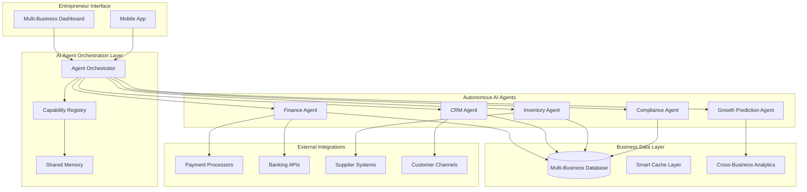
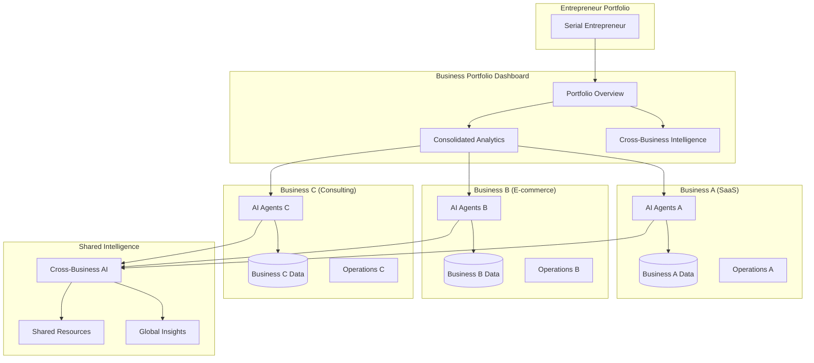

# CoreFlow360 V4 - AI-First Entrepreneurial Scaling Platform

## 1. Project Purpose & Vision

**CoreFlow360 V4** is an AI-first entrepreneurial scaling platform engineered for ambitious founders managing multiple businesses simultaneously. Unlike traditional ERP/CRM systems with AI features bolted on, CoreFlow360 V4 places autonomous AI agents at its core, handling all business operations in the background while founders focus on strategic growth and scaling.

### Vision Statement
Empower serial entrepreneurs to scale multiple businesses effortlessly through autonomous AI agents that handle all operational complexity, from accounting and inventory to customer relationships and compliance.

### Target Audience
- **Serial Entrepreneurs**: Founders managing 2+ businesses
- **Scaling Startups**: Growing companies needing operational automation
- **Multi-Business Portfolios**: Entrepreneurs with diverse business interests
- **Growth-Focused Leaders**: Founders who want to focus on strategy, not operations

### Core Problem Solved
Traditional business management requires founders to get bogged down in operational details. CoreFlow360 V4 solves this by deploying autonomous AI agents that handle all ERP/CRM tasks invisibly, allowing entrepreneurs to focus purely on growth and strategic decisions.

## 2. System Overview

CoreFlow360 V4 is an **AI-agent orchestrated business management ecosystem** where multiple autonomous agents work collaboratively to run business operations without human intervention. The platform enables entrepreneurs to manage multiple businesses from a unified interface while AI agents handle:

- **Autonomous Accounting**: Double-entry bookkeeping, tax calculations, financial reporting
- **Intelligent Inventory Management**: Stock tracking, demand forecasting, supplier coordination
- **Automated Customer Relations**: Lead nurturing, follow-ups, deal progression
- **Cross-Business Intelligence**: Resource optimization across business portfolio
- **Predictive Scaling**: Anticipating growth needs and preparing infrastructure

### Key Capabilities
1. **Multi-Business Portfolio Management**: Single dashboard for all entrepreneur's businesses
2. **Autonomous AI Operations**: Background agents handle all operational tasks
3. **Cross-Business Intelligence**: Insights and optimization across business portfolio
4. **Predictive Growth Planning**: AI agents anticipate and prepare for scaling needs
5. **Zero-Touch Operations**: Businesses run autonomously with minimal founder intervention

## 3. Tech Stack

### Core AI Architecture
- **AI Orchestration**: Cloudflare Workers AI for agent coordination
- **Language Models**: Anthropic Claude + OpenAI GPT integration
- **Agent Framework**: Custom AI agent system with capability registry
- **Intelligence Layer**: Multi-agent collaboration and task distribution

### Backend Infrastructure
- **Runtime**: Cloudflare Workers (Edge Computing)
- **Framework**: Hono.js with TypeScript
- **Database**: Cloudflare D1 (SQLite) with KV caching
- **Storage**: Cloudflare R2 (S3-compatible) for documents/backups
- **Real-time**: Durable Objects for live collaboration
- **Queues**: Cloudflare Queues for background processing

### Frontend Technology
- **Framework**: React 19 with TypeScript (Strict Mode)
- **Build Tool**: Vite with SWC for fast compilation
- **Routing**: TanStack Router with code splitting
- **State Management**: Zustand + Immer for reactive state
- **UI Library**: Custom component system with Radix UI primitives
- **Styling**: Tailwind CSS with design tokens
- **Forms**: React Hook Form + Zod validation

### Data & Integration Layer
- **Validation**: Zod schemas for type-safe data handling
- **Caching**: Multi-tier caching (KV, browser, CDN)
- **APIs**: RESTful APIs with OpenAPI documentation
- **Payments**: Stripe + PayPal integration
- **Communication**: Email, SMS, WhatsApp channels

### Development & Operations
- **Testing**: Vitest + Testing Library (95%+ coverage target)
- **Linting**: ESLint + Prettier with strict rules
- **CI/CD**: GitHub Actions with automated deployments
- **Monitoring**: Sentry error tracking + custom analytics
- **Performance**: <100ms response time targets

## 4. Architecture

### AI-First Architecture Overview



### Multi-Business Architecture



### File Structure
```
CoreFlow360-V4/
├── src/
│   ├── modules/                 # Core business modules
│   │   ├── agents/             # AI agent system
│   │   ├── finance/            # Autonomous finance management
│   │   ├── inventory/          # Intelligent inventory
│   │   ├── crm/               # AI-powered CRM
│   │   └── auth/              # Multi-business authentication
│   ├── routes/                 # API endpoints
│   ├── cloudflare/            # Cloudflare integrations
│   ├── durable-objects/       # Real-time coordination
│   └── shared/                # Shared utilities
├── frontend/                   # React frontend
│   ├── src/components/        # UI components
│   ├── src/stores/           # State management
│   └── src/lib/              # Frontend utilities
├── database/migrations/       # Database schema
└── scripts/                   # Deployment scripts
```

## 5. Core Features

### AI Agent Ecosystem

#### **Autonomous Finance Agent**
- **Double-Entry Bookkeeping**: Automatic journal entries and reconciliation
- **Multi-Currency Management**: Real-time exchange rates and conversion
- **Tax Calculation Engine**: Multi-jurisdiction compliance
- **Invoice Automation**: Generation, sending, and follow-up
- **Cash Flow Prediction**: AI-powered forecasting
- **Cross-Business Consolidation**: Portfolio-level financial reporting

#### **Intelligent CRM Agent**
- **Lead Qualification**: AI-powered lead scoring and prioritization
- **Automated Nurturing**: Personalized communication sequences
- **Deal Progression**: Autonomous pipeline management
- **Customer Intelligence**: Behavior analysis and insights
- **Cross-Business Referrals**: Leveraging portfolio for growth

#### **Smart Inventory Agent**
- **Demand Forecasting**: Predictive inventory planning
- **Supplier Coordination**: Automated ordering and negotiation
- **Multi-Location Optimization**: Stock level balancing
- **Quality Monitoring**: Automated defect tracking
- **Cross-Business Sharing**: Resource optimization across portfolio

#### **Compliance Agent**
- **Regulatory Monitoring**: Continuous compliance checking
- **Audit Trail Generation**: Automatic documentation
- **Risk Assessment**: Proactive risk identification
- **Report Automation**: Regulatory filing and reporting

#### **Growth Prediction Agent**
- **Scaling Readiness**: Infrastructure and resource planning
- **Market Opportunity**: Cross-business market analysis
- **Resource Allocation**: Optimal distribution across portfolio
- **Performance Optimization**: Continuous improvement recommendations

### Multi-Business Management Features

#### **Portfolio Dashboard**
- Unified view of all businesses
- Consolidated KPIs and metrics
- Cross-business performance comparison
- Resource allocation insights

#### **Business Intelligence**
- Cross-portfolio analytics
- Shared customer insights
- Market opportunity identification
- Synergy optimization

#### **Operational Automation**
- Zero-touch business operations
- Autonomous decision making
- Predictive maintenance
- Self-healing systems

### Enterprise Security Features
- **Zero-Trust Architecture**: JWT bypass prevention (CVSS 9.8 protection)
- **Multi-Factor Authentication**: TOTP and SMS verification
- **Role-Based Access Control**: Granular permission system
- **Session Management**: Secure session handling with rotation
- **Audit Logging**: Comprehensive activity tracking
- **Data Encryption**: End-to-end encryption for sensitive data

## 6. Configuration

### Environment Variables

#### Core Application
```bash
# Application
APP_NAME=CoreFlow360 V4
API_VERSION=v4
ENVIRONMENT=production

# AI Services (Core)
ANTHROPIC_API_KEY=your_anthropic_key
OPENAI_API_KEY=your_openai_key
AI_MODEL_PRIMARY=claude-3-sonnet
AI_MODEL_SECONDARY=gpt-4

# Security (Critical)
JWT_SECRET=your_secure_jwt_secret
ENCRYPTION_KEY=your_encryption_key
AUTH_SECRET=your_auth_secret

# Database
DB_MAIN=your_d1_database_id
KV_CACHE=your_kv_cache_namespace
KV_SESSION=your_session_namespace
```

#### Payment Processing
```bash
# Stripe
STRIPE_SECRET_KEY=sk_live_...
STRIPE_PUBLISHABLE_KEY=pk_live_...
STRIPE_WEBHOOK_SECRET=whsec_...

# PayPal
PAYPAL_CLIENT_ID=your_paypal_client_id
PAYPAL_CLIENT_SECRET=your_paypal_secret
```

#### Communication Services
```bash
# Email
SENDGRID_API_KEY=your_sendgrid_key
EMAIL_FROM=noreply@coreflow360.com

# SMS/WhatsApp
TWILIO_ACCOUNT_SID=your_twilio_sid
TWILIO_AUTH_TOKEN=your_twilio_token
```

#### Monitoring & Analytics
```bash
# Error Tracking
SENTRY_DSN=your_sentry_dsn
SENTRY_ENVIRONMENT=production

# Analytics
CLOUDFLARE_ANALYTICS_TOKEN=your_cf_analytics
GOOGLE_ANALYTICS_ID=GA-XXXXXXX
```

### Cloudflare Bindings

#### D1 Databases
- **DB_MAIN**: Primary business data
- **DB_ANALYTICS**: Analytics and reporting data

#### KV Namespaces
- **KV_CACHE**: Query result caching
- **KV_SESSION**: User session storage
- **KV_RATE_LIMIT_METRICS**: Rate limiting data

#### R2 Buckets
- **R2_DOCUMENTS**: Business documents and files
- **R2_BACKUPS**: Database backups and archives

#### Durable Objects
- **RATE_LIMITER_DO**: Distributed rate limiting
- **WORKFLOW_EXECUTOR**: AI agent coordination
- **REALTIME_COORDINATOR**: Live collaboration

## 7. Deployment Guide (Cloudflare)

### Prerequisites
- **Node.js 20+** (Required - engineStrict enforced)
- **Cloudflare Account** with Workers and D1 access
- **Wrangler CLI** installed globally

### Quick Start (30-Minute Setup)

#### 1. Environment Setup (5 min)
```bash
# Clone repository
git clone https://github.com/your-org/coreflow360-v4.git
cd coreflow360-v4

# Verify Node.js version
node --version  # Must be 20.0.0+
```

#### 2. Dependencies Installation (10 min)
```bash
# Install backend dependencies
npm ci

# Install frontend dependencies
cd frontend && npm ci && cd ..

# Verify installation
npm run type-check
```

#### 3. Cloudflare Setup (10 min)
```bash
# Login to Cloudflare
wrangler login

# Create D1 databases
wrangler d1 create coreflow360-main
wrangler d1 create coreflow360-analytics

# Create KV namespaces
wrangler kv:namespace create KV_CACHE
wrangler kv:namespace create KV_SESSION
```

#### 4. Environment Configuration (3 min)
```bash
# Copy configuration
cp wrangler.toml.example wrangler.toml
cp .env.example .env.local

# Set secure secrets
wrangler secret put JWT_SECRET
wrangler secret put ANTHROPIC_API_KEY
wrangler secret put OPENAI_API_KEY
```

#### 5. Database Migration (2 min)
```bash
# Run migrations
wrangler d1 migrations apply coreflow360-main --local
wrangler d1 migrations apply coreflow360-main --remote
```

### Production Deployment

#### Backend Deployment
```bash
# Build and deploy
npm run build:production
npm run deploy:prod

# Verify deployment
curl https://your-worker-domain.workers.dev/health
```

#### Frontend Deployment (Cloudflare Pages)
```bash
# Build frontend
cd frontend
npm run build

# Deploy to Pages
wrangler pages publish dist --project-name=coreflow360-frontend
```

#### Database Setup
```bash
# Create production databases
wrangler d1 create coreflow360-production
wrangler d1 create coreflow360-analytics-prod

# Run production migrations
wrangler d1 migrations apply coreflow360-production
```

### Verification Steps
```bash
# Health check
curl -f https://api.coreflow360.com/health

# API status
curl -f https://api.coreflow360.com/api/status

# AI agent status
curl -f https://api.coreflow360.com/api/agents/status
```

## 8. Security & Compliance

### Multi-Business Security Model

#### **Business Isolation**
- Complete data separation between businesses
- Row-level security with business_id filtering
- Encrypted cross-business communications
- Isolated AI agent contexts

#### **Authentication & Authorization**
- **JWT with Secret Rotation**: Automatic secret rotation for enhanced security
- **Multi-Factor Authentication**: TOTP and SMS verification
- **Token Blacklisting**: Immediate revocation capabilities
- **Session Management**: Secure session handling with automatic expiration

#### **Zero-Trust Architecture**
- No implicit trust between components
- Continuous verification of requests
- Encrypted communication channels
- Granular access controls

### Compliance Features

#### **Audit Trail System**
- Immutable audit logs
- Comprehensive activity tracking
- Regulatory compliance reporting
- Real-time compliance monitoring

#### **Data Protection**
- End-to-end encryption
- PII data anonymization
- GDPR compliance features
- Data retention policies

#### **Enterprise Rate Limiting**
- DDoS protection
- API abuse prevention
- Business-specific rate limits
- Adaptive rate limiting based on behavior

## 9. Performance & Scalability

### AI-Optimized Performance

#### **Response Time Targets**
- **API Endpoints**: <100ms P95 response time
- **AI Agent Actions**: <500ms for simple tasks
- **Cross-Business Queries**: <200ms with caching
- **Real-time Updates**: <50ms propagation time

#### **Caching Strategy**
- **Multi-Tier Caching**: KV, browser, CDN layers
- **Smart Cache Invalidation**: AI-powered cache management
- **Business-Specific Caching**: Isolated cache per business
- **Predictive Caching**: AI agents pre-cache likely queries

#### **Scaling Model**
- **Horizontal Scaling**: Cloudflare Workers auto-scaling
- **Database Scaling**: D1 with intelligent sharding
- **AI Agent Scaling**: Dynamic agent spawning based on load
- **Cross-Business Load Balancing**: Optimal resource distribution

### Optimization Features

#### **Code Splitting**
- Route-based code splitting
- Component lazy loading
- AI agent modules loaded on demand
- Business-specific bundle optimization

#### **Database Optimization**
- Query optimization with caching
- Batch operations for efficiency
- Index optimization for multi-business queries
- Connection pooling simulation

## 10. Maintenance & Operations

### AI-Assisted Monitoring

#### **Autonomous System Health**
- AI agents monitor system performance
- Predictive failure detection
- Self-healing capabilities
- Automatic resource scaling

#### **Business Health Monitoring**
- Per-business performance tracking
- AI-powered anomaly detection
- Automated alerting for issues
- Proactive optimization recommendations

### CI/CD Pipeline

#### **Automated Testing**
- Unit tests (95%+ coverage target)
- Integration tests for AI agents
- End-to-end business workflow tests
- Security vulnerability scanning

#### **Deployment Automation**
```bash
# Development deployment
npm run deploy:dev

# Staging deployment with tests
npm run deploy:staging

# Production deployment with approvals
npm run deploy:prod
```

### Logging & Error Handling

#### **Structured Logging**
- Business-specific log correlation
- AI agent activity tracking
- Performance metrics collection
- Security event logging

#### **Error Tracking**
- Sentry integration for error monitoring
- AI agent error classification
- Automatic error recovery
- Performance degradation alerts

## 11. Appendix

### Key Scripts

#### Development Scripts
```bash
# Development
npm run dev                    # Start development server
npm run dev:watch             # Development with file watching
npm run dev:full              # Full stack development

# Building
npm run build                 # Build for production
npm run build:staging         # Build for staging
npm run type-check           # TypeScript validation

# Testing
npm run test                  # Run unit tests
npm run test:coverage         # Test with coverage
npm run test:ai-integration   # Test AI agent integration
npm run test:security         # Security tests

# AI & Business Operations
npm run agents:status         # Check AI agent status
npm run business:health       # Multi-business health check
npm run analytics:generate    # Generate business analytics
```

#### Production Scripts
```bash
# Deployment
npm run deploy:prod           # Production deployment
npm run deploy:staging        # Staging deployment

# Monitoring
npm run monitor:performance   # Performance monitoring
npm run monitor:ai-agents    # AI agent monitoring
npm run monitor:businesses   # Business health monitoring

# Maintenance
npm run db:backup            # Database backup
npm run cache:clear          # Clear all caches
npm run security:audit       # Security audit
```

### Example Environment Configuration

#### `.env.example`
```bash
# Core AI Configuration
ANTHROPIC_API_KEY=your_anthropic_key
OPENAI_API_KEY=your_openai_key
AI_MODEL_PRIMARY=claude-3-sonnet
AI_MODEL_SECONDARY=gpt-4
AI_TEMPERATURE=0.1
AI_MAX_TOKENS=4000

# Multi-Business Configuration
MAX_BUSINESSES_PER_ENTREPRENEUR=10
CROSS_BUSINESS_ANALYTICS=true
SHARED_RESOURCE_OPTIMIZATION=true

# Performance Configuration
CACHE_TTL_DEFAULT=300
CACHE_TTL_BUSINESS_DATA=60
RESPONSE_TIME_TARGET=100
AI_AGENT_TIMEOUT=5000

# Security Configuration
JWT_EXPIRY=24h
SESSION_TIMEOUT=8h
MFA_REQUIRED=true
AUDIT_RETENTION_DAYS=2555

# Feature Flags
ENABLE_AI_FEATURES=true
ENABLE_CROSS_BUSINESS_INTELLIGENCE=true
ENABLE_PREDICTIVE_SCALING=true
ENABLE_AUTONOMOUS_OPERATIONS=true
```

### Database Schema Overview

#### Core Tables
- **businesses**: Multi-business portfolio management
- **users**: Entrepreneur and team member accounts
- **ai_agents**: AI agent configurations and states
- **ledger_entries**: Double-entry accounting system
- **audit_log**: Comprehensive audit trail
- **business_relationships**: Cross-business connections

#### AI Agent Tables
- **agent_capabilities**: Available AI agent capabilities
- **agent_tasks**: Autonomous task queue
- **agent_memory**: Persistent AI agent memory
- **cross_business_insights**: Shared intelligence data

### API Endpoint Summary

#### Multi-Business Management
- `GET /api/v1/portfolio` - Business portfolio overview
- `GET /api/v1/businesses` - List all businesses
- `POST /api/v1/businesses` - Create new business
- `GET /api/v1/analytics/cross-business` - Cross-business analytics

#### AI Agent System
- `GET /api/v1/agents` - List active AI agents
- `POST /api/v1/agents/deploy` - Deploy new AI agent
- `GET /api/v1/agents/{id}/status` - Agent status
- `POST /api/v1/agents/{id}/task` - Assign task to agent

#### Autonomous Operations
- `GET /api/v1/finance/autonomous` - Autonomous finance status
- `GET /api/v1/crm/autonomous` - Autonomous CRM status
- `GET /api/v1/inventory/autonomous` - Autonomous inventory status

---

**Built for Serial Entrepreneurs by AI-First Engineering**

*Empowering founders to scale multiple businesses through autonomous AI agents*