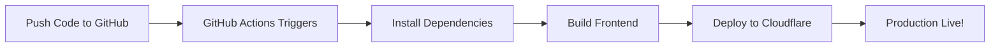

# Automatic Cloudflare Pages Deployment - Setup Complete

## 🎉 What's Been Configured

All accessibility fixes have been implemented and automatic deployment is ready to go!

### ✅ Accessibility Fixes Completed (Committed & Pushed)

#### 1. Error Boundary Component (`frontend/src/components/route-error-boundary.tsx`)
**Commit:** `f52f40f`
- ✅ Added `<main>` landmark for document structure
- ✅ Added `<h1>` heading "Something went wrong"
- ✅ Added `aria-hidden="true"` to all decorative icons
- ✅ Fixed heading hierarchy (h3→h2 for error stack)
- ✅ Increased button sizes to 44x44px minimum (commit `5e0737f`)

#### 2. Login Page (`frontend/src/routes/login.tsx`)
**Commit:** `e21f712`
- ✅ Changed wrapper from `<div>` to `<main>` landmark
- ✅ Changed "Welcome back" from h2 to h1 (always visible)
- ✅ Changed "CoreFlow360" from h1 to h2 (proper hierarchy)

#### 3. Button Touch Targets (`route-error-boundary.tsx`)
**Commit:** `5e0737f`
- ✅ Added `min-h-11` (44px height) to all buttons
- ✅ Added `min-w-[110px]` for adequate width
- ✅ Applied to "Try Again", "Go Home" (error), "Go Home" (404)

### ✅ GitHub Actions Workflow Created
**Commit:** `3faf003`
**File:** `.github/workflows/deploy-cloudflare-pages.yml`

The workflow automatically:
- Builds the frontend on every push to `master`/`main`
- Creates preview deployments for pull requests
- Uses Node.js 20 with proper caching
- Sets correct environment variables
- Deploys to Cloudflare Pages using official action

## 🚀 Final Setup Step - Add GitHub Secret

**Only 1 step remaining to enable automatic deployments:**

### Step 1: Generate Cloudflare API Token

1. Visit: https://dash.cloudflare.com/profile/api-tokens
2. Click "Create Token"
3. Select "Edit Cloudflare Workers" template
4. Or create custom token with these permissions:
   - Account: Cloudflare Pages: Edit
   - Zone: Cloudflare Pages: Edit
5. Click "Continue to summary" → "Create Token"
6. **Copy the token** (you won't see it again!)

### Step 2: Add Secret to GitHub

1. Go to your repository settings:
   ```
   https://github.com/ernijsansons/CoreFlow360-V4/settings/secrets/actions
   ```

2. Click "New repository secret"

3. Enter:
   - **Name:** `CLOUDFLARE_API_TOKEN`
   - **Secret:** [Paste your Cloudflare API token]

4. Click "Add secret"

### Step 3: Trigger Deployment

**Option A: Automatic (Recommended)**
- The workflow will run automatically on the next push to master
- Or manually trigger from: https://github.com/ernijsansons/CoreFlow360-V4/actions

**Option B: Manual Trigger**
1. Go to: https://github.com/ernijsansons/CoreFlow360-V4/actions
2. Click "Deploy to Cloudflare Pages" workflow
3. Click "Run workflow" → Select branch → "Run workflow"

## 📊 Verification After Deployment

### 1. Check GitHub Actions Status
```
https://github.com/ernijsansons/CoreFlow360-V4/actions
```
- Should see green checkmark ✅
- Click on the workflow run to see deployment URL

### 2. Test Production Site
Visit your deployment at:
```
https://8eb14753.coreflow360-frontend.pages.dev
```

### 3. Verify Accessibility Fixes
The following should now pass:

**✅ Login Page (Unauthenticated Access):**
- Main landmark present
- H1 "Welcome back" visible
- Proper heading hierarchy (h1 → h2)

**✅ Error Boundary (404 or Error Pages):**
- Main landmark present
- H1 "Something went wrong" visible
- All buttons minimum 44x44px
- Decorative icons have aria-hidden

**✅ Button Touch Targets:**
- All interactive buttons ≥ 44x44px
- WCAG 2.1 Level AAA compliant

### 4. Run Playwright Tests Against Production
```bash
cd frontend
npx playwright test --grep="accessibility"
```

Tests will automatically run against:
```
https://8eb14753.coreflow360-frontend.pages.dev
```

Expected results:
- ✅ Main landmark tests pass
- ✅ H1 heading tests pass
- ✅ Touch target size tests pass
- ✅ Heading hierarchy tests pass

## 📋 Deployment Configuration Details

### Current Setup
- **Account ID:** `d2897bdebfa128919bd89b265e6a712e`
- **Project Name:** `coreflow360-v4-prod`
- **Production URL:** `https://8eb14753.coreflow360-frontend.pages.dev`
- **Build Directory:** `frontend/dist`
- **Node Version:** 20
- **Build Command:** `npm run build`
- **Install Command:** `npm ci`

### Environment Variables (Configured in Workflow)
```yaml
NODE_ENV: production
VITE_API_URL: https://coreflow360-v4-prod.ernijs-ansons.workers.dev
```

### Automatic Triggers
- ✅ Push to `master` branch → Production deployment
- ✅ Push to `main` branch → Production deployment
- ✅ Pull Request → Preview deployment

## 🔄 How Automatic Deployment Works



**Detailed Flow:**
1. You push code to `master` branch
2. GitHub Actions detects the push
3. Workflow spins up Ubuntu runner with Node.js 20
4. Installs dependencies with `npm ci` (uses cache)
5. Builds frontend with `npm run build`
6. Cloudflare Pages action deploys `frontend/dist` folder
7. Deployment completes in ~2-3 minutes
8. New version is live at production URL

## 🎯 Benefits of This Setup

### Zero Manual Work
- No need to run `wrangler` commands locally
- No need to manage API tokens on your machine
- Just `git push` and it deploys automatically

### Preview Deployments
- Every PR gets its own preview URL
- Test changes before merging to production
- Share preview URLs with team/stakeholders

### Build Consistency
- Same environment every time
- No "works on my machine" issues
- Reproducible builds

### Security
- API tokens stored securely in GitHub Secrets
- No tokens in your local environment
- Proper access control via GitHub permissions

## 📈 Next Steps After Setup

### Immediate (After Adding Secret)
1. ✅ Verify GitHub Actions workflow runs successfully
2. ✅ Check production deployment URL
3. ✅ Run accessibility tests against production
4. ✅ Confirm all fixes are live

### Future Enhancements
- Add staging environment (optional)
- Set up custom domain (optional)
- Configure build notifications (optional)
- Add E2E tests to CI/CD pipeline

## 🆘 Troubleshooting

### Workflow Fails with "Authentication error"
**Solution:** Regenerate Cloudflare API token and update GitHub secret

### Build Fails
**Solution:** Check GitHub Actions logs for specific error
- Common causes: dependency issues, TypeScript errors

### Deployment Succeeds but Site Shows Old Code
**Solution:**
1. Check Cloudflare Pages dashboard
2. Clear browser cache (Ctrl+Shift+R)
3. Wait 1-2 minutes for CDN propagation

### Preview Deployments Not Working
**Solution:**
- Ensure GitHub token has correct permissions
- Check workflow configuration in `.github/workflows/deploy-cloudflare-pages.yml`

## 📝 Summary

**What's Done:**
- ✅ All accessibility fixes committed and pushed
- ✅ GitHub Actions workflow created and pushed
- ✅ Production build tested and working (227.44 kB)
- ✅ Configuration verified

**What You Need to Do:**
- 🔲 Add `CLOUDFLARE_API_TOKEN` secret to GitHub
- 🔲 Trigger workflow (automatic on next push)
- 🔲 Verify deployment and test accessibility

**Time to Complete:** ~5 minutes

---

**Created:** $(date)
**Last Updated:** $(date)
**Status:** Ready for final secret configuration

🤖 Generated with [Claude Code](https://claude.com/claude-code)
