# Phase 1: Systematic Development Plan
## Critical Features Implementation with A+ Frontend & Testing

**Objective:** Develop 8 critical enterprise features with production-ready frontend and comprehensive testing
**Timeline:** 20 weeks (5 months)
**Investment:** $120,000
**Expected ARR:** $140,000

---

## 📋 Table of Contents

1. [Overview](#overview)
2. [Development Methodology](#development-methodology)
3. [Feature Breakdown](#feature-breakdown)
4. [Week-by-Week Schedule](#week-by-week-schedule)
5. [Quality Standards](#quality-standards)
6. [Testing Protocol](#testing-protocol)
7. [Deployment Strategy](#deployment-strategy)

---

## 1. Overview

### Features to Develop (Priority Order)

| # | Feature | Backend | Frontend | Testing | Total | ARR Value |
|---|---------|---------|----------|---------|-------|-----------|
| 1 | Account Reconciliation | 3 days | 4 days | 1 day | 8 days | $10K |
| 2 | Plaid Bank Integration | 4 days | 3 days | 1 day | 8 days | $15K |
| 3 | Multi-Currency | 5 days | 4 days | 1 day | 10 days | $20K |
| 4 | Subscription Billing | 4 days | 4 days | 1 day | 9 days | $20K |
| 5 | Revenue Recognition | 5 days | 4 days | 1 day | 10 days | $25K |
| 6 | Fixed Assets | 5 days | 4 days | 1 day | 10 days | $15K |
| 7 | Custom Report Builder | 5 days | 5 days | 2 days | 12 days | $20K |
| 8 | Approval Workflows | 4 days | 4 days | 1 day | 9 days | $15K |

**Total:** 76 working days = 15.2 weeks (rounded to 20 weeks with buffer)

---

## 2. Development Methodology

### Agile TDD Approach

```mermaid
graph LR
    A[Requirements] --> B[Database Schema]
    B --> C[Backend Tests]
    C --> D[Backend Service]
    D --> E[API Endpoints]
    E --> F[Frontend Tests]
    F --> G[UI Components]
    G --> H[Integration Tests]
    H --> I[E2E Tests]
    I --> J[Manual QA]
    J --> K[Deploy to Staging]
    K --> L[Production Deploy]
```



### Development Phases (Per Feature)

#### Phase A: Planning & Design (10% of time)
- Requirements gathering
- Database schema design
- API endpoint design
- UI/UX mockups
- Test plan creation

#### Phase B: Backend Development (35% of time)
- Database migrations
- Service layer implementation
- Unit tests (95%+ coverage)
- API endpoint creation
- Integration tests

#### Phase C: Frontend Development (40% of time)
- Component development
- Component tests
- Page routing
- State management
- Form validation
- Error handling

#### Phase D: Testing & QA (15% of time)
- E2E test suite
- Manual QA checklist
- Performance testing
- Security audit
- Accessibility testing

---

## 3. Feature Breakdown

### Feature 1: Account Reconciliation (Week 1-2)

#### Requirements
Allow users to reconcile bank/credit card accounts with internal records by uploading statements and matching transactions.

#### Backend Components (3 days)
```
Files to create:
├── database/migrations/031_account_reconciliation.sql
├── src/services/reconciliation/reconciliation-service.ts
├── src/services/reconciliation/statement-parser.ts
├── src/routes/reconciliation.ts
└── src/services/reconciliation/reconciliation-service.test.ts

Database Schema:
- reconciliations (id, account_id, statement_date, status, discrepancies)
- reconciliation_items (id, reconciliation_id, transaction_id, matched)
- reconciliation_rules (id, rule_type, conditions, auto_apply)

API Endpoints:
POST   /api/v1/reconciliation/upload-statement
GET    /api/v1/reconciliation/accounts/:id
POST   /api/v1/reconciliation/:id/match
POST   /api/v1/reconciliation/:id/complete
GET    /api/v1/reconciliation/:id/discrepancies
POST   /api/v1/reconciliation/rules
```

#### Frontend Components (4 days)
```
Files to create:
├── frontend/src/components/reconciliation/ReconciliationDashboard.tsx
├── frontend/src/components/reconciliation/StatementUploader.tsx
├── frontend/src/components/reconciliation/TransactionMatcher.tsx
├── frontend/src/components/reconciliation/DiscrepancyResolver.tsx
├── frontend/src/components/reconciliation/ReconciliationHistory.tsx
├── frontend/src/routes/finance/reconciliation.tsx
└── frontend/src/lib/api/services/reconciliation.service.ts

UI Features:
- Account selection dropdown
- Statement upload (CSV, OFX, QFX)
- Transaction matching table with search/filter
- Auto-match suggestions with confidence scores
- Manual match interface (drag-and-drop)
- Discrepancy identification and resolution
- Reconciliation history with audit trail
```

#### Testing (1 day)
```
Test files:
├── src/services/reconciliation/reconciliation-service.test.ts (unit)
├── frontend/src/components/reconciliation/ReconciliationDashboard.test.tsx (component)
└── e2e/reconciliation.spec.ts (end-to-end)

Test scenarios:
✓ Upload bank statement (CSV format)
✓ Parse transactions from statement
✓ Auto-match transactions with 95%+ confidence
✓ Manual match unmatched transactions
✓ Identify discrepancies (missing, duplicate)
✓ Mark reconciliation as complete
✓ View reconciliation history
✓ Performance: Handle 10,000 transactions
```

#### Acceptance Criteria
- [ ] Upload CSV/OFX/QFX bank statements
- [ ] Auto-match 80%+ of transactions
- [ ] Manual matching UI with drag-and-drop
- [ ] Discrepancy report generation
- [ ] Reconciliation audit trail
- [ ] 95%+ test coverage
- [ ] <2s response time for 1,000 transactions

---

### Feature 2: Plaid Bank Integration (Week 2-3)

#### Requirements
Connect bank accounts via Plaid OAuth, automatically import transactions daily, and sync balances in real-time.

#### Backend Components (4 days)
```
Files to create:
├── database/migrations/032_plaid_integration.sql
├── src/services/plaid/plaid-client.ts
├── src/services/plaid/plaid-sync-service.ts
├── src/routes/plaid.ts
└── src/services/plaid/plaid-client.test.ts

Database Schema:
- plaid_connections (id, business_id, institution_id, access_token, status)
- plaid_accounts (id, connection_id, account_id, name, type, balance)
- plaid_sync_log (id, connection_id, last_sync, transactions_synced)

API Endpoints:
POST   /api/v1/plaid/create-link-token
POST   /api/v1/plaid/exchange-public-token
GET    /api/v1/plaid/connections
GET    /api/v1/plaid/connections/:id/accounts
POST   /api/v1/plaid/connections/:id/sync
DELETE /api/v1/plaid/connections/:id
POST   /api/v1/plaid/webhook
```

#### Frontend Components (3 days)
```
Files to create:
├── frontend/src/components/plaid/PlaidLink.tsx
├── frontend/src/components/plaid/BankConnectionList.tsx
├── frontend/src/components/plaid/AccountSelector.tsx
├── frontend/src/components/plaid/SyncStatus.tsx
├── frontend/src/routes/finance/banking/connections.tsx
└── frontend/src/lib/api/services/plaid.service.ts

UI Features:
- Plaid Link button (OAuth flow)
- Bank connection list with status indicators
- Account selection (checking, savings, credit cards)
- Sync status dashboard (last sync, next sync)
- Connection health monitoring
- Disconnect bank option
- Transaction sync history
```

#### Testing (1 day)
```
Test files:
├── src/services/plaid/plaid-client.test.ts (unit, mocked Plaid API)
├── frontend/src/components/plaid/PlaidLink.test.tsx (component)
└── e2e/plaid-integration.spec.ts (end-to-end, Plaid Sandbox)

Test scenarios:
✓ Create link token
✓ Exchange public token for access token
✓ Fetch accounts from Plaid
✓ Sync transactions (initial + incremental)
✓ Handle Plaid webhook (TRANSACTIONS_READY)
✓ Update account balances
✓ Disconnect bank account
✓ Handle Plaid errors gracefully
```

#### Acceptance Criteria
- [ ] OAuth bank connection via Plaid Link
- [ ] Support 10+ major banks (Chase, BofA, Wells Fargo, etc.)
- [ ] Daily automatic transaction sync
- [ ] Real-time balance updates
- [ ] Webhook handling for transaction updates
- [ ] Connection health monitoring
- [ ] 95%+ test coverage
- [ ] Plaid Sandbox testing complete

---

### Feature 3: Multi-Currency Accounting (Week 4-5)

#### Requirements
Support transactions in multiple currencies with automatic conversion, gain/loss tracking, and multi-currency reporting.

#### Backend Components (5 days)
```
Files to create:
├── database/migrations/033_multi_currency.sql
├── src/services/currency/exchange-rate-service.ts
├── src/services/currency/currency-converter.ts
├── src/services/currency/gain-loss-calculator.ts
├── src/routes/currency.ts
└── src/services/currency/currency-converter.test.ts

Database Schema:
- currencies (code, name, symbol, decimal_places, active)
- exchange_rates (from_currency, to_currency, rate, date, source)
- multi_currency_transactions (txn_id, currency, amount, exchange_rate, base_amount)
- currency_gain_loss (id, account_id, period, realized, unrealized)

API Endpoints:
GET    /api/v1/currencies
GET    /api/v1/currencies/rates
POST   /api/v1/currencies/rates/refresh
GET    /api/v1/currencies/convert?from=USD&to=EUR&amount=100
POST   /api/v1/transactions (enhanced with currency support)
GET    /api/v1/reports/gain-loss?period=2025-Q1
```

#### Frontend Components (4 days)
```
Files to create:
├── frontend/src/components/currency/CurrencySelector.tsx
├── frontend/src/components/currency/CurrencyConverter.tsx
├── frontend/src/components/currency/ExchangeRateDisplay.tsx
├── frontend/src/components/currency/GainLossReport.tsx
├── frontend/src/components/forms/MultiCurrencyInvoiceForm.tsx
├── frontend/src/routes/finance/currency.tsx
└── frontend/src/lib/api/services/currency.service.ts

UI Features:
- Currency selector (150+ currencies)
- Currency converter widget
- Exchange rate display (updated hourly)
- Multi-currency invoice creation
- Multi-currency payment recording
- Gain/loss report (realized vs unrealized)
- Currency trend charts
- Base currency setting per business
```

#### Testing (1 day)
```
Test files:
├── src/services/currency/currency-converter.test.ts (unit)
├── src/services/currency/gain-loss-calculator.test.ts (unit)
├── frontend/src/components/currency/CurrencyConverter.test.tsx (component)
└── e2e/multi-currency.spec.ts (end-to-end)

Test scenarios:
✓ Fetch exchange rates from API
✓ Convert USD to EUR using real-time rate
✓ Create invoice in foreign currency
✓ Record payment in different currency
✓ Calculate realized gain/loss on payment
✓ Calculate unrealized gain/loss on open AR
✓ Generate multi-currency financial reports
✓ Handle currency rate API failures gracefully
```

#### Acceptance Criteria
- [ ] Support 150+ currencies
- [ ] Real-time exchange rates (hourly updates)
- [ ] Multi-currency invoices and payments
- [ ] Automatic gain/loss calculation
- [ ] Multi-currency financial reports
- [ ] Base currency per business
- [ ] 95%+ test coverage
- [ ] <100ms conversion time

---

### Feature 4: Subscription Billing (Week 6-7)

#### Requirements
Automated recurring billing for subscription businesses with proration, dunning, MRR tracking, and churn analytics.

#### Backend Components (4 days)
```
Files to create:
├── database/migrations/034_subscription_billing.sql
├── src/services/subscriptions/subscription-service.ts
├── src/services/subscriptions/billing-scheduler.ts
├── src/services/subscriptions/dunning-manager.ts
├── src/services/subscriptions/mrr-calculator.ts
├── src/routes/subscriptions.ts
└── src/services/subscriptions/subscription-service.test.ts

Database Schema:
- subscription_plans (id, name, amount, interval, trial_days)
- subscriptions (id, customer_id, plan_id, status, current_period_start/end)
- subscription_items (id, subscription_id, plan_id, quantity, amount)
- subscription_invoices (id, subscription_id, amount, due_date, paid_date)
- dunning_attempts (id, invoice_id, attempt_date, status, next_attempt)
- mrr_movements (id, date, movement_type, amount, arr_impact)

API Endpoints:
POST   /api/v1/subscriptions/plans
GET    /api/v1/subscriptions/plans
POST   /api/v1/subscriptions
GET    /api/v1/subscriptions/:id
POST   /api/v1/subscriptions/:id/cancel
POST   /api/v1/subscriptions/:id/pause
POST   /api/v1/subscriptions/:id/resume
GET    /api/v1/subscriptions/metrics/mrr
GET    /api/v1/subscriptions/metrics/churn
POST   /api/v1/subscriptions/invoices/:id/retry-payment
```

#### Frontend Components (4 days)
```
Files to create:
├── frontend/src/components/subscriptions/SubscriptionPlanList.tsx
├── frontend/src/components/subscriptions/SubscriptionForm.tsx
├── frontend/src/components/subscriptions/SubscriptionDetail.tsx
├── frontend/src/components/subscriptions/MRRDashboard.tsx
├── frontend/src/components/subscriptions/ChurnAnalytics.tsx
├── frontend/src/components/subscriptions/DunningManager.tsx
├── frontend/src/routes/finance/subscriptions.tsx
└── frontend/src/lib/api/services/subscriptions.service.ts

UI Features:
- Subscription plan builder (amount, interval, trial)
- Customer subscription management
- Subscription lifecycle (active, paused, canceled)
- Proration preview
- MRR dashboard (chart, breakdown)
- Churn analytics (rate, reasons)
- Dunning management (failed payments, retries)
- Revenue waterfall chart
```

#### Testing (1 day)
```
Test files:
├── src/services/subscriptions/subscription-service.test.ts (unit)
├── src/services/subscriptions/billing-scheduler.test.ts (unit)
├── frontend/src/components/subscriptions/MRRDashboard.test.tsx (component)
└── e2e/subscription-billing.spec.ts (end-to-end)

Test scenarios:
✓ Create subscription plan
✓ Subscribe customer to plan
✓ Generate recurring invoice on schedule
✓ Calculate proration on mid-cycle upgrade
✓ Process successful payment
✓ Handle failed payment (dunning)
✓ Retry failed payment automatically
✓ Cancel subscription (immediate vs end of period)
✓ Calculate MRR accurately
✓ Track churn rate
```

#### Acceptance Criteria
- [ ] Create subscription plans (monthly, quarterly, annual)
- [ ] Subscribe customers with trial periods
- [ ] Automatic recurring billing
- [ ] Proration calculations
- [ ] Dunning management (3 retry attempts)
- [ ] MRR/ARR tracking dashboard
- [ ] Churn analytics
- [ ] 95%+ test coverage
- [ ] <5 minute billing job execution

---

### Feature 5: Revenue Recognition (ASC 606) (Week 8-9)

#### Requirements
Automated revenue recognition following ASC 606 standard with contract management, performance obligations, and deferred revenue tracking.

#### Backend Components (5 days)
```
Files to create:
├── database/migrations/035_revenue_recognition.sql
├── src/services/revenue/revenue-recognition-service.ts
├── src/services/revenue/contract-manager.ts
├── src/services/revenue/performance-obligation-tracker.ts
├── src/services/revenue/ssp-allocator.ts
├── src/routes/revenue-recognition.ts
└── src/services/revenue/revenue-recognition-service.test.ts

Database Schema:
- revenue_contracts (id, customer_id, start_date, end_date, total_value)
- performance_obligations (id, contract_id, description, ssp, allocated_value)
- revenue_schedule (id, obligation_id, recognition_date, amount, status)
- deferred_revenue (id, contract_id, balance, liability_account)
- revenue_recognition_log (id, schedule_id, recognized_date, amount, gl_entry_id)

API Endpoints:
POST   /api/v1/revenue/contracts
GET    /api/v1/revenue/contracts/:id
POST   /api/v1/revenue/contracts/:id/obligations
GET    /api/v1/revenue/schedule?date=2025-01
POST   /api/v1/revenue/recognize (cron job endpoint)
GET    /api/v1/revenue/deferred-revenue
GET    /api/v1/revenue/waterfall?contract_id=123
```

#### Frontend Components (4 days)
```
Files to create:
├── frontend/src/components/revenue/ContractList.tsx
├── frontend/src/components/revenue/ContractForm.tsx
├── frontend/src/components/revenue/PerformanceObligationEditor.tsx
├── frontend/src/components/revenue/RevenueScheduleViewer.tsx
├── frontend/src/components/revenue/DeferredRevenueReport.tsx
├── frontend/src/components/revenue/RevenueWaterfall.tsx
├── frontend/src/routes/finance/revenue-recognition.tsx
└── frontend/src/lib/api/services/revenue.service.ts

UI Features:
- Contract creation form (customer, terms, value)
- Performance obligation editor (multiple obligations per contract)
- SSP allocation calculator
- Revenue schedule viewer (monthly breakdown)
- Deferred revenue balance report
- Revenue waterfall chart
- Manual revenue recognition override
- ASC 606 compliance checklist
```

#### Testing (1 day)
```
Test files:
├── src/services/revenue/revenue-recognition-service.test.ts (unit)
├── src/services/revenue/ssp-allocator.test.ts (unit)
├── frontend/src/components/revenue/RevenueWaterfall.test.tsx (component)
└── e2e/revenue-recognition.spec.ts (end-to-end)

Test scenarios:
✓ Create revenue contract
✓ Add performance obligations
✓ Allocate SSP across obligations
✓ Generate revenue schedule (straight-line)
✓ Recognize revenue monthly (automated)
✓ Track deferred revenue balance
✓ Handle milestone-based recognition
✓ Generate revenue waterfall report
✓ Override manual recognition
✓ Verify GL entry creation
```

#### Acceptance Criteria
- [ ] Contract management with multiple obligations
- [ ] SSP allocation algorithm
- [ ] Automated revenue scheduling
- [ ] Monthly revenue recognition (cron job)
- [ ] Deferred revenue tracking
- [ ] Revenue waterfall reporting
- [ ] ASC 606 compliance
- [ ] 95%+ test coverage
- [ ] <1s schedule generation for 100 contracts

---

### Feature 6: Fixed Assets Management (Week 10-11)

#### Requirements
Track, depreciate, and manage company assets with automatic depreciation calculation and disposal tracking.

#### Backend Components (5 days)
```
Files to create:
├── database/migrations/036_fixed_assets.sql
├── src/services/assets/asset-service.ts
├── src/services/assets/depreciation-calculator.ts
├── src/services/assets/disposal-tracker.ts
├── src/routes/assets.ts
└── src/services/assets/depreciation-calculator.test.ts

Database Schema:
- fixed_assets (id, name, category, acquisition_date, cost, salvage_value, useful_life)
- asset_depreciation (id, asset_id, method, accumulated_depreciation, book_value)
- depreciation_schedule (id, asset_id, period, amount, cumulative, book_value)
- asset_disposals (id, asset_id, disposal_date, proceeds, gain_loss)
- asset_maintenance (id, asset_id, date, description, cost)

API Endpoints:
POST   /api/v1/assets
GET    /api/v1/assets
GET    /api/v1/assets/:id
PUT    /api/v1/assets/:id
POST   /api/v1/assets/:id/dispose
GET    /api/v1/assets/:id/depreciation-schedule
POST   /api/v1/assets/calculate-depreciation (cron job)
GET    /api/v1/assets/reports/register
```

#### Frontend Components (4 days)
```
Files to create:
├── frontend/src/components/assets/AssetList.tsx
├── frontend/src/components/assets/AssetForm.tsx
├── frontend/src/components/assets/AssetDetail.tsx
├── frontend/src/components/assets/DepreciationScheduleViewer.tsx
├── frontend/src/components/assets/AssetDisposalForm.tsx
├── frontend/src/components/assets/AssetRegisterReport.tsx
├── frontend/src/routes/finance/fixed-assets.tsx
└── frontend/src/lib/api/services/assets.service.ts

UI Features:
- Asset registry list (filterable, searchable)
- Asset creation form (name, category, cost, useful life)
- Depreciation method selector (straight-line, declining balance, units of production)
- Depreciation schedule viewer (monthly/yearly breakdown)
- Asset disposal form (proceeds, gain/loss calculation)
- Asset maintenance log
- Asset register report (all assets with current values)
- Depreciation summary by category
```

#### Testing (1 day)
```
Test files:
├── src/services/assets/depreciation-calculator.test.ts (unit)
├── src/services/assets/disposal-tracker.test.ts (unit)
├── frontend/src/components/assets/AssetDetail.test.tsx (component)
└── e2e/fixed-assets.spec.ts (end-to-end)

Test scenarios:
✓ Create fixed asset
✓ Calculate straight-line depreciation
✓ Calculate declining balance depreciation
✓ Calculate units of production depreciation
✓ Generate depreciation schedule
✓ Record monthly depreciation (automated)
✓ Dispose of asset (calculate gain/loss)
✓ Transfer asset between locations
✓ Generate asset register report
✓ Track maintenance history
```

#### Acceptance Criteria
- [ ] Asset registry with categories
- [ ] 3 depreciation methods (straight-line, declining balance, units)
- [ ] Automatic monthly depreciation calculation
- [ ] Disposal tracking with gain/loss
- [ ] Asset transfer between locations
- [ ] Maintenance log
- [ ] Asset register report
- [ ] 95%+ test coverage
- [ ] <500ms depreciation calculation for 1,000 assets

---

### Feature 7: Custom Report Builder (Week 12-14)

#### Requirements
Drag-and-drop report builder with 50+ templates, custom fields, filtering, and export capabilities.

#### Backend Components (5 days)
```
Files to create:
├── database/migrations/037_custom_reports.sql
├── src/services/reports/report-builder-service.ts
├── src/services/reports/query-generator.ts
├── src/services/reports/report-templates.ts
├── src/services/reports/report-exporter.ts
├── src/routes/reports.ts
└── src/services/reports/query-generator.test.ts

Database Schema:
- custom_reports (id, name, description, template_id, config, created_by)
- report_templates (id, name, category, base_query, available_fields)
- report_schedules (id, report_id, frequency, recipients, last_run)
- report_runs (id, report_id, run_date, status, result_url)

API Endpoints:
GET    /api/v1/reports/templates
POST   /api/v1/reports
GET    /api/v1/reports/:id
POST   /api/v1/reports/:id/run
POST   /api/v1/reports/:id/export?format=excel|pdf|csv
POST   /api/v1/reports/:id/schedule
GET    /api/v1/reports/:id/history
```

#### Frontend Components (5 days)
```
Files to create:
├── frontend/src/components/reports/ReportBuilderCanvas.tsx
├── frontend/src/components/reports/FieldSelector.tsx
├── frontend/src/components/reports/FilterBuilder.tsx
├── frontend/src/components/reports/ReportPreview.tsx
├── frontend/src/components/reports/ReportTemplateLibrary.tsx
├── frontend/src/components/reports/ReportScheduler.tsx
├── frontend/src/components/reports/ReportExporter.tsx
├── frontend/src/routes/finance/reports.tsx
└── frontend/src/lib/api/services/reports.service.ts

UI Features:
- Template library (50+ pre-built reports)
- Drag-and-drop field selector
- Visual filter builder (AND/OR conditions)
- Grouping and sorting controls
- Chart type selector (bar, line, pie)
- Live preview
- Export to Excel/PDF/CSV
- Schedule recurring reports
- Report sharing (email, link)
```

#### Testing (2 days)
```
Test files:
├── src/services/reports/query-generator.test.ts (unit)
├── src/services/reports/report-exporter.test.ts (unit)
├── frontend/src/components/reports/ReportBuilderCanvas.test.tsx (component)
└── e2e/custom-reports.spec.ts (end-to-end)

Test scenarios:
✓ Select report template
✓ Add fields to report
✓ Apply filters (date range, categories)
✓ Group by field
✓ Sort results
✓ Generate preview
✓ Export to Excel
✓ Export to PDF
✓ Schedule daily report
✓ Share report via email
✓ Performance: Generate 10,000-row report in <5s
```

#### Acceptance Criteria
- [ ] 50+ report templates
- [ ] Drag-and-drop report builder
- [ ] Visual filter builder
- [ ] Grouping and sorting
- [ ] Chart visualization
- [ ] Export to Excel/PDF/CSV
- [ ] Schedule recurring reports
- [ ] 95%+ test coverage
- [ ] <5s report generation for 10,000 rows

---

### Feature 8: Approval Workflows (Week 15-16)

#### Requirements
Multi-step approval process for expenses, invoices, and purchase orders with email notifications and audit trail.

#### Backend Components (4 days)
```
Files to create:
├── database/migrations/038_approval_workflows.sql
├── src/services/workflows/workflow-engine.ts
├── src/services/workflows/approval-rule-evaluator.ts
├── src/services/workflows/notification-service.ts
├── src/routes/workflows.ts
└── src/services/workflows/workflow-engine.test.ts

Database Schema:
- approval_workflows (id, name, entity_type, steps, active)
- approval_rules (id, workflow_id, condition, approver_role, step_order)
- approval_requests (id, entity_type, entity_id, workflow_id, status, created_by)
- approval_steps (id, request_id, approver_id, step_order, status, decision_date)
- approval_notifications (id, request_id, recipient_id, type, sent_date, read)

API Endpoints:
POST   /api/v1/workflows
GET    /api/v1/workflows
POST   /api/v1/workflows/:id/rules
POST   /api/v1/approvals/request
GET    /api/v1/approvals/pending
POST   /api/v1/approvals/:id/approve
POST   /api/v1/approvals/:id/reject
GET    /api/v1/approvals/:id/history
```

#### Frontend Components (4 days)
```
Files to create:
├── frontend/src/components/workflows/WorkflowBuilder.tsx
├── frontend/src/components/workflows/RuleEditor.tsx
├── frontend/src/components/workflows/ApprovalRequestList.tsx
├── frontend/src/components/workflows/ApprovalRequestDetail.tsx
├── frontend/src/components/workflows/ApprovalHistory.tsx
├── frontend/src/routes/settings/workflows.tsx
├── frontend/src/routes/approvals/pending.tsx
└── frontend/src/lib/api/services/workflows.service.ts

UI Features:
- Workflow builder (visual editor)
- Rule editor (if amount > $1000, require CFO approval)
- Approval request list (pending, approved, rejected)
- One-click approve/reject buttons
- Approval request detail (entity data, history)
- Email notification settings
- Mobile-friendly approval interface
- Audit trail visualization
```

#### Testing (1 day)
```
Test files:
├── src/services/workflows/workflow-engine.test.ts (unit)
├── src/services/workflows/approval-rule-evaluator.test.ts (unit)
├── frontend/src/components/workflows/WorkflowBuilder.test.tsx (component)
└── e2e/approval-workflows.spec.ts (end-to-end)

Test scenarios:
✓ Create approval workflow
✓ Add approval rules (amount thresholds)
✓ Submit expense for approval
✓ Evaluate rules and route to correct approver
✓ Send email notification
✓ Approve request
✓ Reject request with reason
✓ Multi-level approval (2+ steps)
✓ Conditional routing based on amount
✓ View approval history
```

#### Acceptance Criteria
- [ ] Visual workflow builder
- [ ] Rule-based routing (amount, category)
- [ ] Multi-level approvals
- [ ] Email notifications
- [ ] One-click approve/reject
- [ ] Mobile-friendly interface
- [ ] Complete audit trail
- [ ] 95%+ test coverage
- [ ] <100ms approval processing time

---

## 4. Week-by-Week Schedule

### Week 1-2: Account Reconciliation
- **Day 1-3:** Backend (schema, service, API)
- **Day 4-7:** Frontend (components, pages)
- **Day 8:** Testing & QA
- **Deliverable:** Working reconciliation feature

### Week 2-3: Plaid Bank Integration
- **Day 1-4:** Backend (Plaid client, sync service)
- **Day 5-7:** Frontend (Plaid Link, connections)
- **Day 8:** Testing with Plaid Sandbox
- **Deliverable:** Bank connection via Plaid

### Week 4-5: Multi-Currency Accounting
- **Day 1-5:** Backend (exchange rates, converter, gain/loss)
- **Day 6-9:** Frontend (currency selector, reports)
- **Day 10:** Testing & QA
- **Deliverable:** Multi-currency support

### Week 6-7: Subscription Billing
- **Day 1-4:** Backend (billing scheduler, dunning)
- **Day 5-8:** Frontend (plans, MRR dashboard)
- **Day 9:** Testing & QA
- **Deliverable:** Recurring billing system

### Week 8-9: Revenue Recognition
- **Day 1-5:** Backend (contracts, schedules, ASC 606)
- **Day 6-9:** Frontend (contract manager, waterfall)
- **Day 10:** Testing & QA
- **Deliverable:** ASC 606 compliance

### Week 10-11: Fixed Assets
- **Day 1-5:** Backend (depreciation, disposal)
- **Day 6-9:** Frontend (asset registry, schedules)
- **Day 10:** Testing & QA
- **Deliverable:** Asset management system

### Week 12-14: Custom Report Builder
- **Day 1-5:** Backend (query generator, exporter)
- **Day 6-10:** Frontend (builder canvas, templates)
- **Day 11-12:** Testing & QA
- **Deliverable:** Report builder with 50+ templates

### Week 15-16: Approval Workflows
- **Day 1-4:** Backend (workflow engine, rules)
- **Day 5-8:** Frontend (builder, approval UI)
- **Day 9:** Testing & QA
- **Deliverable:** Multi-level approval system

### Week 17-20: Integration Testing & Polish
- **Week 17:** Cross-feature integration testing
- **Week 18:** Performance optimization
- **Week 19:** Security audit & accessibility
- **Week 20:** Documentation & deployment

---

## 5. Quality Standards

### A+ Frontend Criteria

#### Design System Compliance
- ✅ Uses CoreFlow360 brand colors (brand-primary, brand-accent)
- ✅ Consistent spacing (Tailwind scale)
- ✅ Typography hierarchy (3xl headings, lg subheadings)
- ✅ Dark mode support
- ✅ Responsive design (mobile, tablet, desktop)

#### Component Quality
- ✅ Reusable components with props
- ✅ TypeScript strict mode
- ✅ Proper error handling
- ✅ Loading states
- ✅ Empty states
- ✅ Optimistic UI updates

#### User Experience
- ✅ <100ms perceived response time
- ✅ Keyboard navigation support
- ✅ ARIA labels for accessibility
- ✅ Toast notifications for actions
- ✅ Confirmation dialogs for destructive actions
- ✅ Inline validation with helpful error messages

#### Performance
- ✅ Code splitting per route
- ✅ Lazy loading of components
- ✅ Debounced search inputs
- ✅ Virtualized lists for >100 items
- ✅ Image optimization
- ✅ <3s initial page load

---

## 6. Testing Protocol

### Test Pyramid

```
            /\
           /  \  10% E2E Tests (Playwright)
          /____\
         /      \
        /        \ 30% Integration Tests (API + DB)
       /__________\
      /            \
     /              \ 60% Unit Tests (Services + Components)
    /________________\
```

### Testing Checklist (Per Feature)

#### Unit Tests (60% of test effort)
- [ ] Service layer functions (95%+ coverage)
- [ ] Utility functions (100% coverage)
- [ ] React components (85%+ coverage)
- [ ] Validation schemas (100% coverage)
- [ ] Business logic functions (95%+ coverage)

**Tools:** Vitest, React Testing Library

#### Integration Tests (30% of test effort)
- [ ] API endpoint tests (all endpoints)
- [ ] Database queries (CRUD operations)
- [ ] External API mocks (Plaid, exchange rates)
- [ ] Webhook handlers
- [ ] Cron job execution

**Tools:** Vitest, Supertest, D1 Test Database

#### E2E Tests (10% of test effort)
- [ ] Happy path user flows
- [ ] Critical business scenarios
- [ ] Error handling flows
- [ ] Cross-browser testing (Chrome, Firefox, Safari)
- [ ] Mobile responsiveness

**Tools:** Playwright

### Manual QA Checklist

#### Functionality
- [ ] All features work as expected
- [ ] Edge cases handled gracefully
- [ ] Error messages are helpful
- [ ] Success messages confirm actions

#### Performance
- [ ] Page load <3s
- [ ] API responses <200ms
- [ ] Large dataset handling (10,000+ rows)
- [ ] No memory leaks

#### Security
- [ ] Input validation on all forms
- [ ] SQL injection prevention
- [ ] XSS prevention
- [ ] CSRF protection
- [ ] Rate limiting active

#### Accessibility
- [ ] Keyboard navigation works
- [ ] Screen reader compatible
- [ ] Color contrast ratios meet WCAG AA
- [ ] Focus indicators visible
- [ ] Alt text on images

#### Browser Compatibility
- [ ] Chrome (latest)
- [ ] Firefox (latest)
- [ ] Safari (latest)
- [ ] Edge (latest)

---

## 7. Deployment Strategy

### Staging Deployment (Week 17)

```bash
# Deploy to staging environment
npm run deploy:staging

# Run smoke tests
npm run test:smoke:staging

# Manual QA session (2 hours)
# - Test all 8 features
# - Verify integrations
# - Check performance
```

### Production Deployment (Week 20)

#### Pre-Deployment Checklist
- [ ] All tests passing (unit, integration, E2E)
- [ ] Code review completed
- [ ] Performance benchmarks met
- [ ] Security audit passed
- [ ] Documentation updated
- [ ] Changelog prepared
- [ ] Rollback plan ready

#### Deployment Steps
```bash
# 1. Database migrations
wrangler d1 migrations apply coreflow360-main --remote

# 2. Deploy backend
npm run deploy:prod

# 3. Deploy frontend
cd frontend && npm run deploy:prod

# 4. Smoke tests
npm run test:smoke:prod

# 5. Monitor logs
wrangler tail coreflow360-v4-prod
```

#### Post-Deployment Monitoring (48 hours)
- [ ] Error rate <0.1%
- [ ] Response times <200ms P95
- [ ] No customer complaints
- [ ] Usage metrics tracking

---

## 8. Success Metrics

### Development Metrics
| Metric | Target | Tracking Method |
|--------|--------|----------------|
| Code Coverage | 95%+ | Vitest coverage report |
| Test Pass Rate | 100% | CI/CD pipeline |
| Bug Density | <0.5 bugs/feature | GitHub Issues |
| Code Review Time | <24 hours | GitHub PR metrics |

### Performance Metrics
| Metric | Target | Tracking Method |
|--------|--------|----------------|
| API Response Time (P95) | <200ms | Cloudflare Analytics |
| Page Load Time | <3s | Lighthouse |
| Database Query Time | <50ms | D1 query logs |
| Uptime | 99.9% | Cloudflare uptime |

### User Metrics
| Metric | Target | Tracking Method |
|--------|--------|----------------|
| Feature Adoption | 60%+ | Amplitude analytics |
| User Satisfaction | 8+/10 | In-app surveys |
| Support Tickets | <5/feature | Zendesk |
| Time to Value | <5 minutes | User session tracking |

---

## 9. Risk Mitigation

### Technical Risks

| Risk | Probability | Impact | Mitigation |
|------|------------|--------|------------|
| Plaid API changes | Medium | High | Use stable Plaid API version, monitor changelog |
| Exchange rate API downtime | Medium | Medium | Fallback to cached rates, manual entry option |
| Performance issues with large datasets | High | High | Implement pagination, virtualization, indexing |
| Complex report queries timeout | Medium | High | Query optimization, caching, async generation |
| Multi-currency rounding errors | Low | High | Use decimal library, extensive testing |

### Schedule Risks

| Risk | Probability | Impact | Mitigation |
|------|------------|--------|------------|
| Scope creep | High | High | Strict acceptance criteria, weekly reviews |
| Dependencies block progress | Medium | Medium | Parallel development, mock external APIs |
| Testing takes longer than planned | Medium | High | 4-week buffer (Week 17-20) |
| Key developer unavailable | Low | High | Knowledge sharing, pair programming |

---

## 10. Final Testing Protocol

### Comprehensive Test Suite (Week 17-19)

#### Day 1-3: Feature Integration Testing
```bash
# Test 1: Account Reconciliation + Plaid Integration
✓ Connect bank via Plaid
✓ Import transactions
✓ Reconcile account using imported transactions
✓ Verify GL entries created

# Test 2: Multi-Currency + Revenue Recognition
✓ Create contract in EUR
✓ Recognize revenue over time
✓ Calculate currency gain/loss
✓ Verify deferred revenue in base currency

# Test 3: Subscription Billing + Approval Workflows
✓ Create subscription requiring approval
✓ Submit for approval
✓ Approve subscription
✓ Generate recurring invoice
✓ Verify revenue recognition triggered

# Test 4: Fixed Assets + Custom Reports
✓ Create fixed asset
✓ Calculate depreciation
✓ Generate custom asset register report
✓ Export to Excel
✓ Verify calculations match
```

#### Day 4-6: Cross-Feature Workflows
```bash
# Workflow 1: Complete Month-End Close
1. Reconcile all bank accounts
2. Calculate depreciation for all assets
3. Recognize subscription revenue
4. Calculate currency gain/loss
5. Generate financial statements
6. Export reports for review
Expected time: <10 minutes

# Workflow 2: New Customer Onboarding
1. Create customer
2. Create subscription plan
3. Subscribe customer with trial
4. Send first invoice
5. Process payment
6. Recognize revenue
Expected time: <5 minutes

# Workflow 3: International Transaction
1. Create invoice in EUR
2. Receive payment in USD
3. Calculate gain/loss
4. Reconcile with bank transaction
5. Generate gain/loss report
Expected time: <3 minutes
```

#### Day 7-9: Performance & Load Testing
```bash
# Load Test Scenarios
1. Concurrent Users: 100 users simultaneously
2. Data Volume: 50,000 transactions, 1,000 assets, 500 subscriptions
3. Report Generation: 10,000-row custom report
4. Bulk Import: 5,000 transactions via CSV

# Performance Targets
- API Response: <200ms P95
- Report Generation: <5s for 10,000 rows
- Page Load: <3s initial, <1s subsequent
- Database Queries: <50ms P95
```

#### Day 10-12: Security & Accessibility Audit
```bash
# Security Checklist
✓ OWASP Top 10 compliance
✓ SQL injection testing (all endpoints)
✓ XSS testing (all forms)
✓ CSRF protection verified
✓ Rate limiting tested
✓ Authentication/authorization verified
✓ Sensitive data encryption verified

# Accessibility Checklist
✓ WCAG 2.1 AA compliance
✓ Keyboard navigation (all features)
✓ Screen reader testing (NVDA, JAWS)
✓ Color contrast ratios (4.5:1 minimum)
✓ Focus indicators visible
✓ Alt text on all images
✓ Form labels properly associated
```

### Final Sign-Off Checklist

#### Feature Completeness
- [ ] All 8 features fully functional
- [ ] All acceptance criteria met
- [ ] No critical bugs
- [ ] All tests passing

#### Documentation
- [ ] API documentation complete
- [ ] User guide written
- [ ] Developer documentation updated
- [ ] Changelog prepared

#### Deployment Readiness
- [ ] Staging deployment successful
- [ ] Performance benchmarks met
- [ ] Security audit passed
- [ ] Rollback plan tested

#### Go-Live Approval
- [ ] Product owner sign-off
- [ ] Engineering lead sign-off
- [ ] QA lead sign-off
- [ ] Executive sponsor sign-off

---

## 11. Timeline Summary

```
Week 1-2   ████ Account Reconciliation
Week 2-3   ████ Plaid Bank Integration
Week 4-5   ████ Multi-Currency
Week 6-7   ████ Subscription Billing
Week 8-9   ████ Revenue Recognition
Week 10-11 ████ Fixed Assets
Week 12-14 ████ Custom Report Builder
Week 15-16 ████ Approval Workflows
Week 17    ████ Integration Testing
Week 18    ████ Performance Optimization
Week 19    ████ Security & Accessibility
Week 20    ████ Documentation & Deployment
```

**Total Duration:** 20 weeks (5 months)
**Development Days:** 76 days
**Testing Days:** 14 days
**Buffer Days:** 10 days

---

## 12. Budget Breakdown

| Category | Hours | Rate | Cost |
|----------|-------|------|------|
| Backend Development | 248 | $150/hr | $37,200 |
| Frontend Development | 280 | $150/hr | $42,000 |
| Testing & QA | 112 | $150/hr | $16,800 |
| Project Management | 80 | $150/hr | $12,000 |
| DevOps & Deployment | 40 | $150/hr | $6,000 |
| Documentation | 40 | $150/hr | $6,000 |
| **TOTAL** | **800 hours** | | **$120,000** |

---

## 13. Expected ROI

### Year 1 Revenue Projections
| Feature | Monthly ARR | Annual ARR | Customers |
|---------|-------------|------------|-----------|
| Account Reconciliation | $833 | $10,000 | 20 |
| Plaid Integration | $1,250 | $15,000 | 30 |
| Multi-Currency | $1,667 | $20,000 | 15 |
| Subscription Billing | $1,667 | $20,000 | 25 |
| Revenue Recognition | $2,083 | $25,000 | 20 |
| Fixed Assets | $1,250 | $15,000 | 25 |
| Custom Reports | $1,667 | $20,000 | 30 |
| Approval Workflows | $1,250 | $15,000 | 25 |
| **TOTAL** | **$11,667** | **$140,000** | **190** |

### Break-Even Analysis
```
Investment: $120,000
Monthly ARR: $11,667
Break-even: 10.3 months
Year 1 Profit: $20,000 (17% ROI)
Year 2 Projected: $280,000 ARR (133% growth)
Year 2 Profit: $160,000 (233% ROI)
```

---

**Status:** 📋 Ready to Execute
**Next Step:** Begin Week 1 - Account Reconciliation
**Document Owner:** Engineering Team
**Last Updated:** October 12, 2025

---

*Let's build world-class enterprise features with A+ frontend and comprehensive testing!*
