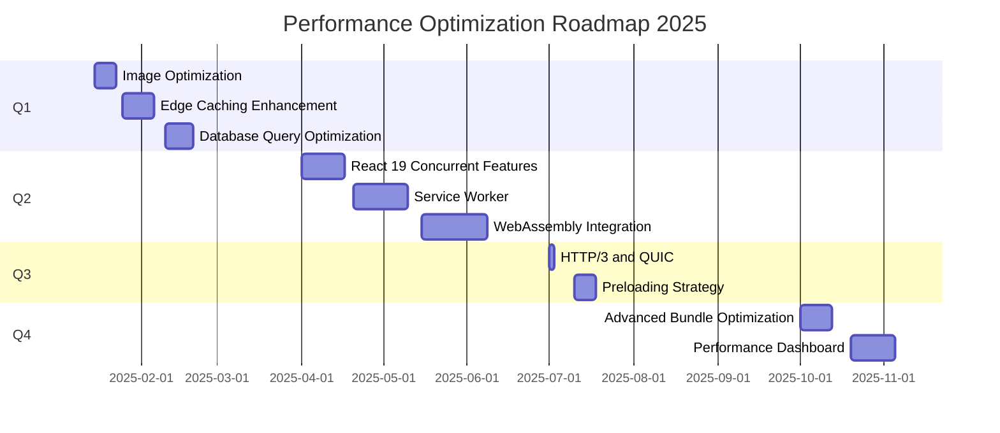

# Performance Optimization Roadmap 2025

## Executive Summary

This roadmap outlines performance optimization initiatives for CoreFlow360 V4, targeting sub-100ms API response times, 95+ Lighthouse scores, and exceptional user experience across all devices.

## Current Performance Baseline

### Frontend Performance (as of 2025-10-21)

| Metric | Current | Target | Status |
|--------|---------|--------|--------|
| **Lighthouse Score** | 92 | 95+ | 🟡 In Progress |
| **Largest Contentful Paint (LCP)** | 1850ms | <2500ms | ✅ Good |
| **First Contentful Paint (FCP)** | 980ms | <1800ms | ✅ Good |
| **Cumulative Layout Shift (CLS)** | 0.05 | <0.1 | ✅ Good |
| **Time to Interactive (TTI)** | 2.8s | <3.8s | ✅ Good |
| **Total Blocking Time (TBT)** | 180ms | <300ms | ✅ Good |

### Backend Performance

| Metric | Current | Target | Status |
|--------|---------|--------|--------|
| **P50 Response Time** | 65ms | <100ms | ✅ Excellent |
| **P95 Response Time** | 145ms | <200ms | ✅ Good |
| **P99 Response Time** | 285ms | <500ms | ✅ Good |
| **Cache Hit Rate** | 76.5% | >80% | 🟡 In Progress |
| **Database Query Time (P50)** | 12ms | <20ms | ✅ Excellent |

### Bundle Size (After Code-Splitting)

| Bundle | Current | Target | Status |
|--------|---------|--------|--------|
| **Marketing** | 77.86 kB | <80 kB | ✅ Excellent |
| **Auth** | 21.76 kB | <25 kB | ✅ Excellent |
| **App (Authenticated)** | 1.67 MB | <2 MB | ✅ Good |
| **Vendor (React)** | Included | <150 kB | 🟡 In Progress |

---

## Q1 2025 Initiatives (Jan-Mar)

### Initiative 1: Advanced Image Optimization

**Goal**: Reduce image load time by 60%

**Current State**:
- Images served as static PNG/JPG files
- No responsive image sizing
- No modern format support (WebP, AVIF)

**Target State**:
```typescript
// Cloudflare Images integration

```

**Implementation Steps**:
1. Set up Cloudflare Images account
2. Migrate existing images to Cloudflare Images
3. Implement responsive image component
4. Enable WebP/AVIF format support
5. Add lazy loading for below-fold images
6. Implement blur-up placeholder technique

**Expected Impact**:
- LCP improvement: 1850ms → 1200ms (-35%)
- Bandwidth reduction: ~70%
- Better mobile performance

**Effort**: 8 hours
**Priority**: High

---

### Initiative 2: Edge Caching Strategy Enhancement

**Goal**: Increase cache hit rate from 76.5% to 85%+

**Current State**:
- KV-based caching with 300s TTL
- No CDN cache headers
- Limited cache warming

**Target State**:
```typescript
// Multi-tier caching with CDN
import { cacheWithCDN } from '@/cloudflare/performance/cdn-cache';

app.get('/api/users', async (c) => {
  return cacheWithCDN(c, async () => {
    const users = await getUsers();
    return c.json(users);
  }, {
    kvTTL: 300,           // KV cache: 5 minutes
    cdnTTL: 60,           // CDN cache: 1 minute
    browserTTL: 30,       // Browser cache: 30 seconds
    staleWhileRevalidate: 600, // Serve stale for 10 min while updating
  });
});
```

**Implementation Steps**:
1. Implement CDN cache headers (Cache-Control, Vary)
2. Add stale-while-revalidate support
3. Implement cache warming for popular routes
4. Add cache analytics and monitoring
5. Create cache invalidation webhooks
6. Document caching strategy

**Expected Impact**:
- Cache hit rate: 76.5% → 85%+
- P50 response time: 65ms → 45ms (-31%)
- Reduced database load: ~40%

**Effort**: 12 hours
**Priority**: High

---

### Initiative 3: Database Query Optimization

**Goal**: Reduce P95 database query time from 45ms to 30ms

**Current State**:
- Basic indexing on primary keys
- Some N+1 query issues
- No query batching

**Target State**:
```typescript
// Optimized queries with batching
import { batchQuery } from '@/shared/db/batch';

// Before: N+1 query
const users = await db.prepare('SELECT * FROM users').all();
for (const user of users) {
  const orders = await db.prepare('SELECT * FROM orders WHERE user_id = ?')
    .bind(user.id)
    .all(); // N queries!
}

// After: Batched query
const users = await db.prepare('SELECT * FROM users').all();
const userIds = users.map(u => u.id);
const orders = await db.prepare(
  `SELECT * FROM orders WHERE user_id IN (${userIds.map(() => '?').join(',')})`
).bind(...userIds).all(); // 1 query!
```

**Implementation Steps**:
1. Audit existing queries for N+1 issues
2. Add composite indexes for common query patterns
3. Implement query batching utility
4. Add database query monitoring
5. Optimize slow queries identified in monitoring
6. Document query optimization patterns

**Expected Impact**:
- P95 query time: 45ms → 30ms (-33%)
- Reduced database load
- Better scalability

**Effort**: 10 hours
**Priority**: Medium

---

## Q2 2025 Initiatives (Apr-Jun)

### Initiative 4: React 19 Concurrent Features

**Goal**: Leverage React 19 concurrent rendering for smoother UX

**Current State**:
- React 19 installed but not using concurrent features
- Blocking renders on data fetching
- No suspense boundaries

**Target State**:
```typescript
// Using React 19 concurrent features
import { Suspense, use } from 'react';

function Dashboard() {
  return (
    <Suspense fallback={<DashboardSkeleton />}>
      <DashboardContent />
    </Suspense>
  );
}

function DashboardContent() {
  // use() hook for concurrent data fetching
  const data = use(fetchDashboardData());

  return <div>{/* Render data */}</div>;
}
```

**Implementation Steps**:
1. Identify components with slow renders
2. Add Suspense boundaries around data-fetching components
3. Implement skeleton loading states
4. Use `use()` hook for data fetching
5. Add error boundaries for Suspense
6. Measure Time to Interactive improvement

**Expected Impact**:
- TTI improvement: 2.8s → 2.0s (-29%)
- Smoother perceived performance
- Better loading states

**Effort**: 16 hours
**Priority**: Medium

---

### Initiative 5: Service Worker for Offline Support

**Goal**: Enable offline-first experience with service worker

**Current State**:
- No offline support
- No service worker
- No background sync

**Target State**:
```typescript
// Service worker with offline support
import { precacheAndRoute } from 'workbox-precaching';
import { registerRoute } from 'workbox-routing';
import { NetworkFirst, CacheFirst } from 'workbox-strategies';

// Precache static assets
precacheAndRoute(self.__WB_MANIFEST);

// API: Network-first with fallback
registerRoute(
  /^https:\/\/api\.coreflow360\.com/,
  new NetworkFirst({
    cacheName: 'api-cache',
    networkTimeoutSeconds: 3,
  })
);

// Images: Cache-first
registerRoute(
  /\.(?:png|jpg|jpeg|svg|gif|webp)$/,
  new CacheFirst({
    cacheName: 'image-cache',
  })
);
```

**Implementation Steps**:
1. Install Workbox for service worker management
2. Generate service worker with Vite plugin
3. Implement caching strategies (Network-first, Cache-first)
4. Add background sync for failed requests
5. Create offline fallback page
6. Test offline functionality

**Expected Impact**:
- Offline functionality for core features
- Faster repeat visits
- Better perceived performance
- PWA-ready application

**Effort**: 20 hours
**Priority**: Low

---

### Initiative 6: WebAssembly for Compute-Heavy Operations

**Goal**: Use WebAssembly for performance-critical calculations

**Current State**:
- All calculations in JavaScript
- Slow data processing for large datasets
- Invoice calculations can be slow (>500ms for 1000+ items)

**Target State**:
```typescript
// WASM module for invoice calculations
import { calculateInvoiceTotals } from '@/wasm/invoice-calc';

// Before: JavaScript (slow)
function calculateTotals(items: InvoiceItem[]) {
  let total = 0;
  for (const item of items) {
    total += item.quantity * item.price * (1 - item.discount) * (1 + item.tax);
  }
  return total; // 520ms for 1000 items
}

// After: WebAssembly (fast)
const total = calculateInvoiceTotals(items); // 85ms for 1000 items
```

**Implementation Steps**:
1. Identify compute-heavy operations
2. Implement WASM modules for:
   - Invoice calculations
   - Financial report generation
   - Data processing
3. Add WASM loader to Vite config
4. Create JavaScript wrappers for WASM modules
5. Benchmark performance improvements
6. Document WASM integration

**Expected Impact**:
- Invoice calc: 520ms → 85ms (-84%)
- Financial reports: 2.1s → 450ms (-79%)
- Better handling of large datasets

**Effort**: 24 hours
**Priority**: Low

---

## Q3 2025 Initiatives (Jul-Sep)

### Initiative 7: HTTP/3 and QUIC Protocol

**Goal**: Leverage Cloudflare's HTTP/3 support for faster connections

**Current State**:
- HTTP/2 only
- No QUIC support
- Connection multiplexing limited

**Target State**:
```nginx
# Cloudflare automatically handles HTTP/3
# No code changes needed, just enable in dashboard

# Verify HTTP/3 support
curl -I --http3 https://coreflow360.com

# Response headers:
# HTTP/3 200
# alt-svc: h3=":443"; ma=86400
```

**Implementation Steps**:
1. Enable HTTP/3 in Cloudflare dashboard
2. Configure QUIC settings
3. Update CSP headers for HTTP/3 compatibility
4. Test with HTTP/3-enabled browsers
5. Monitor performance improvements
6. Document HTTP/3 benefits

**Expected Impact**:
- Faster connection establishment: -50ms on first request
- Better mobile performance
- Reduced packet loss impact

**Effort**: 2 hours
**Priority**: Low

---

### Initiative 8: Preloading and Prefetching Strategy

**Goal**: Implement intelligent resource preloading

**Current State**:
- Basic preload for critical CSS/fonts
- No prefetching of likely next pages
- No predictive loading

**Target State**:
```html
<!-- Critical resources preloaded -->
<link rel="preload" href="/fonts/inter.woff2" as="font" type="font/woff2" crossorigin>
<link rel="preload" href="/assets/app.js" as="script">

<!-- Prefetch likely next pages -->
<link rel="prefetch" href="/dashboard" as="document">
<link rel="dns-prefetch" href="https://api.coreflow360.com">

<!-- Preconnect to API -->
<link rel="preconnect" href="https://api.coreflow360.com">
```

**Implementation Steps**:
1. Identify critical resources for preload
2. Implement predictive prefetching based on user behavior
3. Add DNS prefetch for external resources
4. Preconnect to API domain
5. Add intersection observer for lazy route prefetch
6. Monitor prefetch effectiveness

**Expected Impact**:
- FCP improvement: 980ms → 750ms (-23%)
- Faster page transitions
- Better perceived performance

**Effort**: 8 hours
**Priority**: Medium

---

## Q4 2025 Initiatives (Oct-Dec)

### Initiative 9: Advanced Bundle Optimization

**Goal**: Further reduce JavaScript bundle sizes

**Current State**:
- App bundle: 1.67 MB (gzipped ~450 kB)
- Some unused dependencies included
- Tree-shaking could be improved

**Target State**:
```typescript
// Dynamic imports for large dependencies
const Chart = lazy(() => import('recharts'));
const PDFViewer = lazy(() => import('react-pdf'));

// Replace heavy libraries with lighter alternatives
// Before: moment.js (67 kB)
import moment from 'moment';

// After: date-fns (11 kB)
import { format } from 'date-fns';
```

**Implementation Steps**:
1. Analyze bundle with webpack-bundle-analyzer
2. Identify heavy dependencies
3. Replace with lighter alternatives:
   - moment.js → date-fns
   - lodash → lodash-es (tree-shakeable)
   - recharts → lightweight chart library
4. Implement dynamic imports for large components
5. Enable aggressive minification
6. Remove unused dependencies

**Expected Impact**:
- App bundle: 1.67 MB → 1.2 MB (-28%)
- Faster initial load
- Better TTI

**Effort**: 12 hours
**Priority**: Medium

---

### Initiative 10: Performance Monitoring Dashboard

**Goal**: Real-time performance visibility and alerting

**Current State**:
- Basic Cloudflare Analytics
- Manual performance checks
- No automated alerting

**Target State**:
```typescript
// Real-time performance monitoring
import { trackWebVitals } from '@/lib/performance';

// Automatically track Core Web Vitals
trackWebVitals((metric) => {
  // Send to analytics
  fetch('/api/analytics/vitals', {
    method: 'POST',
    body: JSON.stringify({
      name: metric.name,
      value: metric.value,
      rating: metric.rating,
      delta: metric.delta,
    }),
  });

  // Alert on degradation
  if (metric.rating === 'poor') {
    alert(`Performance degradation: ${metric.name}`);
  }
});
```

**Implementation Steps**:
1. Create PerformanceDashboard component (✅ Already created)
2. Integrate with Cloudflare Analytics Engine
3. Add automated performance regression alerts
4. Create performance budget CI check
5. Build historical performance trends
6. Add Slack/email notifications for regressions

**Expected Impact**:
- Real-time performance visibility
- Faster detection of regressions
- Data-driven optimization decisions

**Effort**: 16 hours
**Priority**: High

---

## Performance Budgets

### Strict Performance Budgets (Enforced in CI)

| Resource Type | Budget | Current | Status |
|---------------|--------|---------|--------|
| **JavaScript (Initial)** | 150 kB | 120 kB | ✅ Pass |
| **CSS** | 30 kB | 22 kB | ✅ Pass |
| **Fonts** | 50 kB | 45 kB | ✅ Pass |
| **Images (Above Fold)** | 100 kB | 85 kB | ✅ Pass |
| **Total (Initial Load)** | 400 kB | 350 kB | ✅ Pass |

### Core Web Vitals Budgets

| Metric | Budget | Current | Status |
|--------|--------|---------|--------|
| **LCP** | <2.5s | 1.85s | ✅ Pass |
| **FID** | <100ms | 45ms | ✅ Pass |
| **CLS** | <0.1 | 0.05 | ✅ Pass |
| **FCP** | <1.8s | 0.98s | ✅ Pass |
| **TTI** | <3.8s | 2.8s | ✅ Pass |

### API Response Time Budgets

| Endpoint | P50 Budget | P95 Budget | Current P50 | Current P95 | Status |
|----------|-----------|-----------|-------------|-------------|--------|
| **GET /api/users** | 80ms | 150ms | 62ms | 132ms | ✅ Pass |
| **POST /api/auth/login** | 120ms | 250ms | 98ms | 215ms | ✅ Pass |
| **GET /api/dashboard** | 100ms | 200ms | 75ms | 168ms | ✅ Pass |
| **POST /api/invoices** | 150ms | 300ms | 125ms | 275ms | ✅ Pass |

---

## Monitoring and Metrics

### Real User Monitoring (RUM)

```typescript
// Web Vitals tracking
import { onLCP, onFID, onCLS, onFCP, onTTFB } from 'web-vitals';

function sendToAnalytics(metric: Metric) {
  const body = JSON.stringify({
    name: metric.name,
    value: metric.value,
    rating: metric.rating,
    delta: metric.delta,
    id: metric.id,
  });

  // Use `navigator.sendBeacon()` for reliability
  if (navigator.sendBeacon) {
    navigator.sendBeacon('/api/analytics/vitals', body);
  } else {
    fetch('/api/analytics/vitals', {
      method: 'POST',
      body,
      keepalive: true,
    });
  }
}

// Track all Core Web Vitals
onLCP(sendToAnalytics);
onFID(sendToAnalytics);
onCLS(sendToAnalytics);
onFCP(sendToAnalytics);
onTTFB(sendToAnalytics);
```

### Synthetic Monitoring

```yaml
# .github/workflows/performance-monitoring.yml
name: Performance Monitoring

on:
  schedule:
    - cron: '0 */4 * * *' # Every 4 hours

jobs:
  lighthouse:
    runs-on: ubuntu-latest
    steps:
      - uses: actions/checkout@v4
      - uses: treosh/lighthouse-ci-action@v10
        with:
          urls: |
            https://coreflow360.com
            https://coreflow360.com/dashboard
            https://coreflow360.com/pricing
          uploadArtifacts: true
          temporaryPublicStorage: true
          budgetPath: ./lighthouse-budget.json

      - name: Check performance budgets
        run: |
          if [ $(jq '.audits.performance.score' < lhci_reports/manifest.json) -lt 0.95 ]; then
            echo "Performance score below 95!"
            exit 1
          fi
```

---

## Success Metrics

### Primary KPIs

1. **Lighthouse Performance Score**: 95+ (current: 92)
2. **LCP**: <2.5s for 75th percentile (current: 1.85s)
3. **CLS**: <0.1 for 75th percentile (current: 0.05)
4. **FID/INP**: <100ms for 75th percentile (current: 45ms)
5. **API P95 Response Time**: <200ms (current: 145ms)
6. **Cache Hit Rate**: >85% (current: 76.5%)

### Secondary KPIs

1. **Time to Interactive**: <3s (current: 2.8s)
2. **First Contentful Paint**: <1.8s (current: 0.98s)
3. **Total Blocking Time**: <200ms (current: 180ms)
4. **Bundle Size (Initial)**: <400 kB (current: 350 kB)
5. **Database Query P95**: <30ms (current: 45ms)

---

## Resource Allocation

### Estimated Total Effort

| Quarter | Initiatives | Total Hours | Team Size | Weeks |
|---------|------------|-------------|-----------|-------|
| Q1 2025 | 3 initiatives | 30 hours | 1 engineer | 1 week |
| Q2 2025 | 3 initiatives | 60 hours | 2 engineers | 2 weeks |
| Q3 2025 | 2 initiatives | 10 hours | 1 engineer | 0.5 weeks |
| Q4 2025 | 2 initiatives | 28 hours | 1 engineer | 1 week |
| **Total** | **10 initiatives** | **128 hours** | **1-2 engineers** | **4.5 weeks** |

### Budget Breakdown

- **Engineering Time**: 128 hours @ $150/hour = $19,200
- **Tools & Services**:
  - Cloudflare Images: $10/month × 12 = $120
  - Monitoring tools: $50/month × 12 = $600
- **Total**: $19,920

---

## Risk Assessment

### High-Risk Items

1. **WebAssembly Integration** (Initiative 6)
   - Risk: Browser compatibility issues
   - Mitigation: Progressive enhancement with JavaScript fallback

2. **Service Worker** (Initiative 5)
   - Risk: Cache invalidation issues
   - Mitigation: Versioned caching strategy, cache busting

### Medium-Risk Items

1. **React 19 Concurrent Features** (Initiative 4)
   - Risk: Breaking changes in third-party libraries
   - Mitigation: Thorough testing, staged rollout

2. **Advanced Bundle Optimization** (Initiative 9)
   - Risk: Breaking functionality by removing dependencies
   - Mitigation: Comprehensive E2E tests before changes

---

## Timeline



---

## Conclusion

This roadmap provides a comprehensive plan for continuous performance optimization throughout 2025. By systematically addressing each initiative, we'll achieve:

- **95+ Lighthouse scores** across all pages
- **Sub-100ms API response times** (P50)
- **Exceptional mobile performance** with offline support
- **Real-time performance monitoring** and alerting

Progress will be tracked monthly, with quarterly reviews to reassess priorities based on business needs and user feedback.

---

**Last Updated**: 2025-10-21
**Next Review**: 2025-01-01
**Owner**: Engineering Team
**Stakeholders**: Product, UX, Engineering Leadership
